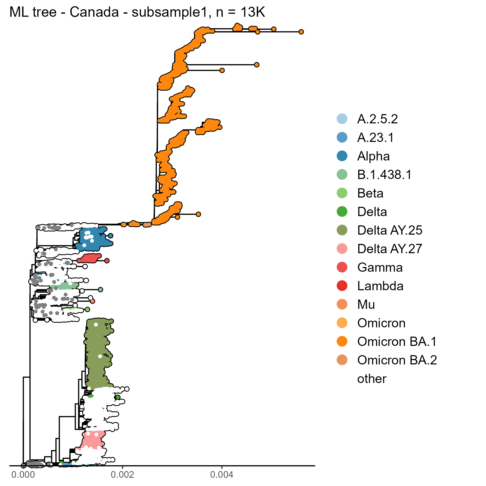

```{r setup, include=FALSE}

#coding and data
library(tidyverse) # wrangling and everything really
library(knitr) # Needed to set root directory
library(reticulate) # Needed for the Python code chunk 
#py_install("pandas") #install pandas in virtual environment
#use_virtualenv(virtualenv = "r-reticulate")
use_condaenv("r-reticulate")
#knitr::knit_engines$set(python = reticulate::eng_python)
library(lubridate) # dates are special
#phylo-specific
library(treeio)
library(phylotools)
library(tidytree)
library(phangorn)
library(phytools)
#plotting and tables
library(ggplot2) # Work-horse plotting package
library(ggtree) #All things phylogenetic visualization
library(cowplot) # Needed to make easy multi-panel plots with ggplot2
library(DT) # Needed to make DT example table
library(ggbeeswarm) # Needed to make beeswarm plots
library(gridExtra) # multi-panel plots
library(kableExtra) # Needed to write out a formatted table
library(scales)
#colors
library(RColorBrewer)
library(colorspace)
library(viridis)
library(MASS)


theme_set(theme_classic())

# # This is the Python to be used (which you would only specify if using Python code chunks)
# use_python("/Users/carme/local/miniconda3/bin/python") # <- FIX this path

# You would need to change this folder to be wherever you wanted the html file to be written.
opts_knit$set(root.dir = getwd())
```

### Contributing authors:  

Data analysis, code, and maintenance of this notebook: Carmen Lia Murall, Raphaël Poujol, Susanne Kraemer, Arnaud N'Guessan, Art Poon, Jesse Shaprio

Sequence collection, generation, and distribution: Canadian laboratories across the country are making these data publicly available. A complete list of lab authors is in this repository and more details are below in the Acknowledgement section. 

# Introduction

This notebook is to explore Canadian SARS-CoV-2 genomic and epidemiological data, for discussion with pillar 6's team and for sharing with collaborators. These analyses can spur further research within or across pillars, be used for reports (or data dashboards), given to the science communication pillar for public dissemination, and the code can be repackaged to give to public health authorities for their internal use.

Canadian genomic and epidemiological data will be regularly pulled from various public sources (see list below) to keep these analyses up-to-date. Only representations of aggregate data will be posted here. 


```{r load_data}

## 1. LOAD processed metadata of Canadian sequences (with latest pangolin, division, and full seq IDs)
#Download metadata from gisaid, put the date here:
gisaiddate="2022_01_31"
#date=2022_01_31
#tar -axf metadata_tsv_$date.tar.xz metadata.tsv -O | tr ' ' '_'  | sed 's/\t\t/\tNA\t/g' | sed 's/\t\t/\tNA\t/g' | sed 's/\t$/\tNA/g' | awk 'NR==1 || substr($1,9,6)=="Canada" && $8=="Human"' | sort -k3,3 > metadata_CANall_$date.uncorrected.csv 
#cat metadata_virrusseq_$date.tsv | tr ' ' '_'  | sed 's/\t\t/\tNA\t/g' | sed 's/\t\t/\tNA\t/g' | sed 's/\t$/\tNA/g' | awk 'NR!=1 && $43!="NA"' | cut -f5,43 | sort -k2,2 | uniq > epidatesfromvirrusseq
#join -1 3 metadata_CANall_$date.uncorrected.csv -a 1 -2 2 epidatesfromvirrusseq | awk '$4!=$23 && length($4)<10 && length($23)==10{$4=$23} {id=$1;$1=$2;$2=$3;$3=id} {print}' | tr ' ' '\t'| cut -f-22 > metadata_CANall_$date.csv
#zip /media/rp/partition4data/Dropbox/Raph/covarrnet/CoVaRRNet_Pillar6_Notebook/data_needed/metadata_CANall_$date.zip metadata_CANall_$date.csv

metaCANall <- read.csv(unz(paste("./data_needed/metadata_CANall_",gisaiddate,".zip",sep=""),paste("metadata_CANall_",gisaiddate,".csv",sep="")),sep="\t",row.names=NULL)
metaCANall$Collection_date <- as.Date(metaCANall$Collection_date)
#max(metaCANall$Collection.date) - min(metaCANall$Collection.date) #time diff: 580 days


VOCVOI <- data.frame(name = character(),pattern = character(),color = numeric())
print(nrow(VOCVOI))
VOCVOI[nrow(VOCVOI)+1, ]=list("Alpha",         "B.1.1.7|Q.","#B29C71")
VOCVOI[nrow(VOCVOI)+1, ]=list("Beta/Lambda/Mu","B.1.351",   "#F08C3A") #Beta
VOCVOI[nrow(VOCVOI)+1, ]=list("Gamma",         "P.",        "#444444")
VOCVOI[nrow(VOCVOI)+1, ]=list("Delta",         "B.1.617|AY.","#A6CEE3")
VOCVOI[nrow(VOCVOI)+1, ]=list("Delta AY.25",   "AY.25",       "#61A6A0")
VOCVOI[nrow(VOCVOI)+1, ]=list("Delta AY.27",   "AY.27",       "#438FC0")
VOCVOI[nrow(VOCVOI)+1, ]=list("Beta/Lambda/Mu","C.37|C.37.1", "#F08C3A")#lambda
VOCVOI[nrow(VOCVOI)+1, ]=list("Omicron BA.1",  "B.1.1.529|BA.","#8B0000")
VOCVOI[nrow(VOCVOI)+1, ]=list("Omicron BA.1.1","BA.1.1",       "#FA8072")
VOCVOI[nrow(VOCVOI)+1, ]=list("Omicron BA.2",  "BA.2",         "#FF0000")
VOCVOI[nrow(VOCVOI)+1, ]=list("Beta/Lambda/Mu","B.1.621",      "#F08C3A")#Mu
VOCVOI[nrow(VOCVOI)+1, ]=list("A.23.1",        "A.23.1",       "#9AD378")
VOCVOI[nrow(VOCVOI)+1, ]=list("B.1.438.1",     "B.1.438.1",    "#3EA534")

#make a pango.group column
metaCANall$pango.group <-"other"
pal["other"]="grey"
for (row in 1:nrow(VOCVOI)) {
    name <- VOCVOI[row, "name"]
    pattern=gsub("\\.",".",VOCVOI[row, "pattern"])
    metaCANall$pango.group[grepl(pattern, metaCANall$Pango_lineage)] <- name
    pal[name]=VOCVOI[row, "color"]
}


  ## 2. LOAD epidemiological data (PHAC)


#from: https://health-infobase.canada.ca/covid-19/epidemiological-summary-covid-19-cases.html?stat=num&measure=total&map=pt#a2
epidataCANall <- read.csv(url("https://health-infobase.canada.ca/src/data/covidLive/covid19-download.csv"))
epidataCANall$date <- as.Date(epidataCANall$date)
epidataCANall$prname <- gsub(' ', '_', epidataCANall$prname)
epidate = tail(epidataCANall,1)$date #download date


```

# Snapshot: SARS-CoV-2 in Canada


## Variants in Canada

Sequence counts for all Canadian data in GISAID, up to `r gisaiddate`, and cases count downloaded on the `r epidate` from  health-infobase.canada.ca. Note that some of the "other" category include some Delta sublineages (AYs) but overall, from the beginning of the pandemic to the fall of 2021, Canadian sequences were mostly of the wildtype lineages (pre-VOCs).

```{r, fig.width=8,fig.height=5}

# --- Histogram plot: counts per variant of all canadian data -------------

#------------- counts over time (by week)
mindate=as.Date("2020-11-01")
maxdate=as.Date(gsub('_','-',gisaiddate))
maxdate=as.Date("2022-01-10")
colorcases="#138808"
  
plot_metadatadf <- function(meta_tab,pal,cases) {
  meta_tab <- filter(meta_tab, !is.na(meta_tab$Collection_date))
  meta_tab <- filter(meta_tab, meta_tab$Collection_date > mindate)
  meta_tab <- filter(meta_tab, meta_tab$Collection_date < maxdate)
  meta_tab <- meta_tab %>% group_by(pango.group) %>% group_by(week = cut(Collection_date, "week")) #adds week coloum
  meta_tab <- meta_tab %>% group_by(week) %>% count(pango.group)
  cases <- filter(cases, cases$date > mindate)
  cases <- filter(cases, cases$date < maxdate)
  cases <- cases %>% group_by(week = cut(date, "week")) #adds week column
  cases <- data.frame(aggregate(cases$numtoday, by=list(Category=cases$week), FUN=sum))
  cases$x=cases$x/7
  ratio <- max(data.frame(aggregate(meta_tab$n, by=list(Category=meta_tab$week), FUN=sum))$x)/max(cases$x)
  cases$x=cases$x*ratio
  print(pal)
  ggplot(meta_tab, aes(x=as.Date(week)))+
    geom_bar(stat = "identity", aes(y= n, fill=pango.group))+
    scale_fill_manual(breaks=unique(sort(meta_tab$pango.group)), values = pal)+
    ylab("")+xlab("")+
    theme_classic()+theme(axis.text.x = element_text(angle=90, vjust=0.1,hjust=0.1))+
    scale_x_date(date_breaks = "28 day")+
    geom_line(data=cases, aes(x=as.Date(Category),y=x),size=2,color=colorcases,alpha=0.6)+
    scale_y_continuous(name = "sequenced cases per day",sec.axis = sec_axis(~./ratio, name="recorded cases per day",labels=label_number_auto()))+
    theme(axis.title.y.right = element_text(color = colorcases),axis.text.y.right = element_text(color = colorcases))
}


plot_metadatadf_freq <- function(meta_tab,pal,cases) {
  meta_tab <- filter(meta_tab, !is.na(meta_tab$Collection_date))
  meta_tab <- filter(meta_tab, meta_tab$Collection_date > mindate)
  meta_tab <- filter(meta_tab, meta_tab$Collection_date < maxdate)
  meta_tab <- meta_tab %>% group_by(pango.group) %>% group_by(week = cut(Collection_date, "week")) #adds week coloum
  meta_tab <- meta_tab %>% group_by(week) %>% count(pango.group)
  meta_tab %>% mutate(freq = prop.table(n)) -> dfprop
  cases <- filter(cases, cases$date > mindate)
  cases <- filter(cases, cases$date < maxdate)
  cases <- cases %>% group_by(week = cut(date, "week")) #adds week column
  cases <- data.frame(aggregate(cases$numtoday, by=list(Category=cases$week), FUN=sum))
  cases$x=cases$x/7
  ratio <- 1/max(cases$x)
  cases$x=cases$x*ratio
  ggplot(dfprop, aes(x=as.Date(week)))+
    geom_bar(stat = "identity", aes(y= freq, fill=pango.group))+
    scale_fill_manual(breaks=unique(sort(dfprop$pango.group)), values = pal)+
    ylab("")+xlab("")+
    theme_classic()+theme(axis.text.x = element_text(angle=90, vjust=0.1,hjust=0.1))+
    scale_x_date(date_breaks = "28 day")+
    geom_line(data=cases, aes(x=as.Date(Category),y=x),size=2,color=colorcases,alpha=0.6)+
    scale_y_continuous(name = "sequenced cases per day",sec.axis = sec_axis(~./ratio, name="recorded cases per day",labels=label_number_auto()))+
    theme(axis.title.y.right = element_text(color = colorcases),axis.text.y.right = element_text(color = colorcases))
}
plot_metadatadf(metaCANall,pal,epidataCANall)
plot_metadatadf_freq(metaCANall,pal,epidataCANall)

```

There are two PANGO lineages that have a Canadian origin and have predominately spread within Canada (with some exportations internationally): B.1.438.1 and B.1.1.176.

Other lineages of Canadian interest:  

* A.2.5.2 - an A lineage (clade 19B) that spread in Quebec, involved in several outbreaks, before Delta arrived  
* B.1.2 - an American (USA) lineage that spread well in Canada  
* B.1.160 - an European lineages that spread well in Canada  
 

## Provinces {.tabset}

Here we show the same plots but for each provinces 
```{r province list}

loc=sapply(strsplit(metaCANall$Location,"_/_"), `[`, 3)
metaCANall$province <- loc
```

### British_Columbia
```{r provinceplot_British_Columbia, fig.width=8,fig.height=5}
prov='British_Columbia'
plot_metadatadf(metaCANall[ which(metaCANall$province==prov), ],pal,epidataCANall[ which(epidataCANall$prname==prov), ])
plot_metadatadf_freq(metaCANall[ which(metaCANall$province==prov), ],pal,epidataCANall[ which(epidataCANall$prname==prov), ])
```

### Alberta
```{r provinceplot_Alberta, fig.width=8,fig.height=5}
prov='Alberta'
plot_metadatadf(metaCANall[ which(metaCANall$province==prov), ],pal,epidataCANall[ which(epidataCANall$prnameFR==prov), ])
plot_metadatadf_freq(metaCANall[ which(metaCANall$province==prov), ],pal,epidataCANall[ which(epidataCANall$prnameFR==prov), ])
```

### Saskatchewan
```{r provinceplot_Saskatchewan, fig.width=8,fig.height=5}
prov='Saskatchewan'
plot_metadatadf(metaCANall[ which(metaCANall$province==prov), ],pal,epidataCANall[ which(epidataCANall$prnameFR==prov), ])
plot_metadatadf_freq(metaCANall[ which(metaCANall$province==prov), ],pal,epidataCANall[ which(epidataCANall$prnameFR==prov), ])
```

### Manitoba
```{r provinceplot_Manitoba, fig.width=8,fig.height=5}
prov='Manitoba'
plot_metadatadf(metaCANall[ which(metaCANall$province==prov), ],pal,epidataCANall[ which(epidataCANall$prnameFR==prov), ])
plot_metadatadf_freq(metaCANall[ which(metaCANall$province==prov), ],pal,epidataCANall[ which(epidataCANall$prnameFR==prov), ])
```

### Ontario
```{r provinceplot_Ontario, fig.width=8,fig.height=5}
prov='Ontario'
plot_metadatadf(metaCANall[ which(metaCANall$province==prov), ],pal,epidataCANall[ which(epidataCANall$prname==prov), ])
plot_metadatadf_freq(metaCANall[ which(metaCANall$province==prov), ],pal,epidataCANall[ which(epidataCANall$prname==prov), ])
```

### Quebec
```{r provinceplot_Quebec, fig.width=8,fig.height=5}
prov='Quebec'
plot_metadatadf(metaCANall[ which(metaCANall$province==prov), ],pal,epidataCANall[ which(epidataCANall$prname==prov), ])
plot_metadatadf_freq(metaCANall[ which(metaCANall$province==prov), ],pal,epidataCANall[ which(epidataCANall$prname==prov), ])
```

### Nova_Scotia
```{r provinceplot_Nova_Scotia, fig.width=8,fig.height=5}
prov='Nova_Scotia'
plot_metadatadf(metaCANall[ which(metaCANall$province==prov), ],pal,epidataCANall[ which(epidataCANall$prname==prov), ])
plot_metadatadf_freq(metaCANall[ which(metaCANall$province==prov), ],pal,epidataCANall[ which(epidataCANall$prname==prov), ])
```

### New_Brunswick
```{r provinceplot_New_Brunswick, fig.width=8,fig.height=5}
prov='New_Brunswick'
plot_metadatadf(metaCANall[ which(metaCANall$province==prov), ],pal,epidataCANall[ which(epidataCANall$prname==prov), ])
plot_metadatadf_freq(metaCANall[ which(metaCANall$province==prov), ],pal,epidataCANall[ which(epidataCANall$prname==prov), ])
```

### Newfoundland_and_Labrador
```{r provinceplot_Newfoundland_and_Labrador, fig.width=8,fig.height=5}
prov='Newfoundland_and_Labrador'
plot_metadatadf(metaCANall[ which(metaCANall$province==prov), ],pal,epidataCANall[ which(epidataCANall$prname==prov), ])
plot_metadatadf_freq(metaCANall[ which(metaCANall$province==prov), ],pal,epidataCANall[ which(epidataCANall$prname==prov), ])
```

## Canadian trees {-}

Down-sampled Canadian SARS-CoV-2 genomes. Taken from GISAID Sept. 12th, 2021. Alignment GISAID, ML tree in IQ-tree. 

 


## Evolution and growth rates of SARS-CoV-2 in Canada

There are various methods to investigate changes in evolutionary rates of VOC/VOIs and compare their relative fitness in an epidemiological context.

For example, root-to-tip plots give estimates of substitution rates. Clusters with stronger positive slopes than the average SARS-CoV-2 dataset, are an indication that they are accumlating mutations at a faster pace, or clusters that jump up above the average could indicate a mutational jump (simlar to what we saw with Alpha when it first appeared in the UK).

<!---->
Maximum likelihood tree ([IQ-TREE](http://www.iqtree.org/)) processed with [root-to-tip regression](https://search.r-project.org/CRAN/refmans/ape/html/rtt.html) and plotting in R.
```{r}
#RTT code contributed by Art Poon
rooted <- read.tree('./data_needed/msa_0908_CANall_downsamp10perday_1.rtt.nwk')
get.dates <- function(phy, delimiter='_', pos=-1, format='%Y-%m-%d') {
  dt <- sapply(phy$tip.label, function(x) {
    tokens <- strsplit(x, delimiter)[[1]]
    if (pos < 0) { return(tokens[length(tokens)+pos+1]) }
    else { return(tokens[pos]) }
  })
  as.Date(dt, format=format)
}
tip.dates <- get.dates(rooted, pos=-2)

# total branch length from root to each tip
div <- node.depth.edgelength(rooted)[1:Ntip(rooted)]

# match tips to metadata to retrieve PANGO lineage assignments
accno <- gsub(".+_(EPI_ISL_[0-9]+)_.+", "\\1", rooted$tip.label)
index <- match(accno, metaCANall$Accession_ID)
pg <- metaCANall$pango.group[index]

blobs <- function(x, y, col, cex=1) {
  points(x, y, pch=21, cex=cex)
  points(x, y, bg=col, col=rgb(0,0,0,0), pch=21, cex=cex)
}
dlines <- function(x, y, col) {
  lines(x, y, lwd=2.5)
  lines(x, y, col=col)
}

vocs <- c('Alpha', 'Beta', 'Gamma', 'Delta', 'Omicron')
pal <- hcl.colors(n=length(vocs), palette="Sunset")

par(mar=c(5,5,0,1))
plot(tip.dates, div, type='n', las=1, cex.axis=0.6, cex.lab=0.7, bty='n',
     xaxt='n', xlab="Sample collection date", ylab="Divergence from root")
xx <- floor_date(seq(min(tip.dates), max(tip.dates), length.out=5), unit="months")
axis(side=1, at=xx, label=format(xx, "%b %Y"), cex.axis=0.6)

blobs(tip.dates[pg=='other'], div[pg=='other'], col='grey', cex=0.8)
fit0 <- rlm(div[pg=='other'] ~ tip.dates[pg=='other'])
abline(fit0, col='gray50')
fits <- list(other=fit0)

for (i in 1:length(vocs)) {
  variant <- vocs[i]
  x <- tip.dates[pg==variant]
  if (all(is.na(x))) next
  y <- div[pg==variant]
  blobs(x, y, col=pal[i], cex=0.8)
  fit <- rlm(y ~ x)
  dlines(fit$x[,2], predict(fit), col=pal[i])
  fits[[variant]] <- fit
}

legend(x=min(tip.dates), y=max(div), legend=vocs, pch=21, pt.bg=pal, bty='n', cex=0.8)
```


```{r}
ci <- lapply(fits, confint.default)
kable(data.frame(
  n=sapply(fits, function(f) nrow(f$x)),                            
  est=29970*sapply(fits, function(f) f$coef[2]),
  lower.95=29970*sapply(ci, function(f) f[2,1]),
  upper.95=29970*sapply(ci, function(f) f[2,2])
), 
col.names = c("Number of genomes", "Estimate", "Lower 95% CI", "Upper 95% CI"),
format="html", align="rrrr", caption="Molecular clock rates (subs/genome/day)",
format.args = list(scientific = FALSE), digits=4, table.attr = "style='width:100%;'")
```

Overall, the evolutionary rate among genomes sampled in Canada (`r lm(div ~ tip.dates)$coef[2]*29970` subs/genome/day, grey line) is close to the global average of `r 0.000822*29970/365` subs/genome/day.
Compared to other lineages sampled in Canada, variant of concern Alpha (B.1.1.7) exhibited a slightly but significantly lower rate of evolution.
Both variants of concern Gamma (P.1) and Delta (B.1.617.2) exhibited higher rates, although only Gamma was significantly higher.


## Omicron in Canada

Compilation of analyses of omicron and its sublineages in Canada.

```{python}
import matplotlib.pyplot as plt
import numpy as np
from data_needed.raphgraph.libs.Functions_For_MutationalGraphs import *

# percent of alt alleles to add mutation label
# File containing label
# Default is AminoAcid labels for non synonymous mutations
def_min_val_label(15)
load_mut_names("data_needed/raphgraph/libs/Mut_Nuc_AA_ORF.dic")
p="data_needed/raphgraph/msa_0120_"


namelist=["Canada.BA.1","final.BA.1","Canada.BA.2","final.BA.2","Canada.B.1.1.529","final.B.1.1.529"]
pathlist=[p+i+".var" for i in namelist]

namelist=[i.replace("_","\n") for i in namelist]
tablelist=openfiles(pathlist)

poslist=getpositions(tablelist,percentmin=75,addmissing=False)
poslist=[i for i in poslist if i>50 and i<29950]
bighist(tablelist,poslist,namelist,mytitle="Omicron mutations: Canada and worldwide")
plt.show()

```

Mutational profile (point mutations>75%) of Omicron and its sublineages in Canada and global (based on genomes available on the 20th of january 2022).


### Add here:  

* growth rates (Sally's code)
* dN/dS (by variant and by gene/domains)
* Tajima's D
* other? (e.g. PyR0, nnet R, ?)
* BEAST analyses? e.g. infer R0, serial interval, etc for the different Omicron sublineages (might have to wait for more BA.2)


# List of useful tools

Collect a list of bioinformatics, phylogenetic, and modelling tools that are useful for SARS-CoV-2 analyses:

* UShER: Ultrafast Sample placement on Existing tRee - for placing a small-ish dataset into the global GISAID phylogenetic tree [web-version: https://genome.ucsc.edu/cgi-bin/hgPhyloPlace, local-version: https://shusher.gi.ucsc.edu/]
* iTol: Tree visualization tool [https://itol.embl.de/itol.cgi]
* List of (mostly) modelling tools by CANMOD: [https://canmod.net/tools], includes RECON, outbreak tools for both modelling and genomic epi [https://github.com/reconhub]
* List of homoplaises in SARS-CoV-2: https://github.com/corneliusroemer/ncov-simplest/blob/main/data/exclude_sites_light.txt
* Erin Gill's COVID-19 dashboard [https://github.com/eringill/COVID_dashboard_reboot]
* The Epi Graph Network: training platform. Programming tools for health data analysis, African/European network of researchers and WHO Afro. [https://thegraphnetwork.training/]
* Paul's subsampling tool of SARS-CoV-2 genome ensembles [https://github.com/nodrogluap/nybbler]
* Pokay tool for checking and reporitng mismatches [https://github.com/nodrogluap/pokay]
* IRIDA Canada's ID analysis platform for genomic epi [https://github.com/pvanheus/irida]
* cov-lineages (summaries of PANGO lineages) [https://cov-lineages.org/lineage_list.html]
* CoVizu (analysis and visualization of the global diversity of SARS-CoV-2 genomes in real time) [https://github.com/PoonLab/covizu/]


# Acknowledgements and Data sources
We thank all the authors, developers, and contributors to the GISAID and VirusSeq database for making their SARS-CoV-2 sequences publicly available. We especially thank the Canadian Public Health Laboratory Network, academic sequencing partners, diagnostic hospital labs, and other sequencing partners for the provision of the Canadian sequence data used in this work. Genome sequencing in Canada was supported by a Genome Canada grant to the Canadian COVID-19 Genomic Network (CanCOGeN). 

We gratefully acknowledge all the Authors, the Originating laboratories responsible for obtaining the specimens, and the Submitting laboratories for generating the genetic sequence and metadata and sharing via the GISAID Initiative, on which this research is based.

* GISAID  (https://www.gisaid.org/)
We would like to thank the GISAID Initiative and are grateful to all of the data contributors, i.e. the Authors, the Originating laboratories responsible for obtaining the specimens, and the Submitting laboratories for generating the genetic sequence and metadata and sharing via the GISAID Initiative, on which this research is based.
Elbe, S., and Buckland-Merrett, G. (2017) Data, disease and diplomacy: GISAID's innovative contribution to global health. Global Challenges, 1:33-46. DOI:10.1002/gch2.1018, PMCID:31565258
Shu, Y., McCauley, J. (2017) GISAID: From vision to reality. EuroSurveillance, 22(13), DOI: 10.2807/1560-7917.ES.2017.22.13.30494, PMCID: PMC5388101

* VirusSeq Portal (https://virusseq-dataportal.ca/explorer)
The list of participating labs in CanCoGen is found in this repository.

* Public Health Agency of Canada (PHAC) / National Microbiology Laboratory (NML) - (https://health-infobase.canada.ca/covid-19/epidemiological-summary-covid-19-cases.html)

* various provincial public health websites (e.g. INSPQ https://www.inspq.qc.ca/covid-19/donnees/)  


# Session info {.tabset}
The version numbers of all packages in the current environment as well as information about the R install is reported below. 

## Hide

## Show

```{r session_info}
sessionInfo()
```
