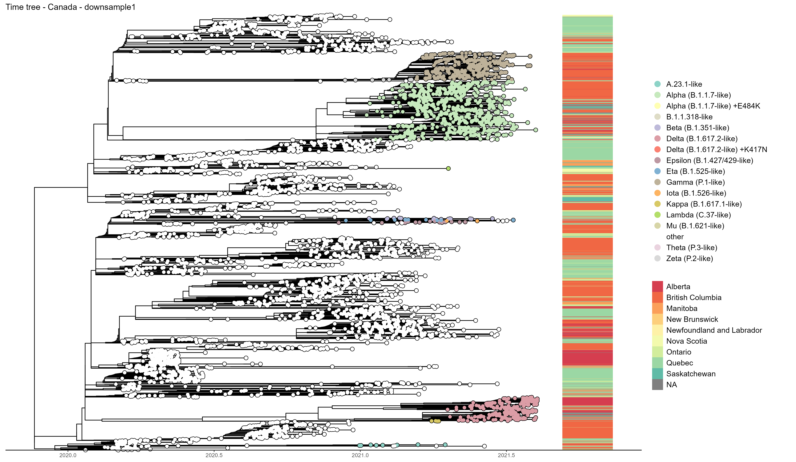
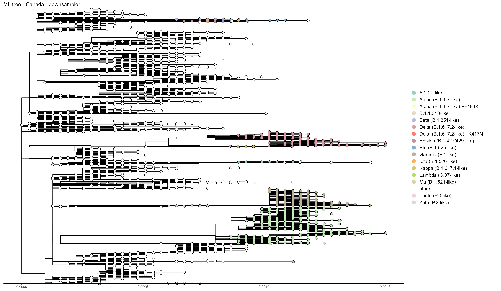
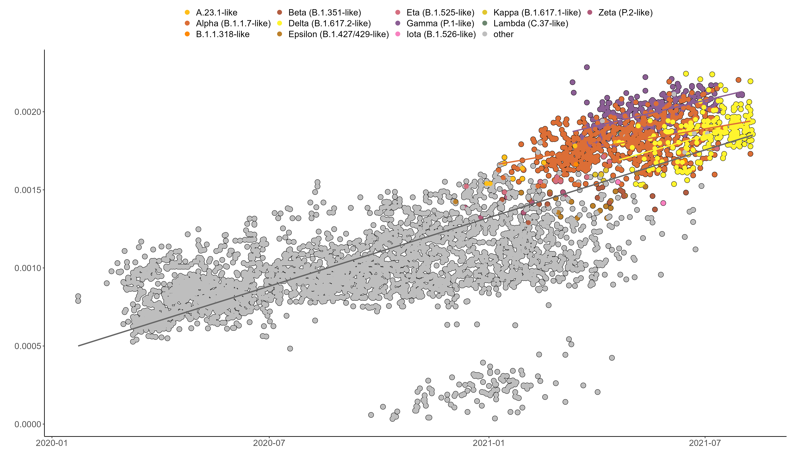

```{r setup, include=FALSE}

#coding and data
library(tidyverse) # wrangling and everything really
library(knitr) # Needed to set root directory
library(reticulate) # Needed for the Python code chunk 
library(lubridate) # dates are special
#phylo-specific
library(treeio)
library(phylotools)
library(tidytree)
library(phangorn)
library(phytools)
#plotting and tables
library(ggplot2) # Work-horse plotting package
library(ggtree) #All things phylogenetic visualization
library(cowplot) # Needed to make easy multi-panel plots with ggplot2
library(DT) # Needed to make DT example table
library(ggbeeswarm) # Needed to make beeswarm plots
library(gridExtra) # multi-panel plots
library(kableExtra) # Needed to write out a formatted table
#colors
library(RColorBrewer)
library(colorspace)
library(viridis)
library(MASS)

theme_set(theme_classic())

# # This is the Python to be used (which you would only specify if using Python code chunks)
# use_python("/Users/carme/local/miniconda3/bin/python") # <- FIX this path

# You would need to change this folder to be wherever you wanted the html file to be written.
opts_knit$set(root.dir = getwd())
```

# Introduction

This notebook is to explore Canadian SARS-CoV-2 genomic and epidemiological data, for discussion with pillar 6's team and for sharing with collaborators. These analyses can spur further research within or across pillars, be used for reports (or data dashboards), given to the science communication pillar for public dissemination, and the code can be repackaged to give to public health authorities for their internal use.

Canadian genomic and epidemiological data will be regularly pulled from various sources to keep these analyses up-to-date. 


```{r load_data}

## 1. LOAD processed metadata of Canadian sequences (with latest pangolin, division, and full seq IDs)
#Download metadata from gisaid, put the date here:
gisaiddate="2022_01_17"
#date=2022_01_17
#tar -axf metadata_tsv_$date.tar.xz metadata.tsv -O | tr ' ' '_'  | sed 's/\t\t/\tNA\t/g' | sed 's/\t\t/\tNA\t/g' | sed 's/\t$/\tNA/g' | awk 'NR==1 || substr($1,9,6)=="Canada" && $8=="Human"' | sort -k3,3 > metadata_CANall_$date.uncorrected.csv 
#cat metadata_virrusseq_2022_01_17.tsv | tr ' ' '_'  | sed 's/\t\t/\tNA\t/g' | sed 's/\t\t/\tNA\t/g' | sed 's/\t$/\tNA/g' | awk 'NR!=1 && $43!="NA"' | cut -f5,43 | sort -k2,2 > epidatesfromvirrusseq
#join -1 3 metadata_CANall_$date.uncorrected.csv -a 1 -2 2 epidatesfromvirrusseq | awk '$4!=$23 && length($4)<10 && length($23)==10{$4=$23} {id=$1;$1=$2;$2=$3;$3=id} {print}' | tr ' ' '\t'| cut -f-22 > metadata_CANall_$date.csv
#zip CoVaRRNet_pillar6notebook/data_needed/metadata_CANall_$date.zip metadata_CANall_$date.csv

metaCANall <- read.csv(unz(paste("./data_needed/metadata_CANall_",gisaiddate,".zip",sep=""),paste("metadata_CANall_",gisaiddate,".csv",sep="")),sep="\t",row.names=NULL)
metaCANall$Collection_date <- as.Date(metaCANall$Collection_date)
#max(metaCANall$Collection.date) - min(metaCANall$Collection.date) #time diff: 580 days

#make a pango.group column

metaCANall$pango.group <- metaCANall$Variant
metaCANall$pango.group[is.na(metaCANall$pango.group)]<-"other"
metaCANall$pango.group[metaCANall$pango.group == "VOC_Alpha_202012/01_GRY_(B.1.1.7+Q.x)_first_detected_in_the_UK"]<-"Alpha"
metaCANall$pango.group[metaCANall$pango.group == "VOC_Beta_GH/501Y.V2_(B.1.351+B.1.351.2+B.1.351.3)_first_detected_in_South_Africa" ]<-"Beta"
metaCANall$pango.group[metaCANall$pango.group == "VOC_Gamma_GR/501Y.V3_(P.1+P.1.x)_first_detected_in_Brazil/Japan"   ]<-"Gamma"
metaCANall$pango.group[metaCANall$pango.group == "VOC_Delta_GK/478K.V1_(B.1.617.2+AY.x)_first_detected_in_India"   ]<-"Delta"
metaCANall$pango.group[metaCANall$Pango_lineage == "AY.25" ]<-"Delta AY.25"
metaCANall$pango.group[metaCANall$Pango_lineage == "AY.27" ]<-"Delta AY.27"
metaCANall$pango.group[metaCANall$pango.group == "VOI_Lambda_GR/452Q.V1_(C.37+C.37.1)_first_detected_in_Peru"  ]<-"Lambda"
metaCANall$pango.group[metaCANall$pango.group == "VOC_Omicron_GRA_(B.1.1.529+BA.*)_first_detected_in_Botswana/Hong_Kong/South_Africa" ]<-"Omicron"
metaCANall$pango.group[metaCANall$pango.group == "VOI_Mu_GH_(B.1.621+B.1.621.1)_first_detected_in_Colombia" ]<-"Mu"
metaCANall$pango.group[str_detect(metaCANall$pango.group,"V") ]<-"other"
metaCANall$pango.group[metaCANall$Pango_lineage == "A.23.1" ]<-"A.23.1"
metaCANall$pango.group[metaCANall$Pango_lineage == "B.1.438.1" ]<-"B.1.438.1"
metaCANall$pango.group[grepl("B\\.1\\.1\\.529|BA\\.", metaCANall$Pango_lineage)] <- "Omicron"

## 2. LOAD epidemiological data (PHAC)


epidataCANall <- read.csv(url("https://health-infobase.canada.ca/src/data/covidLive/covid19-download.csv"))
#from: https://health-infobase.canada.ca/covid-19/epidemiological-summary-covid-19-cases.html?stat=num&measure=total&map=pt#a2
epidate = tail(epidataCANall,1)$date
#epidataAlberta <- epidataCANall[ which(epidataCANall$prnameFR=='Alberta'), ]
#print(epidataAlberta$numtoday)
```

# Snapshot: SARS-CoV-2 in Canada


## Sequencing coverage and sharing

Note that in this demo almost all of Ontario's sequences were not included due to the lack of complete dates in GISAID. Moving forward, using VirusSeq Portal data, we should have better coverage in Ontario.


## Variants in Canada

Sequence counts for all Canadian data in GISAID, up to `r epidate`, shows that by end of summer Alpha and Gamma were still the most sequenced variants. Note that some of the "other" category include some Delta sublineages (AYs) but overall, from the beginning of the pandemic to the fall of 2021, Canadian sequences were mostly of the wildtype lineages (pre-VOCs).

```{r example_summaries}

# --- Histogram plot: counts per variant of all canadian data -------------


listpango <- unique(metaCANall$pango.group)
print(listpango)
listpango <- listpango[order(listpango)]
getpal <- colorRampPalette(brewer.pal(9, "Paired")) #"Set3
pal <- getpal(length(listpango))
names(pal) <- listpango
pal["Omicron"]="#E52823"
pal["other"]="grey"
pal["Alpha"]="#B29C71"
pal["Delta"]="#A6CEE3"
pal["Delta AY.27"]="#438FC0"
pal["Delta AY.25"]="#61A6A0" 
pal["A.23.1"]="#9AD378"
pal["B.1.438.1"]="#3EA534"
pal["Beta"]="#CAB2D6"
pal["Gamma"]="#444444"
pal["Lambda"]="#F08C3A"
pal["Mu"]="#F08C3A"

#print(pal)

#------------- counts over time (by week)

plot_metadatadf <- function(meta_tab,pal) {
  meta_tab <- filter(meta_tab, !is.na(meta_tab$Collection_date))
  df1 <- meta_tab %>% group_by(pango.group) %>% group_by(week = cut(Collection_date, "week")) #adds week coloum
  dfcount <- df1 %>% group_by(week) %>% count(pango.group)
  #plot
  ggplot(dfcount, aes(x=as.Date(week), y= n, fill=pango.group))+geom_bar(stat = "identity")+
    scale_fill_manual(breaks=listpango, values = pal)+ ylab("")+xlab("")+
    scale_x_date(date_breaks = "28 day")+
    theme_classic()+theme(axis.text.x = element_text(angle=90, vjust=0.1,hjust=0.1))
  
}
  
plot_metadatadf_freq <- function(meta_tab,pal) {
  meta_tab <- filter(meta_tab, !is.na(meta_tab$Collection_date))
  df1 <- meta_tab %>% group_by(pango.group) %>% group_by(week = cut(Collection_date, "week")) #adds week coloum
  dfcount <- df1 %>% group_by(week) %>% count(pango.group)
  dfcount %>% mutate(freq = prop.table(n)) -> dfprop
  
  #plot
  ggplot(dfprop, aes(x= as.Date(week), y=freq, fill=pango.group))+geom_bar(stat = "identity")+
    scale_fill_manual(breaks=listpango, values = pal)+ ylab("")+xlab("")+
    scale_x_date(date_breaks = "28 day")+
    theme_classic()+theme(axis.text.x = element_text(angle=90, vjust=0.1,hjust=0.1))
}


plot_metadatadf(metaCANall,pal)
plot_metadatadf_freq(metaCANall,pal)

```

There are two PANGO lineages that have a Canadian origin and have predominately spread within Canada (with some exportations internationally): B.1.438.1 and B.1.1.176.

Other lineages of Canadian interest:  

* A.2.5.2 - an A lineage (clade 19B) that spread in Quebec, involved in several outbreaks, before Delta arrived  
* B.1.2 - an American (USA) lineage that spread well in Canada  
* B.1.160 - an European lineages that spread well in Canada  
 

## Provinces {.tabset}

Here we show the same plots but for each provinces 
```{r province list}

loc=sapply(strsplit(metaCANall$Location,"_/_"), `[`, 3)
metaCANall$province <- loc
print(unique(metaCANall$province))
```

### British_Columbia
```{r provinceplot_British_Columbia}
plot_metadatadf(metaCANall[ which(metaCANall$province=='British_Columbia'), ],pal)
plot_metadatadf_freq(metaCANall[ which(metaCANall$province=='British_Columbia'), ],pal)
```

### Alberta
```{r provinceplot_Alberta}
plot_metadatadf(metaCANall[ which(metaCANall$province=='Alberta'), ],pal)
plot_metadatadf_freq(metaCANall[ which(metaCANall$province=='Alberta'), ],pal)
```

### Saskatchewan
```{r provinceplot_Saskatchewan}
plot_metadatadf(metaCANall[ which(metaCANall$province=='Saskatchewan'), ],pal)
plot_metadatadf_freq(metaCANall[ which(metaCANall$province=='Saskatchewan'), ],pal)
```

### Manitoba
```{r provinceplot_Manitoba}
plot_metadatadf(metaCANall[ which(metaCANall$province=='Manitoba'), ],pal)
plot_metadatadf_freq(metaCANall[ which(metaCANall$province=='Manitoba'), ],pal)
```

### Ontario
```{r provinceplot_Ontario}
plot_metadatadf(metaCANall[ which(metaCANall$province=='Ontario'), ],pal)
plot_metadatadf_freq(metaCANall[ which(metaCANall$province=='Ontario'), ],pal)
```

### Quebec
```{r provinceplot_Quebec}
plot_metadatadf(metaCANall[ which(metaCANall$province=='Quebec'), ],pal)
plot_metadatadf_freq(metaCANall[ which(metaCANall$province=='Quebec'), ],pal)
```

### Nova_Scotia
```{r provinceplot_Nova_Scotia}
plot_metadatadf(metaCANall[ which(metaCANall$province=='Nova_Scotia'), ],pal)
plot_metadatadf_freq(metaCANall[ which(metaCANall$province=='Nova_Scotia'), ],pal)
```

### New_Brunswick
```{r provinceplot_New_Brunswick}
plot_metadatadf(metaCANall[ which(metaCANall$province=='New_Brunswick'), ],pal)
plot_metadatadf_freq(metaCANall[ which(metaCANall$province=='New_Brunswick'), ],pal)
```

### Newfoundland_and_Labrador
```{r provinceplot_Newfoundland_and_Labrador}
subtab=metaCANall[ which(metaCANall$province=='Newfoundland' | metaCANall$province=='Newfoundland_and_Labrador' ), ]
plot_metadatadf(subtab,pal)
plot_metadatadf_freq(subtab,pal)
```

## Canadian trees {-}

Down-sampled Canadian SARS-CoV-2 genomes. Taken from GISAID Sept. 12th, 2021. Alignment GISAID, ML tree in IQ-tree. This tree was generated using TreeTime and visualized in ggtree.

 


This tree shows several features of VOC spread in Canada:

* Alpha spread across most of Canada
* Gamma was mostly located in BC
* Alberta represents most of the Delta cases
* Expansion of Alpha and Gamma coincide with a decrease in detection of wildtype variants
* Delta is the bulk of what was being sequenced at the end of the summer

These last two points are suggestive of strain (variant) replacement, i.e. competitive exclusion, but more detailed analyses would be required to clarify this.

Divergence tree from TreeTime run, visualized in ggtree.



## Evolution and growth rates of SARS-CoV-2 in Canada

There are various methods to investigate changes in evolutionary rates of VOC/VOIs and compare their relative fitness in an epidemiological context.

For example, root-to-tip plots give estimates of substitution rates. Clusters with stronger positive slopes than the average SARS-CoV-2 dataset, are an indication that they are accumlating mutations at a faster pace, or clusters that jump up above the average could indicate a mutational jump (simlar to what we saw with Alpha when it first appeared in the UK).

<!---->
Maximum likelihood tree ([IQ-TREE](http://www.iqtree.org/)) processed with [root-to-tip regression](https://search.r-project.org/CRAN/refmans/ape/html/rtt.html) and plotting in R.
```{r}
rooted <- read.tree('./data_needed/msa_0908_CANall_downsamp10perday_1.rtt.nwk')
get.dates <- function(phy, delimiter='_', pos=-1, format='%Y-%m-%d') {
  dt <- sapply(phy$tip.label, function(x) {
    tokens <- strsplit(x, delimiter)[[1]]
    if (pos < 0) { return(tokens[length(tokens)+pos+1]) }
    else { return(tokens[pos]) }
  })
  as.Date(dt, format=format)
}
tip.dates <- get.dates(rooted, pos=-2)

# total branch length from root to each tip
div <- node.depth.edgelength(rooted)[1:Ntip(rooted)]

# match tips to metadata to retrieve PANGO lineage assignments
accno <- gsub(".+_(EPI_ISL_[0-9]+)_.+", "\\1", rooted$tip.label)
index <- match(accno, metaCANall$Accession_ID)
pg <- metaCANall$pango.group[index]

blobs <- function(x, y, col, cex=1) {
  points(x, y, pch=21, cex=cex)
  points(x, y, bg=col, col=rgb(0,0,0,0), pch=21, cex=cex)
}
dlines <- function(x, y, col) {
  lines(x, y, lwd=2.5)
  lines(x, y, col=col)
}

vocs <- c('Alpha', 'Beta', 'Gamma', 'Delta', 'Omicron')
pal <- hcl.colors(n=length(vocs), palette="Sunset")

par(mar=c(5,5,0,1))
plot(tip.dates, div, type='n', las=1, cex.axis=0.6, cex.lab=0.7, bty='n',
     xaxt='n', xlab="Sample collection date", ylab="Divergence from root")
xx <- floor_date(seq(min(tip.dates), max(tip.dates), length.out=5), unit="months")
axis(side=1, at=xx, label=format(xx, "%b %Y"), cex.axis=0.6)

blobs(tip.dates[pg=='other'], div[pg=='other'], col='grey', cex=0.8)
fit0 <- rlm(div[pg=='other'] ~ tip.dates[pg=='other'])
abline(fit0, col='gray50')
fits <- list(other=fit0)

for (i in 1:length(vocs)) {
  variant <- vocs[i]
  x <- tip.dates[pg==variant]
  if (all(is.na(x))) next
  y <- div[pg==variant]
  blobs(x, y, col=pal[i], cex=0.8)
  fit <- rlm(y ~ x)
  dlines(fit$x[,2], predict(fit), col=pal[i])
  fits[[variant]] <- fit
}

legend(x=min(tip.dates), y=max(div), legend=vocs, pch=21, pt.bg=pal, bty='n', cex=0.8)
```


```{r}
ci <- lapply(fits, confint.default)
kable(data.frame(
  n=sapply(fits, function(f) nrow(f$x)),                            
  est=29970*sapply(fits, function(f) f$coef[2]),
  lower.95=29970*sapply(ci, function(f) f[2,1]),
  upper.95=29970*sapply(ci, function(f) f[2,2])
), 
col.names = c("Number of genomes", "Estimate", "Lower 95% CI", "Upper 95% CI"),
format="html", align="rrrr", caption="Molecular clock rates (subs/genome/day)",
format.args = list(scientific = FALSE), digits=4, table.attr = "style='width:100%;'")
```

Overall, the evolutionary rate among genomes sampled in Canada (`r lm(div ~ tip.dates)$coef[2]*29970` subs/genome/day, grey line) is close to the global average of `r 0.000822*29970/365` subs/genome/day.
Compared to other lineages sampled in Canada, variant of concern Alpha (B.1.1.7) exhibited a slightly but significantly lower rate of evolution.
Both variants of concern Gamma (P.1) and Delta (B.1.617.2) exhibited higher rates, although only Gamma was significantly higher.


Add here:  

* growth rates (Sally's code)
* dN/dS (by variant and by gene/domains)
* Tajima's D
* other? (e.g. PyR0, nnet R, ?)
* Delta and its sublineages (specific plots as above, also delta w/+w/o E484K in Canada/PTs)

Are there any BEAST analyses we'd like to do? e.g. infer R0, serial interval, etc for the different Delta sublineages (might have to restrict this geographically to specific PTs with enough coverage)


# List of useful tools

Collect a list of bioinformatics, phylogenetic, and modelling tools that are useful for SARS-CoV-2 analyses:

* UShER: Ultrafast Sample placement on Existing tRee - for placing a small-ish dataset into the global GISAID phylogenetic tree [web-version: https://genome.ucsc.edu/cgi-bin/hgPhyloPlace, local-version: https://shusher.gi.ucsc.edu/]
* iTol: Tree visualization tool [https://itol.embl.de/itol.cgi]
* List of (mostly) modelling tools by CANMOD: [https://canmod.net/tools], includes RECON, outbreak tools for both modelling and genomic epi [https://github.com/reconhub]
* List of homoplaises in SARS-CoV-2: https://github.com/corneliusroemer/ncov-simplest/blob/main/data/exclude_sites_light.txt
* Erin Gill's COVID-19 dashboard [https://github.com/eringill/COVID_dashboard_reboot]
* The Epi Graph Network: training platform. Programming tools for health data analysis, African/European network of researchers and WHO Afro. [https://thegraphnetwork.training/]
* Paul's subsampling tool of SARS-CoV-2 genome ensembles [https://github.com/nodrogluap/nybbler]
* Pokay tool for checking and reporitng mismatches [https://github.com/nodrogluap/pokay]
* IRIDA Canada's ID analysis platform for genomic epi [https://github.com/pvanheus/irida]
* cov-lineages (summaries of PANGO lineages) [https://cov-lineages.org/lineage_list.html]
* CoVizu (analysis and visualization of the global diversity of SARS-CoV-2 genomes in real time) [https://github.com/PoonLab/covizu/]


# Data sources

* GISAID  
* VirusSeq Portal
* PHAC  
* various PT PH websites (e.g. INSPQ)  


# Session info {.tabset}
The version numbers of all packages in the current environment as well as information about the R install is reported below. 

## Hide

## Show

```{r session_info}
sessionInfo()
```
