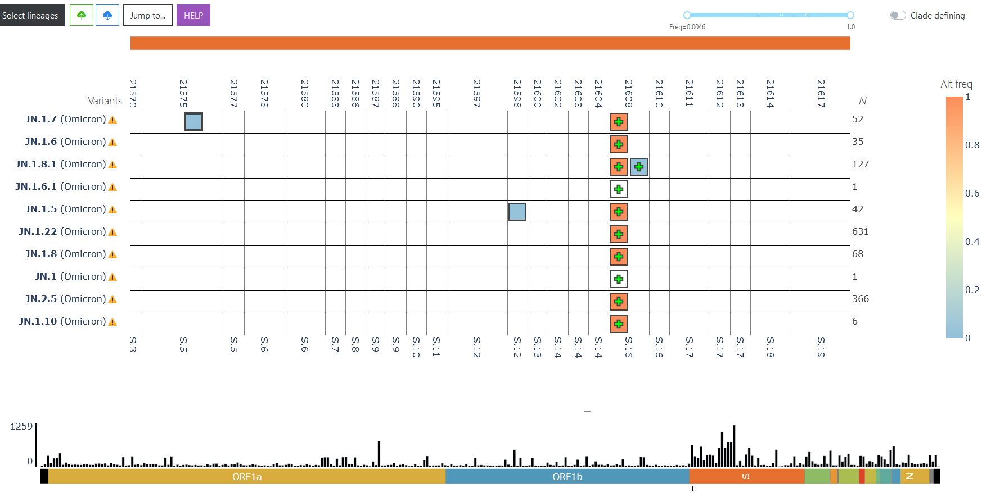

---
title: |
  {width=1lm}
subtitle: "Duotang, a genomic epidemiology analyses and mathematical modelling notebook"
author: "Pillar 6 - CAMEO, CoVaRR-Net"
output:
  html_document:
    keep_md: true
    self_contained: false
    code_folding: hide
    theme: cerulean
    toc: true
    toc_float: 
      collapsed: true
params:
 datestamp:
  label: "Datestamp"
  input: date
  format: yyyy-mm-dd
  value: "2024-09-27"
 datadir:
  label: "DataDir"
  input: text
  value: "data_needed/"
editor_options:
  chunk_output_type: console
---


```{r setup, include=FALSE, warning=FALSE}

#automatically pulls in libraries not available in conda
list.of.packages <- c("ggfree")
new.packages <- list.of.packages[!(list.of.packages %in% installed.packages()[,"Package"])]
if(length(new.packages)>0) {
  require(devtools)
  devtools::install_github("ArtPoon/ggfree")
}

list.of.packages <- c("tidyr", "knitr", "lubridate", "parallel", "ggplot2", "r2d3", "jsonlite", "tidyverse", "reshape2", "DT", "plotly", "splines", 'HelpersMG', "bbmle", "tippy")
new.packages <- list.of.packages[!(list.of.packages %in% installed.packages()[,"Package"])]
if(length(new.packages)>0) {
  install.packages(new.packages, repos = "http://cran.us.r-project.org")
}

#load libraries
library(tidyr)
library(knitr) # Needed to set root directory
library(lubridate)  # dates are awful
library(parallel)  # speed up selection plotting (#133)
library(ggplot2)  # Work-horse plotting package
library(ggfree) # used for constructing the data required for interactive phylo tree.
library(r2d3)  # used for passing data to JavaScript D3 framework
library(jsonlite) 
library(tidyverse)
library(reshape2) #used to plot case count selection plots
library(DT)
library(plotly)
library(splines)
library(grid)

theme_set(theme_classic())

# You would need to change this folder to be wherever you wanted the html file to be written.
opts_knit$set(root.dir = getwd())
```

```{r load_data, echo=FALSE}
############################
##### GLOBAL VARIABLES #####
############################

source("scripts/utils.R")
#Date of the VirusSeq release, load from params passed in during CLI command
VirusSeq_release=format(as.Date(params$datestamp),"%B %d, %Y")
Variants_Canada_over_time_Start_Date=as.Date('2020-01-01')

pangoversion="4.2 (Viral AI)" #this should probably be passed in via params

# load variant designations and colour palette from file
VOCVOI <- read.csv("resources/vocvoi.csv")

#define canadian provinces that are available and can be shown. 
all.regions = data.frame(name=c("Canada","British Columbia", "Alberta",
                                "Saskatchawan", "Manitoba", "Ontario", 
                                "Quebec", "Nova Scotia", "New Brunswick",
                                "Newfoundland and Labrador"),
                         shortname=c("Canada","BC", "AB",
                                     "SK", "MB", "ON", 
                                     "QC", "NS", "NB","NL"))

#define a color palatte for variants used throughout the RMD
pal <- VOCVOI$color
names(pal) <- VOCVOI$name
pal["other"] <- 'grey' 

## 1. LOAD processed metadata of Canadian sequences (with latest pangolin, division, and full seq IDs)
#Download metadata from VirusSeq, put the date here:
meta <- read.csv(gzfile(paste0(params$datadir, "virusseq.metadata.csv.gz")), sep="\t")
meta$province <- meta$geo_loc_name_state_province_territory
# Select only the column we want to use later
columnlist=c("fasta_header_name", "province", "host_gender", "host_age_bin",
             "sample_collection_date", "sample_collected_by", 
             "purpose_of_sampling", "purpose_of_sequencing","lineage", 
             "raw_lineage", "gisaid_accession", "isolate")
meta <- meta[ , columnlist]

### metadata cleaning 
unknown.str <- c("Undeclared", "Not Provided", "Restricted Access", "Missing", 
                 "Not Applicable","","NA","unknow")
meta <- as.data.frame(apply(meta, 2, function(x) {
  x[is.element(x, unknown.str)] <- "Unknown"
  x
}))

meta$sample_collection_date <- as.Date(meta$sample_collection_date)
meta$week <- cut(meta$sample_collection_date, 'week')
meta$month <- gsub("-..$","",as.character(cut(meta$sample_collection_date, 'month')))

#Set a starting date
#Note that the startdate shouldn't be too much before both alleles become common
#or rare migration events that die off could throw off the estimation procedure 
#(so that the parameter estimates account for the presence of those alleles long in the past).
startdate<-max(meta$sample_collection_date)-days(130) #Using a later date with less sampling noise
enddate<-params$datestamp

## parse PANGO lineages
source("scripts/scanlineages.R")


meta <- meta %>% mutate(gisaid_accession = str_replace(gisaid_accession, "EPI_ISL_", "")) %>% rename(GID=gisaid_accession)

#bandaid solution to remove XEE until i can fix the dico table
meta <- meta %>% rowwise() %>% mutate(raw_lineage = ifelse(raw_lineage == "XEE", "JN.1", raw_lineage)) %>% mutate(raw_lineage = ifelse(raw_lineage == "XEF", "JN.1", raw_lineage) )


#for the recombinant descendants that does not start with X, e.g. FD. append their full lineage path to the raw_lineage column
meta <- meta %>% rowwise() %>%
      mutate(raw_lineage = ifelse(grepl("^X", raw_lineage), 
                                   str_replace_all(paste0(realtorawlineage(substr(raw_lineage, 1,str_locate(raw_lineage, "\\.")-1)),
                                          ".",
                                          substr(raw_lineage, str_locate(raw_lineage, "\\.")+1, nchar(raw_lineage))),"[\r\n]" , ""),
                                   raw_lineage)) %>% as.data.frame()


dico <- makepangolindico() #rebuild the lineage dictionary so the correct names gets assigned for XBB descedants not named XBB
#dico[dico$surname=="XEE"]
meta$pango_group <- create.pango.group(VOCVOI, meta)
meta$pango_group <- as.factor(meta$pango_group)

fullpangotree <- makepangotree(unique(meta$raw_lineage))

latelineage_pangotree <- makepangotree(unique(
  meta$raw_lineage[
    meta$sample_collection_date > startdate
    ]
  ))

## 2. LOAD epidemiological data (PHAC)

# #from: https://health-infobase.canada.ca/covid-19/epidemiological-summary-covid-19-cases.html?stat=num&measure=total&map=pt#a2
# epidataCANall <- read.csv(paste0(params$datadir, "/CanadianEpiData.csv"))
# epidataCANall$date <- as.Date(epidataCANall$date)
# epidataCANall$prname <- gsub('_', ' ', epidataCANall$prname)
# 
# epidataCANall$previousvalue <- 0
# # #small loop to get the numtoday column from previous versions of this file from the cumulative cases
# for(row in 1:nrow(epidataCANall)) {
#   p <- epidataCANall[row, "prname"]
#   subdf <- epidataCANall[which(
#     (epidataCANall$date > epidataCANall[row, "date"] & epidataCANall$prname==p)
#     ), ]
#   if(nrow(subdf) != 0) {
#     nextrow <- which( (epidataCANall$date == min(subdf$date) & epidataCANall$prname==p))
#     epidataCANall[nextrow, "previousvalue"] <- epidataCANall[row, "totalcases"]
#   }
# }
# epidataCANall$numtoday <- epidataCANall$totalcases - epidataCANall$previousvalue

uniqueNamedLineageLast120Days <- unique(
  meta$lineage[
    meta$sample_collection_date > startdate
    ]
  )

#load the pango_lineage notes file and extracts parental data using it's alias as a separate column
lineageDescriptions <- read.table(paste0(params$datadir,"lineageNotes.tsv"), sep = "\t", header=T, as.is=TRUE, quote = "", stringsAsFactors = F, comment.char = "", fill = T) %>% 
  mutate(alias=str_extract(Description, "(?<=Alias of )(.*?)(?=(,| ))")) %>% 
  mutate(parentAlias = str_extract(alias, ".*(?=\\.)")) %>% rowwise() %>% mutate(Parent = rawtoreallineage(parentAlias)) %>%
  dplyr::select(Lineage, Parent, Description) %>% mutate(`Present in Canada Last 120 days` = ifelse(Lineage %in% uniqueNamedLineageLast120Days, length(meta$lineage[meta$lineage == Lineage & meta$sample_collection_date > startdate]), 0)) %>% mutate(`Present in Canada Last 14 days` = ifelse(Lineage %in% uniqueNamedLineageLast120Days, length(meta$lineage[meta$lineage == Lineage & meta$sample_collection_date > max(meta$sample_collection_date)-days(14)]), 0))
colnames(lineageDescriptions) <- c("Lineage", "Ancestor", "Description", "# In Canada Last 3Mo", "# In Canada Last 2wk")

#this is used to build the tooltips in current situation.
write_tsv(lineageDescriptions, "downloads/lineagesNotesAnnotated.tsv")
system("python scripts/tooltipsadd.py")

```

```{r, include=FALSE}
#hack to make plotly display plots using a for/apply() loop
#This is the "official" workaround for this lol. See:
#https://github.com/plotly/plotly.R/issues/273#issuecomment-195611009
#https://stackoverflow.com/questions/60685631/using-ggplotly-and-dt-from-a-for-loop-in-rmarkdown
htmltools::tagList(ggplotly(ggplot()))
#htmltools::tagList(DT::datatable(meta))

```

##### `r format(as.Date(params$datestamp), '%d %B, %Y')`

### Contributing authors:  

Data analysis, code, and maintenance of this notebook: Justin Jia (current), Carmen Lia Murall, Raphaël Poujol, Susanne Kraemer, Arnaud N'Guessan, Sarah Otto, Art Poon, Jesse Shapiro, Fiona Brinkman, Zohaib Anwar, and Erin Gill.
Input and direction by other members of [Pillar 6](https://covarrnet.ca/our-team/#pillar-6) and [CAMEO](https://covarrnet.ca/computational-analysis-modelling-and-evolutionary-outcomes-cameo), which include: Caroline Colijn, Jorg Fritz, Morgan Langille, Paul Gordon, Julie Hussin, Jeff Joy, and William Hsiao. 

Sequence collection, generation, release, and feedback on analyses: Canadian laboratories as part of the CPHLN and CanCOGeN are making these data publicly available and contribute feedback on analyses presented here.
A complete list of lab authors is in this repository, and more details are below in the Acknowledgement section.   

### Citation

To cite Duotang in publications, please use:

Gill E.E., et al. The Canadian VirusSeq Data Portal & Duotang: open resources for SARS-CoV-2 viral sequences and genomic epidemiology. arXiv.  	
[doi:10.48550/arXiv.2405.04734](https://arxiv.org/abs/2405.04734)

# SARS-CoV-2 In Canada

## Introduction

This notebook was built to explore Canadian SARS-CoV-2 genomic and epidemiological data with the aim of investigating viral evolution and spread. 
It is developed by the CAMEO team (Computational Analysis, Modelling and Evolutionary Outcomes Group) associated with the Coronavirus Variants Rapid Response Network (CoVaRR-Net) for sharing with collaborators, including public health labs. 
These analyses are freely available and open source, enabling code reuse by public health authorities and other researchers for their own use.

Canadian genomic and epidemiological data will be regularly pulled from various public sources (see list below) to keep these analyses up-to-date.
Only representations of aggregate data will be posted here.

## Important limitations
These analyses represent only a snapshot of SARS-CoV-2 evolution in Canada. Only some infections are detected by PCR testing, only some of those are sent for whole-genome sequencing, and not all sequences are posted to public facing reposittories.
Furthermore, sequencing volumes and priorities have changed during the pandemic, specific variants or populations might be preferentially sequenced at certain times in certain jurisdictions.
When possible, these differences in sampling strategies are mentioned but they are not always known.
With the arrival of the Omicron wave, many jurisdictions across Canada reached testing and sequencing capacity mid-late December 2021 and thus switched to targeted testing of priority groups (e.g., hospitalized patients, health care workers, and people in high-risk settings).
Currently, most jurisdictions are sequencing mainly hospitalized patients or outbreaks, with little population-level random sampling, underestimating case counts and viral diversity.

Thus, interpretation of these plots and comparisons between health regions should be made with caution, considering that the data may not be fully representative.
These analyses are subject to frequent change given new data and updated lineage designations.

**The last sample collection date is `r format(as.Date(max(meta$sample_collection_date)), '%d %B, %Y' )`**

```{r general fits for selection estimator, message = F, warning=FALSE, echo = FALSE, fig.width=5,fig.height=5, fig.show="hold", out.width="50%"}
source("scripts/plot_selection_estimator.R")
startpar2 <- list(p=0.5, s=0.02)
#individualSelectionPlotReference <- getStrictoSubLineages("EG.5.1.1", meta)
individualSelectionPlotReference <- getStrictoSubLineages("KP.3.1.1", meta)

#saveRDS(allparams, "newallparams.rds")
allparams <- mclapply(latelineage_pangotree, function(l) {
  lineagelist <- getStrictoSubLineages(l, meta)
  lapply(rev(all.regions$name), function(region) {
    if(length(intersect(individualSelectionPlotReference, lineagelist)) == 0) {
      #message(paste0(lineagelist,";",region,"\n"))
      generateAllParams(region=region, startdate=startdate, reference=individualSelectionPlotReference, mutants=lineagelist, startpar=startpar2)
    } else {
      NA
    }
  })
}, mc.cores=16)

allparams <- do.call(c, allparams)  # same structure as below
allparams <- allparams[!is.na(allparams)]
#print(Sys.time() - t0)

allparams <- allparams[order(sapply(allparams, function(p) { 
    if (is.atomic(p))
    {
      NA
    } else if (any(is.na(p$fit))){
      NA
    } else{
      (p$fit)$fit[["s1"]]
    }
    # ifelse( any(is.na(p$fit)), NA,(p$fit)$fit[["s1"]] )
  }), decreasing = TRUE)]

#debugging
# for (item in allparams){
#   if (length(item$mut) == 1 && item$region == "Ontario"){
#       if (item$mut == "KP.3.1.1"){
#       this <- (item)
#     }
#   }
# }
# 
# this$fit$fit
# 
#that <- generateAllParams(region="Canada", startdate=startdate, reference=individualSelectionPlotReference, mutants="XEC", startpar=startpar2)
# 

```

<hr style="border:1px solid gray">

# Current SARS-CoV-2 situation

```{r, currensituation, echo=FALSE,  warning=FALSE, message=FALSE, results="asis"}
md_file <- readLines("currentsituation.md")
cat(md_file, sep = "\n")
```

```{r rtt, child="Tooltip.Rmd"}
```

We thank the global team of those monitoring variants (such as those posting issues here: https://github.com/cov-lineages/pango-designation/issues), and other SARS-CoV-2 genome analysis tool providers (see [List of Useful Tools below](#Appendix)), which play a key role in identifying new variants of note.

# Sublineages in Canada 

There are `r length(uniqueNamedLineageLast120Days)` unique named variants currently circulating in Canada since `r startdate` (last 120 days). Please see [Pango lineage table](#lineages) for number of sequences per lineage present.

## {.tabset .tabset-fade .unlisted .unnumbered .toc-ignore}

Below is an interactive visualization showing frequencies of ciruclating lineages, sub-divided by major sub-lineages, currently circulating in Canada. A table of lineage frequencies can be downloaded by clicking on the (Frequency Table Download) button. 

Tips: Click and drag to zoom, double click to reset. Clicking on an item in the legend will hide it, double clicking an item in legend will hide everything else but that item.

```{r, figures-side, echo=FALSE,  warning=FALSE,out.width="100%", out.height=800, results='asis'}

source("scripts/subtype_plotter.R")
sublineagestoplot = data.frame(name=c("B*", "BA.1*","BA.2*",
                                      "BA.4*","BA.5*","B*"),
                               tabname=c("Last 120 days", "BA.1","BA.2",
                                         "BA.4","BA.5","Recombinants"),
                               mindate=c(as.character(startdate),"","","","",""),
                               maxdate=c("","","","","",""),
                               exclude_previously_plotted=c(F, FALSE,FALSE,FALSE,F,F),
                               nonRecombinantOnly=c(F, T,T,T, T,F),
                               recombinantsOnly=c(F, F,F,F, F,T))

plotted=c()
frequencyTable <- data.frame()
for (i in 1:nrow(sublineagestoplot)) {
  mindate=NA
  maxdate=NA
  if(sublineagestoplot[[i,"mindate"]]!=""){
    mindate=as.Date(sublineagestoplot[[i,"mindate"]])
  }
  if(sublineagestoplot[[i,"maxdate"]]!=""){
    maxdate=as.Date(sublineagestoplot[[i,"maxdate"]])
  }
  set=getStrictoSubLineages(sublineagestoplot[[i,"name"]],meta, 
                            nonRecombinantOnly=sublineagestoplot[[i,"nonRecombinantOnly"]], 
                            recombinantsOnly = sublineagestoplot[[i,"recombinantsOnly"]])
  if(sublineagestoplot[[i,"exclude_previously_plotted"]]){
    set=set[!set %in% plotted]
  }
  if (i == 1){ #set the maximum number of lineages to show in legend. non-interactive plots can only accomodate 12.
    maxLegendCount = 25
  } else{
    maxLegendCount = 12
  }
  subVariantData=plot.subvariants.ggplot(sublineage=set,mindate=mindate,maxdate=maxdate, max = maxLegendCount)
  
  #outputs the text/plots into RMD
  cat("###", sublineagestoplot[[i,"tabname"]], " {.unlisted .unnumbered}\n")
  cat("####", sublineagestoplot[[i,"tabname"]],"sublineages ")
  if (!is.na(mindate)){cat(" starting from",sublineagestoplot[[i,"mindate"]])}
  if (!is.na(maxdate)){cat(" until",sublineagestoplot[[i,"maxdate"]])}
  cat(" ")
  cat("[ (Frequency Table Download)](", DisplayHTMLTableDownloadLink(subVariantData$data %>% dplyr::select(Date, Lineage, Frequency, `% Frequency`),sublineagestoplot[[i,"tabname"]]),")")

  cat("\n\n")
  # ay <- list(
  # tickfont = list(size=11.7),
  # titlefont=list(size=14.6),
  # overlaying = "y",
  # nticks = 5,
  # side = "right",
  # title = "Second y axis"
  # )
  
  if (i==1){
      print(htmltools::tagList(ggplotly(subVariantData$absolute, height = 400)))
  #%>% add_lines(x=~Date, y=~`TotalCases(*10e2)`, colors="grey", yaxis="y2", data=subVariantData$data, showlegend=F, inherit=F) %>% layout(yaxis2=ay)))
      print(htmltools::tagList(ggplotly(subVariantData$relative, height = 400)))
  } else{
    print(subVariantData$absolute)
     cat("\n")
    print(subVariantData$relative)
  }

  cat("\n\n")
  
  if (nrow(frequencyTable) == 0){
      frequencyTable <- subVariantData$data %>% dplyr::select(Date, Lineage, Frequency,`% Frequency`)
  }else{
    frequencyTable <- rbind(frequencyTable, (subVariantData$data %>% dplyr::select(Date, Lineage, Frequency,`% Frequency`)) )
  }
  
  #cat("\n**Lineage frequencies table for the above chart:**\n\n")
  #printing the datatable here works but for some reason the download buttons gets dropped and search dont work properly. 
  #To get it working, we need to print a table of everything after this loop. see below
  #print(htmltools::tagList(DisplayHTMLTable(subVariantData$data %>% dplyr::select(Date, Lineage, Frequency, `% Frequency`), width="100%")))

  plotted <<- unique(c(plotted,set))
  
  cat ("\n\n")
}

```

### {-}

```{r, echo=FALSE, warning=FALSE, fig.width=5, fig.height=5, out.width="50%",results='asis'}
#DO NOT DELETE THESE 3 LINES
#If you dont display this table after the for loop, the tables printed out via the above loop are missing features.
#something to do with the required javascript library not being loaded properly. See the "official workaround" section above.
# cat("###", "Frequency Table", "\n")
# cat("####", "Frequency Table")
# DisplayHTMLTable(frequencyTable)
```

<hr style="border:1px solid gray">

```{r selection, , echo=FALSE, child="selection.Rmd"}
```

<hr style="border:1px solid gray">

# VIRUS-MVP: Mutational composition of Omicron

<!-- <iframe src="https://virusmvp.org/covid-mvp/" height="500" width="100%" align="left" style="border:none;" title="covidmvp-iframe"></iframe>  -->
The image below is a screenshot from VIRUS-MVP showing a snapshot of the mutations from lineages actively circulating in Canada. Please click on the link to scan the entire genome and examine the functional impact of the mutations. More details, click on the image below or see https://virusmvp.org/covid-mvp.

<a href="https://virusmvp.org/covid-mvp" target="_blank">
   
</a>


<hr style="border:1px solid gray">

# Variants in Canada over time

This plot shows the changing composition of sequences for all Canadian data posted to the VirusSeq Portal according to Pango lineage designation, up to `r format(as.Date(max(meta$sample_collection_date)), '%d %B, %Y' )`.
Because sampling and sequencing procedures vary by region and time, this does not necessarily reflect the true composition of SARS-CoV-2 viruses in Canada over time. 

```{r example_summaries, echo = FALSE, out.height="580px"}
# focus on emergence of VoCs in Canada

meta1 <- meta[as.Date(meta$week) > Variants_Canada_over_time_Start_Date, ]
meta1$week <- as.factor(as.character(meta1$week))

dat <- lapply(unique(meta1$province), function(x) {
  as.data.frame.matrix(table(meta1$week[meta1$province==x],
                             meta1$pango_group[meta1$province==x]))
})
names(dat) <- unique(meta1$province)

dat[['Canada']] <- as.data.frame.matrix(table(meta1$week, meta1$pango_group))

# pass colour legend to JavaScript layer
dat[['legend']] <- as.list(VOCVOI$color)
names(dat[['legend']]) <- VOCVOI$name
dat[['legend']]$other <- 'grey'

r2d3(data=toJSON(dat), script="js/barplot.js", container="div",
     elementId="barplot-element")
rm(dat)
rm(meta1)
```

<hr style="border:1px solid gray">

# Canadian trees {.tabset .tabset-fade}  

```{r trees, child="trees.Rmd"}
#The trees make up about 20MB in the HTML file
```


<hr style="border:1px solid gray">


# Root-to-tip analyses  

```{r rtt, child="rtt.Rmd"}
```

<hr style="border:1px solid gray">

# Lineages

Here we present a searchable table that provides a short description of each PANGO lineage, it's immediate ancestor, and the number of sequences in the last 120days.

```{r function for displaying lineage informaiton, echo=FALSE, warning=FALSE, message=FALSE}
#show the table as paged and column searchable.
DisplayHTMLTable(lineageDescriptions)
#cat (paste0("[Please click here to download data](",DisplayHTMLTableDownloadLink(lineageDescriptions, "LineageDescriptions"),")\n\n"))
cat ("\n\n")

```

# Appendix {#appendix}

## Future development

We are in the process of adding or would like to develop code for some of the following analyses:   

* dN/dS (by variant and by gene/domains)  
* Tajima's D over time  
* clustering analyses
* genomically inferred epidemiological parameters: R0, serial interval, etc.

With anonymized data on vaccination status, severity/outcome, reason for sequencing (*e.g.*, outbreak, hospitalization, or general sampling), and setting (workplace, school, daycare, LTC, health institution, other), we could analyze genomic characteristics of the virus relative to the epidemiological and immunological conditions in which it is spreading and evolving.
Studies on mutational correlations to superspreading events, vaccination status, or comparisons between variants would allow us to better understand transmission and evolution in these environments.   

## List of useful tools

A selection of bioinformatics, phylogenetic, and modelling tools that are useful for SARS-CoV-2 analyses:

* [UShER](https://usher-wiki.readthedocs.io/en/latest/UShER.html): Ultrafast Sample placement on Existing tRee - for placing a small-ish dataset into the global GISAID phylogenetic tree.
* List of (mostly) [modelling tools by CANMOD](https://canmod.net/tools), includes [RECON](https://github.com/reconhub), an outbreak tools for both modelling and genomic epidemiology
* [The Epi Graph Network](https://thegraphnetwork.training/): training platform. Programming tools for health data analysis, African/European network of researchers and WHO Afro.
* [Pokay tool](https://github.com/nodrogluap/pokay) for checking and reporitng mismatches
* [IRIDA Canada's ID analysis platform](https://github.com/pvanheus/irida) for genomic epidemiology
* [cov-lineages](https://cov-lineages.org/lineage_list.html): summaries of Pango lineages
* [CoVizu](https://github.com/PoonLab/covizu/): analysis and visualization of the global diversity of SARS-CoV-2 genomes in real time
* [VIRUS-MVP](https://virusmvp.org/covid-mvp/): mutation tracker and visualization in real-time from Centre for Infectious Disease Genomics and One Health (CIDGOH)
* [Outbreak Info](https://outbreak.info/situation-reports): SARS-CoV-2 data explorer: lineage comparison, mutation tracker, etc
* Mike Honey’s [SARS-CoV-2 genomes DataViz Projects](https://github.com/Mike-Honey/sars-cov-2-genomes)
* [Raj Rajnarayanan's data "vizzes"](https://public.tableau.com/app/profile/raj.rajnarayanan/vizzes)
* [SMDP: SARS-CoV-2 Mutation Distribution Profiler](https://eringill.shinyapps.io/covid_mutation_distributions/)

We look for additional combinations of mutations identified through mutation scanning that are involved in binding or immune evasion. See for example:

* Greaney, Starr, & Bloom, Virus Evolution, 8:veac021 (2022)
* Cao et al, Nature, 614:521-529 (2023)
* Yisimayi et al, bioRxiv, DOI 10.1101/2023.05.01.538516 (2023)
* Dadonaite et al, bioRxiv, DOI 10.1101/2023.11.13.566961 (2023)
* Bdeir et al, medRxiv, DOI 10.1101/2024.01.03.23300575 (2024)


## Methodology {.tabset .tabset-fade} 

Genome data and metadata are sourced from the [Canadian VirusSeq Data Portal](https://virusseq-dataportal.ca/).
Pango lineage assignments are generated using the [pangoLEARN](https://github.com/cov-lineages/pangoLEARN) algorithm.
Source code for generating this RMarkdown notebook can be found in [https://github.com/CoVaRR-NET/duotang].

### Trees
#### Phylogenetic trees
Canadian genomes were obtained from the VirusSeq data on the `r VirusSeq_release` and down-sampled to two genomes per lineage, province and month before October 2021, and five genomes per lineage, province and month after October 2021 (about 10,000 genomes in total).
We used a Python wrapper of [minimap2](https://github.com/lh3/minimap2) (version 2.17) to generate multiple sequence alignments for these genome samples.
A maximum likelihood (ML) tree was reconstructed from each alignment using the COVID-19 release of [IQ-TREE](http://www.iqtree.org/) (version 2.2.0).
Outliers were identified in by root-to-tip regression using the R package [ape](https://cran.r-project.org/web/packages/ape/) and removed from the dataset.
[TreeTime](https://github.com/neherlab/treetime) was used to reconstruct a time-scaled tree under a strict molecular clock model.
The resulting trees were converted into interactive plots with [ggfree](https://github.com/ArtPoon/ggfree) and [r2d3](https://rstudio.github.io/r2d3/).

### Selection
#### Selection Coefficents
To estimate selection, we used standard likelihood techniques.
In brief, sublineages of interest were prespecified (e.g., JN.1) and counts by day tracked over time.
If selection were constant over time, the frequency of sub-type $i$ at time $t$ would be expected to rise according to $$p_i(t) = \frac{p_i(0) \exp(s_i t)}{\sum_j p_j(0) \exp(s_j t)},$$ where $s_i$ is the selection coefficient favouring sub-type $i$.
A selection coefficient of $s_i=0.1$ implies that sub-type $i$ is expected to rise from 10% to 90% frequency in 44 days (in $4.4./s_i$ days for other values of $s_i$).

At any given time $t$, the probability of observing $n_i$ sequences of sublineage $i$ is multinomially distributed, given the total number of sequences from that day and the frequency of each $p_i(t)$.
Consequently, the likelihood of seeing the observed sequence data over all times $t$ and over all sublineages $j$ is proportional to $$L = \prod_t \prod_j  p_i(t)^{n_i(t)}.$$

The [BBMLE](https://cran.r-project.org/web/packages/bbmle/bbmle.pdf) package in R was used to maximize the likelihood of the observed data (using the default optimization method, optim).
For each selection coefficient, 95% confidence intervals were obtained by profile likelihood (using uniroot). 

Graphs illustrating the rise in frequency of a variant over time are shown (left panels), with the area of each dot proportional to the number of sequences.
95% confidence bands were obtained by randomly drawing 10,000 sets of parameters ($p_i$ and $s_i$ for each sub-type) using `RandomFromHessianOrMCMC`, assuming a multi-normal distribution around the maximum likelihood point (estimated from the Hessian matrix, [Pawitan 2001](https://books.google.ca/books?hl=en&lr=&id=WHsSDAAAQBAJ&oi=fnd&pg=PP1&dq=Pawitan+2001+likelihood&ots=v9sM5DuFrf&sig=vnRb--i2zu0jox_KnBSVxtG2aPg#v=onepage&q=Pawitan%202001%20likelihood&f=false)).
At each point in time, the 2.5%-97.5% range of values for $p_i(t)$ are then shown in the confidence bands.

Logit plots (right panels) show $$ln(\frac{p_i(t)}{p_{ref}(t)})$$ relative to a given reference genotype (here BA.1), which gives a line whose slope is the strength of selection $s_i$.
Changes in slope indicate changes in selection on a variant (*e.g.*, see [Otto et al.](https://mast.queensu.ca/~tday/pdf/Otto2021.pdf)).

These estimates of selection ignore heterogeneity within provinces and may be biased by the arrival of travel-related cases while frequencies are very low.
Sampling strategies that oversample clustered cases (*e.g.*, sequencing outbreaks) will introduce additional variation beyond the multinomial expectation, but these should lead to one-time shifts in frequency rather than trends over time.
Provinces with sampling strategies that are variant specific are removed, unless explicit information about the variant frequencies is available.

#### Detection trends by variant 

As of 13 July 2024, the number of detected cases for all provinces are obtained from the “Respiratory virus detection data” (PHAC; [link](https://health-infobase.canada.ca/respiratory-virus-detections/)), multiplying the number of SARS-CoV-2 tests times the fraction that are positive. These reported counts are then normalized to cases per 100,000 individual based off of Statistics Canada's population estimates for each province or the total population of Canada. We then remove the last 1 data point as those data continue to be gathered and are likely underestimated. This normalized cases over time ($n$) is then log transformed and fitted to a smooth spline with a lambda value of 0.001 using the R stats' smooth.spline() function. A list of smoothed detection counts ($n(t)$), where each element correspond to a count on a particular date $t$, is then obtained from this fitting function by reversing the log transformation.

The previously discussed methods allow us to estimate the proportion of a lineage over time (see equation for $p_i(t)$ above). This produces a list of proportions for each lineage of interest, where each element correspond to a lineage proportion on a particular date, $t$. By multiplying the list from detection counts to this lineage frequency list at all time points, we can estimate the inferred number of reported cases that are due to a specific lineage at each time point as $$n_i(t) = p_i(t) \; n(t).$$

Finally, once the inferred detection counts ($n_i(t)$) of each lineages are calculated, we take the last two days of data from the smooth spline times lineage frequency curve to get $n_i(t)$ and $n_i(t-1)$, from which the growth rate of that lineage ($r_i$) is estimated as $$r_i = ln\left( \frac{n_i(t)}{n_i(t-1)} \right).$$

Because genomics data often lag detection count data, the last date of reliable detection count data may be closer to the present than the last date of genomics data. In these cases, the evolutionary model for $p_i(t)$ is projected forward in time and shown as a ligher shaded area under the curve within the plot).

#### Rates
##### Root-to-tip estimates of substitution rate
Substitution rates were obtained from the maximum likelihood tree made using [IQ-TREE](http://www.iqtree.org/) and a [root-to-tip regression](https://search.r-project.org/CRAN/refmans/ape/html/rtt.html) conducted, without forcing the intercept to zero (similar results were seen when forcing the intercept). Up to 10000 samples for non-XBB lineages and all samples for XBB lineages are used to construct this tree. For the estimation of each VOI's substitution rates over time, all sequences of that VOI present in the tree are used. While this ignores pseudo-replication among the samples due to relatedness, the estimated slope is robust given the large sample sizes. Furthermore, we calculated SE bars from three different independent samples to reduce the influence of closely related viral samples. The global rate estimate was obtained by a regression over time of all the sequences present in the tree, as illustrated in the root-to-tip plot, ignoring variants classification.


## Data notes by province {.tabset .tabset-fade}

All analyses draw on the most recent publicly available viral sequence data on ViralSeq and should be interpreted with caution due to lags in reporting and sequencing priorities that can differ across provinces or territories. Note that the NCCID provides a timeline of Canadian events related to each variant: https://nccid.ca/covid-19-variants/. 

As of 13 July 2024, the number of detected cases is obtained from the “Respiratory virus detection data” (PHAC; [link](https://health-infobase.canada.ca/respiratory-virus-detections/)).


## Historical notes

From the beginning of the pandemic to the fall of 2021, Canadian sequences were mostly of the wildtype lineages (pre-VOCs).
By the beginning of summer 2021, the VOCs Alpha and Gamma were the most sequenced lineages overall in Canada.
The Delta wave grew during the summer of 2021 with sublineages AY.25 and AY.27 constituting sizeable proportions of this wave. Omicron arrived in November of 2021 and spread in three main waves, first BA.1* (early 2022), then BA.2* (spring 2022), then BA.5* (summer 2022). Current, multiple sublineages of Omicron persist, with emerging sublineages spreading, such as BQ.1.1 (a BA.5 sub-lineage).

There are two Pango lineages that have a Canadian origin and that predominately spread within Canada (with some exportations internationally): B.1.438.1 and B.1.1.176. Other lineages of historical interest in Canada:  

* A.2.5.2 - an A lineage (clade 19B) that spread in Quebec, involved in several outbreaks before Delta arrived  (see this post for more details: https://virological.org/t/recent-evolution-and-international-transmission-of-sars-cov-2-clade-19b-pango-a-lineages/711)
* B.1.2 - a USA lineage that spread well in Canada  
* B.1.160 - an European lineages that spread well in Canada  

This historical analysis is not being further updated, as we focus on more interactive data plots and the “Current situation” text above.

## Previous Versions

[Here we store old versions of the Duotang notebook](https://covarr-net.github.io/duotang/archive/)

<!-- ## [Duotang Sandbox!](https://covarr-net.github.io/duotang/duotang-sandbox.html) -->

## Session info {.tabset .tabset-fade}
The version numbers of all packages in the current environment as well as information about the R install is reported below. 


### Hide

### Show

```{r session_info}
sessionInfo()
```

# [Duotang-GSD](https://covarr-net.github.io/duotang/duotangGSD.html)

[Link to Duotang-GSD](https://covarr-net.github.io/duotang/duotangGSD.html)

# Acknowledgements

We thank all the authors, developers, and contributors to the VirusSeq database for making their SARS-CoV-2 sequences publicly available. We especially thank the Canadian Public Health Laboratory Network, academic sequencing partners, diagnostic hospital labs, and other sequencing partners for the provision of the Canadian sequence data used in this work. Genome sequencing in Canada was supported by a Genome Canada grant to the Canadian COVID-19 Genomic Network (CanCOGeN).

We gratefully acknowledge all the Authors, the Originating laboratories responsible for obtaining the specimens, and the Submitting laboratories for generating the genetic sequence and metadata and sharing via the VirusSeq database, on which this research is based.

* The Canadian VirusSeq Data Portal (https://virusseq-dataportal.ca) 
We wish to acknowledge the following organisations/laboratories for contributing data to the Portal: Canadian Public Health Laboratory Network (CPHLN), CanCOGGeN VirusSeq, Saskatchewan - Roy Romanow Provincial Laboratory (RRPL), Nova Scotia Health Authority, Alberta Precision Labs (APL), Queen's University / Kingston Health Sciences Centre, National Microbiology Laboratory (NML), Institut National de Sante Publique du Quebec (INSPQ), BCCDC Public Health Laboratory, Public Health Ontario (PHO), Newfoundland and Labrador - Eastern Health, Unity Health Toronto, Ontario Institute for Cancer Research (OICR), Provincial Public Health Laboratory Network of Nova Scotia, Centre Hospitalier Universitaire Georges L. Dumont - New Brunswick, and Manitoba Cadham Provincial Laboratory. Please see the complete list of laboratories included in this repository. 

* Public Health Agency of Canada (PHAC) / National Microbiology Laboratory (NML) - (https://health-infobase.canada.ca/covid-19/epidemiological-summary-covid-19-cases.html)

* Various provincial public health websites (e.g. INSPQ https://www.inspq.qc.ca/covid-19/donnees/)

* Canadian Institutes of Health Research (CIHR) - Coronavirus Variants Rapid Response Network (CoVaRR-Net;https://covarrnet.ca/)

