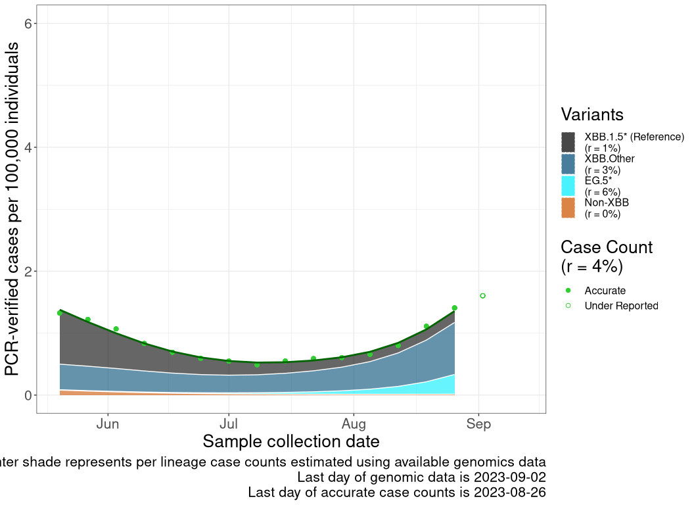
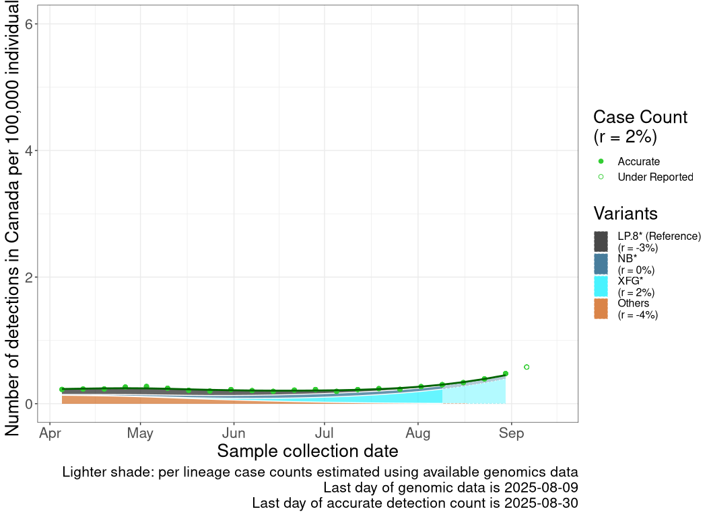
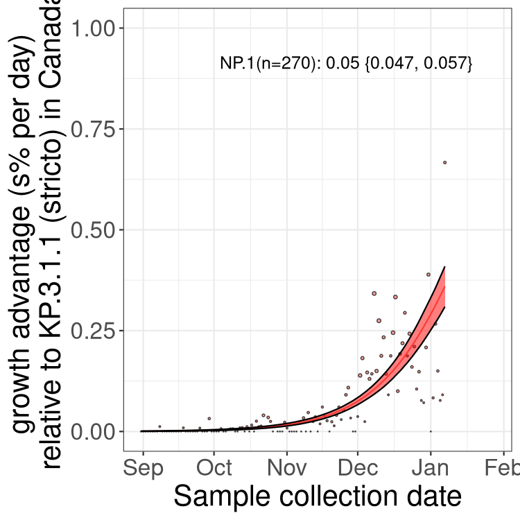

---
title: |
  {width=1lm}  
subtitle: "Genomic epidemiology analyses and mathematical modelling notebook"
author: "Pillar 6"
date: 'May 15, 2022'
output:
  html_document:
    keep_md: true
    code_folding: hide
    theme: cerulean
    toc: true
    toc_float: true
---


### Contributing authors:  

Data analysis, code, and maintenance of this notebook: Carmen Lia Murall, Raphaël Poujol, Susanne Kraemer, Arnaud N'Guessan, Sarah Otto, Art Poon, Jesse Shapiro.
Input and direction by other members of Pillar 6 (https://covarrnet.ca/our-team/#pillar-6 ), which include: Fiona Brinkman, Caroline Colijn, Jorg Fritz, Morgan Langille, Paul Gordon, Julie Hussin, Jeff Joy, William Hsiao, and Erin Gill. 

Sequence collection, generation, release, and feedback on analyses: Canadian laboratories as part of the CPHLN and CanCOGeN are making these data publicly available and contribute feedback on analyses presented here.
A complete list of lab authors is in this repository, and more details are below in the Acknowledgement section.   


# Introduction  

This notebook is built to explore Canadian SARS-CoV-2 genomic and epidemiological data with the aim of investigating viral evolution and spread.
It is for discussion with pillar 6's team and for sharing with collaborators, e.g. PH labs.
These analyses can spur further research within or across pillars, be used for reports (or data dashboards), support discussions with the science communication pillar for public dissemination, and enable code reuse by public health authorities/laboratories for their internal use.

Canadian genomic and epidemiological data will be regularly pulled from various public sources (see list below) to keep these analyses up-to-date.
Only representations of aggregate data will be posted here.

**Important caveats and disclaimers:**  
These analyses represent only a snapshot of SARS-CoV-2 evolution in Canada. Only some infections are detected by PCR testing, only some of those are sent for whole-genome sequencing, and not all sequences are posted to public facing repositories.
Sequencing volumes and priorities have changed during the pandemic, and the sequencing strategy is typically a combination of prioritizing outbreaks, travellers, public health investigations, and random sampling for genomic surveillance.

For example, specific variants or populations might be preferentially sequenced at certain times in certain jurisdictions.
When possible, these differences in sampling strategies are mentioned but they are not always known.
With the arrival of the Omicron wave, many jurisdictions across Canada reached testing and sequencing capacity mid-late December 2021 and thus switched to targeted testing of priority groups (e.g., hospitalized patients, health care workers, and people in high-risk settings).
Therefore, from this time onward, case counts are likely underestimated and the sequenced virus diversity is not necessarily representative of the virus circulating in the overall population. 

Thus, interpretation of these plots and comparisons between health regions should be made with caution, considering that the data may not be fully representative.
These analyses are subject to change given new data and updated lineage designations.


```r
## 1. LOAD processed metadata of Canadian sequences (with latest pangolin, division, and full seq IDs)
#Download metadata from VirusSeq, put the date here:

VirusSeq_date="2022-04-28"
pangoversion="4.0.6 (Viral AI)"


# this can be made more compact for faster loading
meta <- read.csv(gzfile("data_needed/virusseq.metadata.csv.gz"))

# amend our PANGO lineage classifications with those from ViralAI
#vai <- read.csv("data_needed/viralai.csv")
#idx <- match(meta$isolate, vai$isolate)
# all(meta$isolate == vai$isolate[idx], na.rm=T)
#meta$lineage <- vai$lineage[idx]
#write.csv(meta, "data_needed/virusseq.metadata.csv", row.names=F)

meta$sample.collection.date <- as.Date(meta$sample.collection.date)
meta$province <- meta$geo_loc_name..state.province.territory.


# restore pangolearn calls overriden by scorpio - issue #46
#plearn <- gsub(".+assignment ([A-Z]+\\.[0-9.]*).*", "\\1",
#               meta$note[meta$lineage=="None"])
#plearn[which(grepl("_", plearn))] <- "None"
#meta$lineage[meta$lineage=="None"] <- plearn

#make a pango.group column
VOCVOI <- data.frame(
  name=c('Alpha', 'Beta', 'Gamma', 'Delta', 'Delta AY.25', 'Delta AY.27', 
         'Lambda', 'Omicron BA.1', 'Omicron BA.1.1', 'Omicron BA.2', 'Mu',
         'A.23.1', 'B.1.438.1'),
  pattern=c('^B\\.1\\.1\\.7|^Q\\.', '^B\\.1\\.351', '^P\\.', 
            '^B\\.1\\.617|^(?!AY\\.2[57])AY\\.', '^AY\\.25', '^AY\\.27', 
            '^C\\.37|^C\\.37\\.1',
            '^B\\.1\\.1\\.529|^BA\\.1$|^BA\\.1\\.[1-9][0-9]|BA\\.1\\.[2-9]$', 
            '^BA\\.1\\.1$|^BA\\.1\\.1\\.[0-9]+$', 
            '^BA\\.2', 
            '^B\\.1\\.621', 
            '^A\\.23\\.1', '^B\\.1\\.438\\.1'),
  color=c('#B29C71', '#F08C3A', '#444444', '#A6CEE3', '#61A6A0',
          '#438FC0', '#CD950C', '#8B0000', '#FA8072', '#FF0000',
          '#BB4513', '#9AD378', '#3EA534')
)
variants <- sapply(VOCVOI$pattern, function(p) 
  grepl(p, meta$lineage, perl=T))

# verify that every row matches either 0 or 1 patterns
# table(apply(variants, 1, sum))

meta$pango.group <- 'other'
meta$pango.group[apply(variants, 1, sum)==1] <- VOCVOI$name[unlist(apply(variants, 1, which))]
meta$pango.group <- as.factor(meta$pango.group)

pal <- VOCVOI$color
names(pal) <- VOCVOI$name
pal["other"] <- 'grey'  # named character vector

## 2. LOAD epidemiological data (PHAC)


#from: https://health-infobase.canada.ca/covid-19/epidemiological-summary-covid-19-cases.html?stat=num&measure=total&map=pt#a2
epidataCANall <- read.csv(url("https://health-infobase.canada.ca/src/data/covidLive/covid19-download.csv"))
epidataCANall$date <- as.Date(epidataCANall$date)
epidataCANall$prname <- gsub('_', ' ', epidataCANall$prname)
epidate <- tail(epidataCANall,1)$date #download date

# for barplots
meta$week <- cut(meta$sample.collection.date, 'week')
```


# SARS-CoV-2 in Canada

## Variants in Canada over time


```r
# focus on emergence of VoCs in Canada
meta1 <- meta[as.Date(meta$week) > as.Date('2020-11-01'), ]
meta1$week <- as.factor(as.character(meta1$week))

dat <- lapply(unique(meta1$province), function(x) {
  as.data.frame.matrix(table(meta1$week[meta1$province==x],
                             meta1$pango.group[meta1$province==x]))
})
names(dat) <- unique(meta1$province)

tab <- as.data.frame.matrix(table(meta1$week, meta1$pango.group))
dat[['Canada']] <- tab

r2d3(data=toJSON(dat), script="js/barplot.js", container="div",
     elementId="barplot-element")
```

```{=html}
<div id="barplot-element" style="width:672px;height:580px;" class="r2d3 html-widget"></div>
<script type="application/json" data-for="barplot-element">{"x":{"data":{"Alberta":[{"A.23.1":0,"Alpha":0,"B.1.438.1":0,"Beta":0,"Delta":0,"Delta AY.25":0,"Delta AY.27":0,"Gamma":0,"Lambda":0,"Mu":0,"Omicron BA.1":0,"Omicron BA.1.1":0,"Omicron BA.2":0,"other":6,"_row":"2020-11-02"},{"A.23.1":0,"Alpha":0,"B.1.438.1":0,"Beta":0,"Delta":0,"Delta AY.25":0,"Delta AY.27":0,"Gamma":0,"Lambda":0,"Mu":0,"Omicron BA.1":0,"Omicron BA.1.1":0,"Omicron BA.2":0,"other":4,"_row":"2020-11-09"},{"A.23.1":0,"Alpha":0,"B.1.438.1":5,"Beta":0,"Delta":0,"Delta AY.25":0,"Delta AY.27":0,"Gamma":0,"Lambda":0,"Mu":0,"Omicron BA.1":0,"Omicron BA.1.1":0,"Omicron BA.2":0,"other":37,"_row":"2020-11-16"},{"A.23.1":0,"Alpha":0,"B.1.438.1":7,"Beta":0,"Delta":0,"Delta AY.25":0,"Delta AY.27":0,"Gamma":0,"Lambda":0,"Mu":0,"Omicron BA.1":0,"Omicron BA.1.1":0,"Omicron BA.2":0,"other":31,"_row":"2020-11-23"},{"A.23.1":1,"Alpha":0,"B.1.438.1":2,"Beta":0,"Delta":0,"Delta AY.25":0,"Delta AY.27":0,"Gamma":0,"Lambda":0,"Mu":0,"Omicron BA.1":0,"Omicron BA.1.1":0,"Omicron BA.2":0,"other":29,"_row":"2020-11-30"},{"A.23.1":0,"Alpha":1,"B.1.438.1":12,"Beta":0,"Delta":0,"Delta AY.25":0,"Delta AY.27":0,"Gamma":0,"Lambda":0,"Mu":0,"Omicron BA.1":0,"Omicron BA.1.1":0,"Omicron BA.2":0,"other":23,"_row":"2020-12-07"},{"A.23.1":1,"Alpha":1,"B.1.438.1":44,"Beta":0,"Delta":0,"Delta AY.25":0,"Delta AY.27":0,"Gamma":0,"Lambda":0,"Mu":0,"Omicron BA.1":0,"Omicron BA.1.1":0,"Omicron BA.2":0,"other":32,"_row":"2020-12-14"},{"A.23.1":3,"Alpha":0,"B.1.438.1":50,"Beta":0,"Delta":0,"Delta AY.25":0,"Delta AY.27":0,"Gamma":0,"Lambda":0,"Mu":0,"Omicron BA.1":0,"Omicron BA.1.1":0,"Omicron BA.2":0,"other":32,"_row":"2020-12-21"},{"A.23.1":9,"Alpha":2,"B.1.438.1":62,"Beta":0,"Delta":0,"Delta AY.25":0,"Delta AY.27":0,"Gamma":0,"Lambda":0,"Mu":0,"Omicron BA.1":0,"Omicron BA.1.1":0,"Omicron BA.2":0,"other":46,"_row":"2020-12-28"},{"A.23.1":19,"Alpha":7,"B.1.438.1":102,"Beta":0,"Delta":0,"Delta AY.25":0,"Delta AY.27":0,"Gamma":0,"Lambda":0,"Mu":0,"Omicron BA.1":0,"Omicron BA.1.1":0,"Omicron BA.2":0,"other":113,"_row":"2021-01-04"},{"A.23.1":33,"Alpha":8,"B.1.438.1":159,"Beta":4,"Delta":0,"Delta AY.25":0,"Delta AY.27":0,"Gamma":0,"Lambda":0,"Mu":0,"Omicron BA.1":0,"Omicron BA.1.1":0,"Omicron BA.2":0,"other":167,"_row":"2021-01-11"},{"A.23.1":14,"Alpha":2,"B.1.438.1":104,"Beta":0,"Delta":0,"Delta AY.25":0,"Delta AY.27":0,"Gamma":0,"Lambda":0,"Mu":0,"Omicron BA.1":0,"Omicron BA.1.1":0,"Omicron BA.2":0,"other":96,"_row":"2021-01-18"},{"A.23.1":9,"Alpha":10,"B.1.438.1":93,"Beta":0,"Delta":0,"Delta AY.25":0,"Delta AY.27":0,"Gamma":0,"Lambda":0,"Mu":0,"Omicron BA.1":0,"Omicron BA.1.1":0,"Omicron BA.2":0,"other":63,"_row":"2021-01-25"},{"A.23.1":11,"Alpha":19,"B.1.438.1":82,"Beta":1,"Delta":0,"Delta AY.25":0,"Delta AY.27":0,"Gamma":0,"Lambda":0,"Mu":0,"Omicron BA.1":0,"Omicron BA.1.1":0,"Omicron BA.2":0,"other":76,"_row":"2021-02-01"},{"A.23.1":29,"Alpha":35,"B.1.438.1":240,"Beta":0,"Delta":0,"Delta AY.25":0,"Delta AY.27":0,"Gamma":0,"Lambda":0,"Mu":0,"Omicron BA.1":0,"Omicron BA.1.1":0,"Omicron BA.2":0,"other":189,"_row":"2021-02-08"},{"A.23.1":26,"Alpha":58,"B.1.438.1":223,"Beta":0,"Delta":0,"Delta AY.25":0,"Delta AY.27":0,"Gamma":0,"Lambda":0,"Mu":0,"Omicron BA.1":0,"Omicron BA.1.1":0,"Omicron BA.2":0,"other":197,"_row":"2021-02-15"},{"A.23.1":28,"Alpha":147,"B.1.438.1":311,"Beta":3,"Delta":0,"Delta AY.25":0,"Delta AY.27":0,"Gamma":0,"Lambda":1,"Mu":0,"Omicron BA.1":0,"Omicron BA.1.1":0,"Omicron BA.2":0,"other":230,"_row":"2021-02-22"},{"A.23.1":21,"Alpha":179,"B.1.438.1":364,"Beta":5,"Delta":0,"Delta AY.25":0,"Delta AY.27":0,"Gamma":2,"Lambda":0,"Mu":0,"Omicron BA.1":0,"Omicron BA.1.1":0,"Omicron BA.2":0,"other":279,"_row":"2021-03-01"},{"A.23.1":26,"Alpha":150,"B.1.438.1":491,"Beta":2,"Delta":0,"Delta AY.25":0,"Delta AY.27":0,"Gamma":3,"Lambda":0,"Mu":0,"Omicron BA.1":0,"Omicron BA.1.1":0,"Omicron BA.2":0,"other":262,"_row":"2021-03-08"},{"A.23.1":39,"Alpha":65,"B.1.438.1":416,"Beta":5,"Delta":0,"Delta AY.25":0,"Delta AY.27":0,"Gamma":24,"Lambda":0,"Mu":0,"Omicron BA.1":0,"Omicron BA.1.1":0,"Omicron BA.2":0,"other":231,"_row":"2021-03-15"},{"A.23.1":80,"Alpha":85,"B.1.438.1":526,"Beta":0,"Delta":1,"Delta AY.25":0,"Delta AY.27":0,"Gamma":55,"Lambda":0,"Mu":0,"Omicron BA.1":0,"Omicron BA.1.1":0,"Omicron BA.2":0,"other":449,"_row":"2021-03-22"},{"A.23.1":16,"Alpha":186,"B.1.438.1":270,"Beta":3,"Delta":1,"Delta AY.25":0,"Delta AY.27":0,"Gamma":135,"Lambda":0,"Mu":0,"Omicron BA.1":0,"Omicron BA.1.1":0,"Omicron BA.2":0,"other":347,"_row":"2021-03-29"},{"A.23.1":19,"Alpha":343,"B.1.438.1":371,"Beta":13,"Delta":3,"Delta AY.25":0,"Delta AY.27":0,"Gamma":234,"Lambda":0,"Mu":0,"Omicron BA.1":0,"Omicron BA.1.1":0,"Omicron BA.2":0,"other":276,"_row":"2021-04-05"},{"A.23.1":26,"Alpha":378,"B.1.438.1":294,"Beta":24,"Delta":11,"Delta AY.25":0,"Delta AY.27":2,"Gamma":387,"Lambda":0,"Mu":0,"Omicron BA.1":0,"Omicron BA.1.1":0,"Omicron BA.2":0,"other":179,"_row":"2021-04-12"},{"A.23.1":33,"Alpha":353,"B.1.438.1":250,"Beta":10,"Delta":5,"Delta AY.25":0,"Delta AY.27":3,"Gamma":135,"Lambda":0,"Mu":0,"Omicron BA.1":0,"Omicron BA.1.1":0,"Omicron BA.2":0,"other":128,"_row":"2021-04-19"},{"A.23.1":11,"Alpha":239,"B.1.438.1":322,"Beta":17,"Delta":21,"Delta AY.25":0,"Delta AY.27":6,"Gamma":61,"Lambda":0,"Mu":0,"Omicron BA.1":0,"Omicron BA.1.1":0,"Omicron BA.2":0,"other":148,"_row":"2021-04-26"},{"A.23.1":0,"Alpha":98,"B.1.438.1":141,"Beta":1,"Delta":9,"Delta AY.25":0,"Delta AY.27":4,"Gamma":35,"Lambda":1,"Mu":0,"Omicron BA.1":0,"Omicron BA.1.1":0,"Omicron BA.2":0,"other":76,"_row":"2021-05-03"},{"A.23.1":0,"Alpha":79,"B.1.438.1":73,"Beta":4,"Delta":17,"Delta AY.25":0,"Delta AY.27":13,"Gamma":34,"Lambda":0,"Mu":0,"Omicron BA.1":0,"Omicron BA.1.1":0,"Omicron BA.2":0,"other":60,"_row":"2021-05-10"},{"A.23.1":0,"Alpha":88,"B.1.438.1":17,"Beta":0,"Delta":20,"Delta AY.25":0,"Delta AY.27":9,"Gamma":22,"Lambda":0,"Mu":0,"Omicron BA.1":0,"Omicron BA.1.1":0,"Omicron BA.2":0,"other":17,"_row":"2021-05-17"},{"A.23.1":0,"Alpha":61,"B.1.438.1":10,"Beta":0,"Delta":19,"Delta AY.25":0,"Delta AY.27":8,"Gamma":8,"Lambda":0,"Mu":6,"Omicron BA.1":0,"Omicron BA.1.1":0,"Omicron BA.2":0,"other":11,"_row":"2021-05-24"},{"A.23.1":0,"Alpha":106,"B.1.438.1":3,"Beta":0,"Delta":8,"Delta AY.25":0,"Delta AY.27":2,"Gamma":6,"Lambda":0,"Mu":0,"Omicron BA.1":0,"Omicron BA.1.1":0,"Omicron BA.2":0,"other":1,"_row":"2021-05-31"},{"A.23.1":0,"Alpha":515,"B.1.438.1":95,"Beta":3,"Delta":71,"Delta AY.25":0,"Delta AY.27":91,"Gamma":55,"Lambda":0,"Mu":11,"Omicron BA.1":0,"Omicron BA.1.1":0,"Omicron BA.2":0,"other":54,"_row":"2021-06-07"},{"A.23.1":1,"Alpha":383,"B.1.438.1":87,"Beta":2,"Delta":142,"Delta AY.25":5,"Delta AY.27":120,"Gamma":74,"Lambda":0,"Mu":6,"Omicron BA.1":0,"Omicron BA.1.1":0,"Omicron BA.2":0,"other":73,"_row":"2021-06-14"},{"A.23.1":0,"Alpha":605,"B.1.438.1":41,"Beta":16,"Delta":74,"Delta AY.25":1,"Delta AY.27":104,"Gamma":59,"Lambda":1,"Mu":10,"Omicron BA.1":0,"Omicron BA.1.1":0,"Omicron BA.2":0,"other":62,"_row":"2021-06-21"},{"A.23.1":0,"Alpha":82,"B.1.438.1":0,"Beta":10,"Delta":40,"Delta AY.25":3,"Delta AY.27":53,"Gamma":9,"Lambda":0,"Mu":2,"Omicron BA.1":0,"Omicron BA.1.1":0,"Omicron BA.2":0,"other":3,"_row":"2021-06-28"},{"A.23.1":0,"Alpha":60,"B.1.438.1":2,"Beta":2,"Delta":26,"Delta AY.25":10,"Delta AY.27":39,"Gamma":11,"Lambda":0,"Mu":0,"Omicron BA.1":0,"Omicron BA.1.1":0,"Omicron BA.2":0,"other":0,"_row":"2021-07-05"},{"A.23.1":0,"Alpha":22,"B.1.438.1":1,"Beta":2,"Delta":84,"Delta AY.25":18,"Delta AY.27":71,"Gamma":9,"Lambda":0,"Mu":0,"Omicron BA.1":0,"Omicron BA.1.1":0,"Omicron BA.2":0,"other":6,"_row":"2021-07-12"},{"A.23.1":0,"Alpha":23,"B.1.438.1":0,"Beta":3,"Delta":159,"Delta AY.25":119,"Delta AY.27":287,"Gamma":28,"Lambda":0,"Mu":2,"Omicron BA.1":0,"Omicron BA.1.1":0,"Omicron BA.2":0,"other":1,"_row":"2021-07-19"},{"A.23.1":0,"Alpha":18,"B.1.438.1":0,"Beta":0,"Delta":194,"Delta AY.25":169,"Delta AY.27":351,"Gamma":25,"Lambda":0,"Mu":2,"Omicron BA.1":0,"Omicron BA.1.1":0,"Omicron BA.2":0,"other":1,"_row":"2021-07-26"},{"A.23.1":0,"Alpha":8,"B.1.438.1":0,"Beta":0,"Delta":186,"Delta AY.25":195,"Delta AY.27":388,"Gamma":15,"Lambda":0,"Mu":1,"Omicron BA.1":0,"Omicron BA.1.1":0,"Omicron BA.2":0,"other":33,"_row":"2021-08-02"},{"A.23.1":0,"Alpha":12,"B.1.438.1":0,"Beta":0,"Delta":129,"Delta AY.25":218,"Delta AY.27":520,"Gamma":12,"Lambda":0,"Mu":0,"Omicron BA.1":0,"Omicron BA.1.1":0,"Omicron BA.2":0,"other":21,"_row":"2021-08-09"},{"A.23.1":0,"Alpha":3,"B.1.438.1":0,"Beta":0,"Delta":176,"Delta AY.25":252,"Delta AY.27":638,"Gamma":8,"Lambda":0,"Mu":0,"Omicron BA.1":0,"Omicron BA.1.1":0,"Omicron BA.2":0,"other":0,"_row":"2021-08-16"},{"A.23.1":0,"Alpha":7,"B.1.438.1":0,"Beta":0,"Delta":226,"Delta AY.25":318,"Delta AY.27":804,"Gamma":4,"Lambda":0,"Mu":0,"Omicron BA.1":0,"Omicron BA.1.1":0,"Omicron BA.2":0,"other":0,"_row":"2021-08-23"},{"A.23.1":0,"Alpha":3,"B.1.438.1":0,"Beta":0,"Delta":195,"Delta AY.25":293,"Delta AY.27":719,"Gamma":4,"Lambda":0,"Mu":0,"Omicron BA.1":0,"Omicron BA.1.1":0,"Omicron BA.2":0,"other":0,"_row":"2021-08-30"},{"A.23.1":0,"Alpha":0,"B.1.438.1":0,"Beta":0,"Delta":206,"Delta AY.25":392,"Delta AY.27":751,"Gamma":0,"Lambda":0,"Mu":0,"Omicron BA.1":0,"Omicron BA.1.1":0,"Omicron BA.2":0,"other":0,"_row":"2021-09-06"},{"A.23.1":0,"Alpha":0,"B.1.438.1":0,"Beta":0,"Delta":110,"Delta AY.25":243,"Delta AY.27":439,"Gamma":0,"Lambda":0,"Mu":0,"Omicron BA.1":0,"Omicron BA.1.1":0,"Omicron BA.2":0,"other":0,"_row":"2021-09-13"},{"A.23.1":0,"Alpha":0,"B.1.438.1":0,"Beta":0,"Delta":80,"Delta AY.25":187,"Delta AY.27":256,"Gamma":0,"Lambda":0,"Mu":0,"Omicron BA.1":0,"Omicron BA.1.1":0,"Omicron BA.2":0,"other":0,"_row":"2021-09-20"},{"A.23.1":0,"Alpha":0,"B.1.438.1":0,"Beta":0,"Delta":107,"Delta AY.25":260,"Delta AY.27":351,"Gamma":0,"Lambda":0,"Mu":0,"Omicron BA.1":0,"Omicron BA.1.1":0,"Omicron BA.2":0,"other":0,"_row":"2021-09-27"},{"A.23.1":0,"Alpha":0,"B.1.438.1":0,"Beta":0,"Delta":66,"Delta AY.25":212,"Delta AY.27":230,"Gamma":1,"Lambda":0,"Mu":0,"Omicron BA.1":0,"Omicron BA.1.1":0,"Omicron BA.2":0,"other":0,"_row":"2021-10-04"},{"A.23.1":0,"Alpha":2,"B.1.438.1":0,"Beta":0,"Delta":73,"Delta AY.25":202,"Delta AY.27":171,"Gamma":0,"Lambda":0,"Mu":0,"Omicron BA.1":0,"Omicron BA.1.1":0,"Omicron BA.2":0,"other":0,"_row":"2021-10-11"},{"A.23.1":0,"Alpha":0,"B.1.438.1":0,"Beta":0,"Delta":92,"Delta AY.25":301,"Delta AY.27":213,"Gamma":0,"Lambda":0,"Mu":0,"Omicron BA.1":0,"Omicron BA.1.1":0,"Omicron BA.2":0,"other":0,"_row":"2021-10-18"},{"A.23.1":0,"Alpha":0,"B.1.438.1":0,"Beta":0,"Delta":99,"Delta AY.25":267,"Delta AY.27":160,"Gamma":0,"Lambda":0,"Mu":0,"Omicron BA.1":0,"Omicron BA.1.1":0,"Omicron BA.2":0,"other":0,"_row":"2021-10-25"},{"A.23.1":0,"Alpha":0,"B.1.438.1":0,"Beta":0,"Delta":115,"Delta AY.25":313,"Delta AY.27":160,"Gamma":0,"Lambda":0,"Mu":0,"Omicron BA.1":0,"Omicron BA.1.1":0,"Omicron BA.2":0,"other":0,"_row":"2021-11-01"},{"A.23.1":0,"Alpha":0,"B.1.438.1":0,"Beta":0,"Delta":104,"Delta AY.25":321,"Delta AY.27":98,"Gamma":0,"Lambda":0,"Mu":0,"Omicron BA.1":0,"Omicron BA.1.1":0,"Omicron BA.2":0,"other":0,"_row":"2021-11-08"},{"A.23.1":0,"Alpha":1,"B.1.438.1":0,"Beta":0,"Delta":119,"Delta AY.25":381,"Delta AY.27":89,"Gamma":0,"Lambda":0,"Mu":0,"Omicron BA.1":0,"Omicron BA.1.1":0,"Omicron BA.2":0,"other":0,"_row":"2021-11-15"},{"A.23.1":0,"Alpha":0,"B.1.438.1":0,"Beta":0,"Delta":155,"Delta AY.25":606,"Delta AY.27":93,"Gamma":0,"Lambda":0,"Mu":0,"Omicron BA.1":4,"Omicron BA.1.1":1,"Omicron BA.2":0,"other":0,"_row":"2021-11-22"},{"A.23.1":0,"Alpha":0,"B.1.438.1":0,"Beta":0,"Delta":109,"Delta AY.25":486,"Delta AY.27":69,"Gamma":0,"Lambda":0,"Mu":0,"Omicron BA.1":12,"Omicron BA.1.1":4,"Omicron BA.2":0,"other":0,"_row":"2021-11-29"},{"A.23.1":0,"Alpha":0,"B.1.438.1":1,"Beta":0,"Delta":113,"Delta AY.25":405,"Delta AY.27":42,"Gamma":0,"Lambda":0,"Mu":0,"Omicron BA.1":46,"Omicron BA.1.1":17,"Omicron BA.2":0,"other":0,"_row":"2021-12-06"},{"A.23.1":0,"Alpha":0,"B.1.438.1":0,"Beta":0,"Delta":80,"Delta AY.25":210,"Delta AY.27":21,"Gamma":0,"Lambda":0,"Mu":0,"Omicron BA.1":535,"Omicron BA.1.1":265,"Omicron BA.2":0,"other":3,"_row":"2021-12-13"},{"A.23.1":0,"Alpha":0,"B.1.438.1":0,"Beta":0,"Delta":57,"Delta AY.25":159,"Delta AY.27":17,"Gamma":0,"Lambda":0,"Mu":0,"Omicron BA.1":568,"Omicron BA.1.1":270,"Omicron BA.2":0,"other":0,"_row":"2021-12-20"},{"A.23.1":0,"Alpha":0,"B.1.438.1":0,"Beta":0,"Delta":30,"Delta AY.25":48,"Delta AY.27":2,"Gamma":0,"Lambda":0,"Mu":0,"Omicron BA.1":529,"Omicron BA.1.1":339,"Omicron BA.2":1,"other":0,"_row":"2021-12-27"},{"A.23.1":0,"Alpha":0,"B.1.438.1":0,"Beta":0,"Delta":12,"Delta AY.25":61,"Delta AY.27":1,"Gamma":0,"Lambda":0,"Mu":0,"Omicron BA.1":296,"Omicron BA.1.1":386,"Omicron BA.2":6,"other":0,"_row":"2022-01-03"},{"A.23.1":0,"Alpha":0,"B.1.438.1":0,"Beta":0,"Delta":10,"Delta AY.25":22,"Delta AY.27":0,"Gamma":0,"Lambda":0,"Mu":0,"Omicron BA.1":303,"Omicron BA.1.1":390,"Omicron BA.2":40,"other":0,"_row":"2022-01-10"},{"A.23.1":0,"Alpha":0,"B.1.438.1":0,"Beta":0,"Delta":2,"Delta AY.25":11,"Delta AY.27":0,"Gamma":0,"Lambda":0,"Mu":0,"Omicron BA.1":227,"Omicron BA.1.1":301,"Omicron BA.2":123,"other":0,"_row":"2022-01-17"},{"A.23.1":0,"Alpha":0,"B.1.438.1":0,"Beta":0,"Delta":5,"Delta AY.25":5,"Delta AY.27":0,"Gamma":0,"Lambda":0,"Mu":0,"Omicron BA.1":275,"Omicron BA.1.1":515,"Omicron BA.2":183,"other":0,"_row":"2022-01-24"},{"A.23.1":0,"Alpha":0,"B.1.438.1":0,"Beta":0,"Delta":0,"Delta AY.25":2,"Delta AY.27":0,"Gamma":0,"Lambda":0,"Mu":0,"Omicron BA.1":241,"Omicron BA.1.1":431,"Omicron BA.2":112,"other":1,"_row":"2022-01-31"},{"A.23.1":0,"Alpha":0,"B.1.438.1":0,"Beta":0,"Delta":3,"Delta AY.25":0,"Delta AY.27":0,"Gamma":0,"Lambda":0,"Mu":0,"Omicron BA.1":139,"Omicron BA.1.1":343,"Omicron BA.2":64,"other":0,"_row":"2022-02-07"},{"A.23.1":0,"Alpha":0,"B.1.438.1":0,"Beta":0,"Delta":1,"Delta AY.25":0,"Delta AY.27":0,"Gamma":0,"Lambda":0,"Mu":0,"Omicron BA.1":141,"Omicron BA.1.1":360,"Omicron BA.2":75,"other":4,"_row":"2022-02-14"},{"A.23.1":0,"Alpha":0,"B.1.438.1":0,"Beta":0,"Delta":0,"Delta AY.25":0,"Delta AY.27":0,"Gamma":0,"Lambda":0,"Mu":0,"Omicron BA.1":120,"Omicron BA.1.1":489,"Omicron BA.2":187,"other":1,"_row":"2022-02-21"},{"A.23.1":0,"Alpha":0,"B.1.438.1":0,"Beta":0,"Delta":0,"Delta AY.25":0,"Delta AY.27":0,"Gamma":0,"Lambda":0,"Mu":0,"Omicron BA.1":85,"Omicron BA.1.1":356,"Omicron BA.2":177,"other":1,"_row":"2022-02-28"},{"A.23.1":0,"Alpha":0,"B.1.438.1":0,"Beta":0,"Delta":0,"Delta AY.25":0,"Delta AY.27":0,"Gamma":0,"Lambda":0,"Mu":0,"Omicron BA.1":41,"Omicron BA.1.1":290,"Omicron BA.2":285,"other":8,"_row":"2022-03-07"},{"A.23.1":0,"Alpha":0,"B.1.438.1":0,"Beta":0,"Delta":0,"Delta AY.25":0,"Delta AY.27":0,"Gamma":0,"Lambda":0,"Mu":0,"Omicron BA.1":20,"Omicron BA.1.1":177,"Omicron BA.2":330,"other":2,"_row":"2022-03-14"},{"A.23.1":0,"Alpha":0,"B.1.438.1":0,"Beta":0,"Delta":0,"Delta AY.25":0,"Delta AY.27":0,"Gamma":0,"Lambda":0,"Mu":0,"Omicron BA.1":5,"Omicron BA.1.1":36,"Omicron BA.2":67,"other":1,"_row":"2022-03-21"},{"A.23.1":0,"Alpha":0,"B.1.438.1":0,"Beta":0,"Delta":0,"Delta AY.25":0,"Delta AY.27":0,"Gamma":0,"Lambda":0,"Mu":0,"Omicron BA.1":1,"Omicron BA.1.1":0,"Omicron BA.2":13,"other":0,"_row":"2022-03-28"},{"A.23.1":0,"Alpha":0,"B.1.438.1":0,"Beta":0,"Delta":0,"Delta AY.25":0,"Delta AY.27":0,"Gamma":0,"Lambda":0,"Mu":0,"Omicron BA.1":0,"Omicron BA.1.1":0,"Omicron BA.2":0,"other":0,"_row":"2022-04-04"}],"New Brunswick":[{"A.23.1":0,"Alpha":0,"B.1.438.1":0,"Beta":0,"Delta":0,"Delta AY.25":0,"Delta AY.27":0,"Gamma":0,"Lambda":0,"Mu":0,"Omicron BA.1":0,"Omicron BA.1.1":0,"Omicron BA.2":0,"other":0,"_row":"2020-11-02"},{"A.23.1":0,"Alpha":0,"B.1.438.1":0,"Beta":0,"Delta":0,"Delta AY.25":0,"Delta AY.27":0,"Gamma":0,"Lambda":0,"Mu":0,"Omicron BA.1":0,"Omicron BA.1.1":0,"Omicron BA.2":0,"other":0,"_row":"2020-11-09"},{"A.23.1":0,"Alpha":0,"B.1.438.1":0,"Beta":0,"Delta":0,"Delta AY.25":0,"Delta AY.27":0,"Gamma":0,"Lambda":0,"Mu":0,"Omicron BA.1":0,"Omicron BA.1.1":0,"Omicron BA.2":0,"other":1,"_row":"2020-11-16"},{"A.23.1":0,"Alpha":0,"B.1.438.1":0,"Beta":0,"Delta":0,"Delta AY.25":0,"Delta AY.27":0,"Gamma":0,"Lambda":0,"Mu":0,"Omicron BA.1":0,"Omicron BA.1.1":0,"Omicron BA.2":0,"other":0,"_row":"2020-11-23"},{"A.23.1":0,"Alpha":0,"B.1.438.1":0,"Beta":0,"Delta":0,"Delta AY.25":0,"Delta AY.27":0,"Gamma":0,"Lambda":0,"Mu":0,"Omicron BA.1":0,"Omicron BA.1.1":0,"Omicron BA.2":0,"other":0,"_row":"2020-11-30"},{"A.23.1":0,"Alpha":0,"B.1.438.1":0,"Beta":0,"Delta":0,"Delta AY.25":0,"Delta AY.27":0,"Gamma":0,"Lambda":0,"Mu":0,"Omicron BA.1":0,"Omicron BA.1.1":0,"Omicron BA.2":0,"other":1,"_row":"2020-12-07"},{"A.23.1":0,"Alpha":0,"B.1.438.1":0,"Beta":0,"Delta":0,"Delta AY.25":0,"Delta AY.27":0,"Gamma":0,"Lambda":0,"Mu":0,"Omicron BA.1":0,"Omicron BA.1.1":0,"Omicron BA.2":0,"other":0,"_row":"2020-12-14"},{"A.23.1":0,"Alpha":0,"B.1.438.1":2,"Beta":0,"Delta":0,"Delta AY.25":0,"Delta AY.27":0,"Gamma":0,"Lambda":0,"Mu":0,"Omicron BA.1":0,"Omicron BA.1.1":0,"Omicron BA.2":0,"other":4,"_row":"2020-12-21"},{"A.23.1":7,"Alpha":0,"B.1.438.1":0,"Beta":0,"Delta":0,"Delta AY.25":0,"Delta AY.27":0,"Gamma":0,"Lambda":0,"Mu":0,"Omicron BA.1":0,"Omicron BA.1.1":0,"Omicron BA.2":0,"other":27,"_row":"2020-12-28"},{"A.23.1":7,"Alpha":1,"B.1.438.1":0,"Beta":0,"Delta":0,"Delta AY.25":0,"Delta AY.27":0,"Gamma":0,"Lambda":0,"Mu":0,"Omicron BA.1":0,"Omicron BA.1.1":0,"Omicron BA.2":0,"other":35,"_row":"2021-01-04"},{"A.23.1":6,"Alpha":0,"B.1.438.1":0,"Beta":0,"Delta":0,"Delta AY.25":0,"Delta AY.27":0,"Gamma":0,"Lambda":0,"Mu":0,"Omicron BA.1":0,"Omicron BA.1.1":0,"Omicron BA.2":0,"other":17,"_row":"2021-01-11"},{"A.23.1":14,"Alpha":3,"B.1.438.1":0,"Beta":0,"Delta":0,"Delta AY.25":0,"Delta AY.27":0,"Gamma":0,"Lambda":0,"Mu":0,"Omicron BA.1":0,"Omicron BA.1.1":0,"Omicron BA.2":0,"other":16,"_row":"2021-01-18"},{"A.23.1":7,"Alpha":0,"B.1.438.1":0,"Beta":0,"Delta":0,"Delta AY.25":0,"Delta AY.27":0,"Gamma":1,"Lambda":0,"Mu":0,"Omicron BA.1":0,"Omicron BA.1.1":0,"Omicron BA.2":0,"other":19,"_row":"2021-01-25"},{"A.23.1":0,"Alpha":1,"B.1.438.1":1,"Beta":0,"Delta":0,"Delta AY.25":0,"Delta AY.27":0,"Gamma":1,"Lambda":0,"Mu":0,"Omicron BA.1":0,"Omicron BA.1.1":0,"Omicron BA.2":0,"other":4,"_row":"2021-02-01"},{"A.23.1":1,"Alpha":0,"B.1.438.1":0,"Beta":0,"Delta":0,"Delta AY.25":0,"Delta AY.27":0,"Gamma":0,"Lambda":0,"Mu":0,"Omicron BA.1":0,"Omicron BA.1.1":0,"Omicron BA.2":0,"other":17,"_row":"2021-02-08"},{"A.23.1":0,"Alpha":0,"B.1.438.1":0,"Beta":0,"Delta":0,"Delta AY.25":0,"Delta AY.27":0,"Gamma":0,"Lambda":0,"Mu":0,"Omicron BA.1":0,"Omicron BA.1.1":0,"Omicron BA.2":0,"other":9,"_row":"2021-02-15"},{"A.23.1":0,"Alpha":1,"B.1.438.1":0,"Beta":0,"Delta":0,"Delta AY.25":0,"Delta AY.27":0,"Gamma":0,"Lambda":0,"Mu":0,"Omicron BA.1":0,"Omicron BA.1.1":0,"Omicron BA.2":0,"other":7,"_row":"2021-02-22"},{"A.23.1":0,"Alpha":10,"B.1.438.1":0,"Beta":0,"Delta":0,"Delta AY.25":0,"Delta AY.27":0,"Gamma":0,"Lambda":0,"Mu":0,"Omicron BA.1":0,"Omicron BA.1.1":0,"Omicron BA.2":0,"other":6,"_row":"2021-03-01"},{"A.23.1":0,"Alpha":7,"B.1.438.1":1,"Beta":0,"Delta":0,"Delta AY.25":0,"Delta AY.27":0,"Gamma":0,"Lambda":0,"Mu":0,"Omicron BA.1":0,"Omicron BA.1.1":0,"Omicron BA.2":0,"other":4,"_row":"2021-03-08"},{"A.23.1":0,"Alpha":15,"B.1.438.1":0,"Beta":0,"Delta":0,"Delta AY.25":0,"Delta AY.27":0,"Gamma":0,"Lambda":0,"Mu":0,"Omicron BA.1":0,"Omicron BA.1.1":0,"Omicron BA.2":0,"other":5,"_row":"2021-03-15"},{"A.23.1":0,"Alpha":64,"B.1.438.1":0,"Beta":0,"Delta":0,"Delta AY.25":0,"Delta AY.27":0,"Gamma":0,"Lambda":0,"Mu":0,"Omicron BA.1":0,"Omicron BA.1.1":0,"Omicron BA.2":0,"other":10,"_row":"2021-03-22"},{"A.23.1":0,"Alpha":14,"B.1.438.1":0,"Beta":0,"Delta":0,"Delta AY.25":0,"Delta AY.27":0,"Gamma":0,"Lambda":0,"Mu":0,"Omicron BA.1":0,"Omicron BA.1.1":0,"Omicron BA.2":0,"other":2,"_row":"2021-03-29"},{"A.23.1":0,"Alpha":44,"B.1.438.1":0,"Beta":5,"Delta":0,"Delta AY.25":0,"Delta AY.27":0,"Gamma":0,"Lambda":0,"Mu":0,"Omicron BA.1":0,"Omicron BA.1.1":0,"Omicron BA.2":0,"other":1,"_row":"2021-04-05"},{"A.23.1":0,"Alpha":16,"B.1.438.1":0,"Beta":7,"Delta":0,"Delta AY.25":0,"Delta AY.27":0,"Gamma":0,"Lambda":0,"Mu":0,"Omicron BA.1":0,"Omicron BA.1.1":0,"Omicron BA.2":0,"other":0,"_row":"2021-04-12"},{"A.23.1":0,"Alpha":4,"B.1.438.1":0,"Beta":40,"Delta":7,"Delta AY.25":0,"Delta AY.27":0,"Gamma":0,"Lambda":0,"Mu":0,"Omicron BA.1":0,"Omicron BA.1.1":0,"Omicron BA.2":0,"other":2,"_row":"2021-04-19"},{"A.23.1":0,"Alpha":7,"B.1.438.1":0,"Beta":20,"Delta":6,"Delta AY.25":0,"Delta AY.27":0,"Gamma":1,"Lambda":0,"Mu":0,"Omicron BA.1":0,"Omicron BA.1.1":0,"Omicron BA.2":0,"other":0,"_row":"2021-04-26"},{"A.23.1":0,"Alpha":0,"B.1.438.1":0,"Beta":0,"Delta":1,"Delta AY.25":0,"Delta AY.27":0,"Gamma":0,"Lambda":0,"Mu":0,"Omicron BA.1":0,"Omicron BA.1.1":0,"Omicron BA.2":0,"other":0,"_row":"2021-05-03"},{"A.23.1":0,"Alpha":14,"B.1.438.1":0,"Beta":0,"Delta":23,"Delta AY.25":0,"Delta AY.27":0,"Gamma":7,"Lambda":0,"Mu":0,"Omicron BA.1":0,"Omicron BA.1.1":0,"Omicron BA.2":0,"other":0,"_row":"2021-05-10"},{"A.23.1":0,"Alpha":8,"B.1.438.1":0,"Beta":0,"Delta":35,"Delta AY.25":0,"Delta AY.27":0,"Gamma":1,"Lambda":0,"Mu":0,"Omicron BA.1":0,"Omicron BA.1.1":0,"Omicron BA.2":0,"other":0,"_row":"2021-05-17"},{"A.23.1":0,"Alpha":0,"B.1.438.1":0,"Beta":0,"Delta":1,"Delta AY.25":0,"Delta AY.27":0,"Gamma":0,"Lambda":0,"Mu":0,"Omicron BA.1":0,"Omicron BA.1.1":0,"Omicron BA.2":0,"other":0,"_row":"2021-05-24"},{"A.23.1":0,"Alpha":0,"B.1.438.1":0,"Beta":0,"Delta":0,"Delta AY.25":0,"Delta AY.27":0,"Gamma":0,"Lambda":0,"Mu":0,"Omicron BA.1":0,"Omicron BA.1.1":0,"Omicron BA.2":0,"other":0,"_row":"2021-05-31"},{"A.23.1":0,"Alpha":0,"B.1.438.1":0,"Beta":0,"Delta":1,"Delta AY.25":0,"Delta AY.27":0,"Gamma":0,"Lambda":0,"Mu":0,"Omicron BA.1":0,"Omicron BA.1.1":0,"Omicron BA.2":0,"other":0,"_row":"2021-06-07"},{"A.23.1":0,"Alpha":0,"B.1.438.1":0,"Beta":0,"Delta":0,"Delta AY.25":0,"Delta AY.27":0,"Gamma":0,"Lambda":0,"Mu":0,"Omicron BA.1":0,"Omicron BA.1.1":0,"Omicron BA.2":0,"other":0,"_row":"2021-06-14"},{"A.23.1":0,"Alpha":0,"B.1.438.1":0,"Beta":0,"Delta":0,"Delta AY.25":0,"Delta AY.27":0,"Gamma":0,"Lambda":0,"Mu":0,"Omicron BA.1":0,"Omicron BA.1.1":0,"Omicron BA.2":0,"other":0,"_row":"2021-06-21"},{"A.23.1":0,"Alpha":0,"B.1.438.1":0,"Beta":0,"Delta":0,"Delta AY.25":0,"Delta AY.27":0,"Gamma":0,"Lambda":0,"Mu":0,"Omicron BA.1":0,"Omicron BA.1.1":0,"Omicron BA.2":0,"other":0,"_row":"2021-06-28"},{"A.23.1":0,"Alpha":0,"B.1.438.1":0,"Beta":0,"Delta":0,"Delta AY.25":0,"Delta AY.27":0,"Gamma":0,"Lambda":0,"Mu":0,"Omicron BA.1":0,"Omicron BA.1.1":0,"Omicron BA.2":0,"other":0,"_row":"2021-07-05"},{"A.23.1":0,"Alpha":0,"B.1.438.1":0,"Beta":0,"Delta":1,"Delta AY.25":0,"Delta AY.27":0,"Gamma":0,"Lambda":0,"Mu":0,"Omicron BA.1":0,"Omicron BA.1.1":0,"Omicron BA.2":0,"other":0,"_row":"2021-07-12"},{"A.23.1":0,"Alpha":0,"B.1.438.1":0,"Beta":0,"Delta":4,"Delta AY.25":0,"Delta AY.27":0,"Gamma":0,"Lambda":0,"Mu":0,"Omicron BA.1":0,"Omicron BA.1.1":0,"Omicron BA.2":0,"other":0,"_row":"2021-07-19"},{"A.23.1":0,"Alpha":18,"B.1.438.1":0,"Beta":0,"Delta":10,"Delta AY.25":0,"Delta AY.27":0,"Gamma":0,"Lambda":0,"Mu":0,"Omicron BA.1":0,"Omicron BA.1.1":0,"Omicron BA.2":0,"other":0,"_row":"2021-07-26"},{"A.23.1":0,"Alpha":27,"B.1.438.1":0,"Beta":0,"Delta":4,"Delta AY.25":0,"Delta AY.27":1,"Gamma":0,"Lambda":0,"Mu":0,"Omicron BA.1":0,"Omicron BA.1.1":0,"Omicron BA.2":0,"other":0,"_row":"2021-08-02"},{"A.23.1":0,"Alpha":30,"B.1.438.1":0,"Beta":0,"Delta":15,"Delta AY.25":1,"Delta AY.27":2,"Gamma":0,"Lambda":0,"Mu":0,"Omicron BA.1":0,"Omicron BA.1.1":0,"Omicron BA.2":0,"other":0,"_row":"2021-08-09"},{"A.23.1":0,"Alpha":23,"B.1.438.1":0,"Beta":0,"Delta":28,"Delta AY.25":14,"Delta AY.27":1,"Gamma":0,"Lambda":0,"Mu":0,"Omicron BA.1":0,"Omicron BA.1.1":0,"Omicron BA.2":0,"other":0,"_row":"2021-08-16"},{"A.23.1":0,"Alpha":7,"B.1.438.1":0,"Beta":0,"Delta":18,"Delta AY.25":4,"Delta AY.27":15,"Gamma":0,"Lambda":0,"Mu":0,"Omicron BA.1":0,"Omicron BA.1.1":0,"Omicron BA.2":0,"other":0,"_row":"2021-08-23"},{"A.23.1":0,"Alpha":9,"B.1.438.1":0,"Beta":0,"Delta":9,"Delta AY.25":7,"Delta AY.27":6,"Gamma":0,"Lambda":0,"Mu":0,"Omicron BA.1":0,"Omicron BA.1.1":0,"Omicron BA.2":0,"other":0,"_row":"2021-08-30"},{"A.23.1":0,"Alpha":12,"B.1.438.1":0,"Beta":0,"Delta":29,"Delta AY.25":79,"Delta AY.27":18,"Gamma":0,"Lambda":0,"Mu":0,"Omicron BA.1":0,"Omicron BA.1.1":0,"Omicron BA.2":0,"other":0,"_row":"2021-09-06"},{"A.23.1":0,"Alpha":2,"B.1.438.1":0,"Beta":0,"Delta":49,"Delta AY.25":84,"Delta AY.27":26,"Gamma":0,"Lambda":0,"Mu":0,"Omicron BA.1":0,"Omicron BA.1.1":0,"Omicron BA.2":0,"other":0,"_row":"2021-09-13"},{"A.23.1":0,"Alpha":0,"B.1.438.1":0,"Beta":0,"Delta":29,"Delta AY.25":30,"Delta AY.27":22,"Gamma":0,"Lambda":0,"Mu":0,"Omicron BA.1":0,"Omicron BA.1.1":0,"Omicron BA.2":0,"other":0,"_row":"2021-09-20"},{"A.23.1":0,"Alpha":2,"B.1.438.1":0,"Beta":0,"Delta":16,"Delta AY.25":35,"Delta AY.27":27,"Gamma":0,"Lambda":0,"Mu":0,"Omicron BA.1":0,"Omicron BA.1.1":0,"Omicron BA.2":0,"other":0,"_row":"2021-09-27"},{"A.23.1":0,"Alpha":1,"B.1.438.1":0,"Beta":0,"Delta":37,"Delta AY.25":60,"Delta AY.27":31,"Gamma":0,"Lambda":0,"Mu":0,"Omicron BA.1":0,"Omicron BA.1.1":0,"Omicron BA.2":0,"other":0,"_row":"2021-10-04"},{"A.23.1":0,"Alpha":3,"B.1.438.1":0,"Beta":0,"Delta":21,"Delta AY.25":77,"Delta AY.27":19,"Gamma":0,"Lambda":0,"Mu":0,"Omicron BA.1":0,"Omicron BA.1.1":0,"Omicron BA.2":0,"other":0,"_row":"2021-10-11"},{"A.23.1":0,"Alpha":0,"B.1.438.1":0,"Beta":0,"Delta":22,"Delta AY.25":95,"Delta AY.27":22,"Gamma":0,"Lambda":0,"Mu":0,"Omicron BA.1":0,"Omicron BA.1.1":0,"Omicron BA.2":0,"other":0,"_row":"2021-10-18"},{"A.23.1":0,"Alpha":0,"B.1.438.1":0,"Beta":0,"Delta":6,"Delta AY.25":62,"Delta AY.27":6,"Gamma":0,"Lambda":0,"Mu":0,"Omicron BA.1":0,"Omicron BA.1.1":0,"Omicron BA.2":0,"other":0,"_row":"2021-10-25"},{"A.23.1":0,"Alpha":0,"B.1.438.1":0,"Beta":0,"Delta":13,"Delta AY.25":52,"Delta AY.27":12,"Gamma":0,"Lambda":0,"Mu":0,"Omicron BA.1":0,"Omicron BA.1.1":0,"Omicron BA.2":0,"other":0,"_row":"2021-11-01"},{"A.23.1":0,"Alpha":0,"B.1.438.1":0,"Beta":0,"Delta":0,"Delta AY.25":81,"Delta AY.27":3,"Gamma":0,"Lambda":0,"Mu":0,"Omicron BA.1":0,"Omicron BA.1.1":0,"Omicron BA.2":0,"other":0,"_row":"2021-11-08"},{"A.23.1":0,"Alpha":0,"B.1.438.1":0,"Beta":0,"Delta":3,"Delta AY.25":159,"Delta AY.27":16,"Gamma":0,"Lambda":0,"Mu":0,"Omicron BA.1":0,"Omicron BA.1.1":0,"Omicron BA.2":0,"other":0,"_row":"2021-11-15"},{"A.23.1":0,"Alpha":0,"B.1.438.1":0,"Beta":0,"Delta":3,"Delta AY.25":116,"Delta AY.27":4,"Gamma":0,"Lambda":0,"Mu":0,"Omicron BA.1":0,"Omicron BA.1.1":0,"Omicron BA.2":0,"other":0,"_row":"2021-11-22"},{"A.23.1":0,"Alpha":0,"B.1.438.1":0,"Beta":0,"Delta":11,"Delta AY.25":166,"Delta AY.27":3,"Gamma":0,"Lambda":0,"Mu":0,"Omicron BA.1":0,"Omicron BA.1.1":0,"Omicron BA.2":0,"other":0,"_row":"2021-11-29"},{"A.23.1":0,"Alpha":0,"B.1.438.1":0,"Beta":0,"Delta":23,"Delta AY.25":156,"Delta AY.27":5,"Gamma":0,"Lambda":0,"Mu":0,"Omicron BA.1":0,"Omicron BA.1.1":19,"Omicron BA.2":0,"other":0,"_row":"2021-12-06"},{"A.23.1":0,"Alpha":0,"B.1.438.1":0,"Beta":0,"Delta":21,"Delta AY.25":96,"Delta AY.27":4,"Gamma":0,"Lambda":0,"Mu":0,"Omicron BA.1":22,"Omicron BA.1.1":66,"Omicron BA.2":0,"other":0,"_row":"2021-12-13"},{"A.23.1":0,"Alpha":0,"B.1.438.1":0,"Beta":0,"Delta":4,"Delta AY.25":34,"Delta AY.27":3,"Gamma":0,"Lambda":0,"Mu":0,"Omicron BA.1":16,"Omicron BA.1.1":26,"Omicron BA.2":0,"other":0,"_row":"2021-12-20"},{"A.23.1":0,"Alpha":0,"B.1.438.1":0,"Beta":0,"Delta":0,"Delta AY.25":17,"Delta AY.27":1,"Gamma":0,"Lambda":0,"Mu":0,"Omicron BA.1":26,"Omicron BA.1.1":60,"Omicron BA.2":0,"other":0,"_row":"2021-12-27"},{"A.23.1":0,"Alpha":0,"B.1.438.1":0,"Beta":0,"Delta":0,"Delta AY.25":15,"Delta AY.27":0,"Gamma":0,"Lambda":0,"Mu":0,"Omicron BA.1":59,"Omicron BA.1.1":128,"Omicron BA.2":0,"other":0,"_row":"2022-01-03"},{"A.23.1":0,"Alpha":0,"B.1.438.1":0,"Beta":0,"Delta":2,"Delta AY.25":11,"Delta AY.27":0,"Gamma":0,"Lambda":0,"Mu":0,"Omicron BA.1":54,"Omicron BA.1.1":118,"Omicron BA.2":0,"other":0,"_row":"2022-01-10"},{"A.23.1":0,"Alpha":0,"B.1.438.1":0,"Beta":0,"Delta":1,"Delta AY.25":3,"Delta AY.27":0,"Gamma":0,"Lambda":0,"Mu":0,"Omicron BA.1":56,"Omicron BA.1.1":133,"Omicron BA.2":0,"other":0,"_row":"2022-01-17"},{"A.23.1":0,"Alpha":0,"B.1.438.1":0,"Beta":0,"Delta":0,"Delta AY.25":4,"Delta AY.27":0,"Gamma":0,"Lambda":0,"Mu":0,"Omicron BA.1":36,"Omicron BA.1.1":150,"Omicron BA.2":1,"other":0,"_row":"2022-01-24"},{"A.23.1":0,"Alpha":0,"B.1.438.1":0,"Beta":0,"Delta":0,"Delta AY.25":0,"Delta AY.27":0,"Gamma":0,"Lambda":0,"Mu":0,"Omicron BA.1":6,"Omicron BA.1.1":57,"Omicron BA.2":0,"other":0,"_row":"2022-01-31"},{"A.23.1":0,"Alpha":0,"B.1.438.1":0,"Beta":0,"Delta":0,"Delta AY.25":0,"Delta AY.27":0,"Gamma":0,"Lambda":0,"Mu":0,"Omicron BA.1":22,"Omicron BA.1.1":96,"Omicron BA.2":7,"other":0,"_row":"2022-02-07"},{"A.23.1":0,"Alpha":0,"B.1.438.1":0,"Beta":0,"Delta":0,"Delta AY.25":0,"Delta AY.27":0,"Gamma":0,"Lambda":0,"Mu":0,"Omicron BA.1":8,"Omicron BA.1.1":13,"Omicron BA.2":0,"other":0,"_row":"2022-02-14"},{"A.23.1":0,"Alpha":0,"B.1.438.1":0,"Beta":0,"Delta":0,"Delta AY.25":0,"Delta AY.27":0,"Gamma":0,"Lambda":0,"Mu":0,"Omicron BA.1":20,"Omicron BA.1.1":142,"Omicron BA.2":7,"other":0,"_row":"2022-02-21"},{"A.23.1":0,"Alpha":0,"B.1.438.1":0,"Beta":0,"Delta":0,"Delta AY.25":0,"Delta AY.27":0,"Gamma":0,"Lambda":0,"Mu":0,"Omicron BA.1":11,"Omicron BA.1.1":94,"Omicron BA.2":23,"other":0,"_row":"2022-02-28"},{"A.23.1":0,"Alpha":0,"B.1.438.1":0,"Beta":0,"Delta":0,"Delta AY.25":0,"Delta AY.27":0,"Gamma":0,"Lambda":0,"Mu":0,"Omicron BA.1":11,"Omicron BA.1.1":77,"Omicron BA.2":16,"other":0,"_row":"2022-03-07"},{"A.23.1":0,"Alpha":0,"B.1.438.1":0,"Beta":0,"Delta":0,"Delta AY.25":0,"Delta AY.27":0,"Gamma":0,"Lambda":0,"Mu":0,"Omicron BA.1":15,"Omicron BA.1.1":75,"Omicron BA.2":35,"other":0,"_row":"2022-03-14"},{"A.23.1":0,"Alpha":0,"B.1.438.1":0,"Beta":0,"Delta":0,"Delta AY.25":0,"Delta AY.27":0,"Gamma":0,"Lambda":0,"Mu":0,"Omicron BA.1":4,"Omicron BA.1.1":68,"Omicron BA.2":36,"other":0,"_row":"2022-03-21"},{"A.23.1":0,"Alpha":0,"B.1.438.1":0,"Beta":0,"Delta":0,"Delta AY.25":0,"Delta AY.27":0,"Gamma":0,"Lambda":0,"Mu":0,"Omicron BA.1":0,"Omicron BA.1.1":0,"Omicron BA.2":0,"other":0,"_row":"2022-03-28"},{"A.23.1":0,"Alpha":0,"B.1.438.1":0,"Beta":0,"Delta":0,"Delta AY.25":0,"Delta AY.27":0,"Gamma":0,"Lambda":0,"Mu":0,"Omicron BA.1":0,"Omicron BA.1.1":0,"Omicron BA.2":0,"other":0,"_row":"2022-04-04"}],"Saskatchewan":[{"A.23.1":0,"Alpha":0,"B.1.438.1":0,"Beta":0,"Delta":0,"Delta AY.25":0,"Delta AY.27":0,"Gamma":0,"Lambda":0,"Mu":0,"Omicron BA.1":0,"Omicron BA.1.1":0,"Omicron BA.2":0,"other":13,"_row":"2020-11-02"},{"A.23.1":0,"Alpha":0,"B.1.438.1":0,"Beta":0,"Delta":0,"Delta AY.25":0,"Delta AY.27":0,"Gamma":0,"Lambda":0,"Mu":0,"Omicron BA.1":0,"Omicron BA.1.1":0,"Omicron BA.2":0,"other":3,"_row":"2020-11-09"},{"A.23.1":0,"Alpha":0,"B.1.438.1":1,"Beta":0,"Delta":0,"Delta AY.25":0,"Delta AY.27":0,"Gamma":0,"Lambda":0,"Mu":0,"Omicron BA.1":0,"Omicron BA.1.1":0,"Omicron BA.2":0,"other":7,"_row":"2020-11-16"},{"A.23.1":0,"Alpha":0,"B.1.438.1":0,"Beta":0,"Delta":0,"Delta AY.25":0,"Delta AY.27":0,"Gamma":0,"Lambda":0,"Mu":0,"Omicron BA.1":0,"Omicron BA.1.1":0,"Omicron BA.2":0,"other":9,"_row":"2020-11-23"},{"A.23.1":0,"Alpha":0,"B.1.438.1":0,"Beta":0,"Delta":0,"Delta AY.25":0,"Delta AY.27":0,"Gamma":0,"Lambda":0,"Mu":0,"Omicron BA.1":0,"Omicron BA.1.1":0,"Omicron BA.2":0,"other":16,"_row":"2020-11-30"},{"A.23.1":0,"Alpha":0,"B.1.438.1":0,"Beta":0,"Delta":0,"Delta AY.25":0,"Delta AY.27":0,"Gamma":0,"Lambda":0,"Mu":0,"Omicron BA.1":0,"Omicron BA.1.1":0,"Omicron BA.2":0,"other":11,"_row":"2020-12-07"},{"A.23.1":0,"Alpha":0,"B.1.438.1":1,"Beta":0,"Delta":0,"Delta AY.25":0,"Delta AY.27":0,"Gamma":0,"Lambda":0,"Mu":0,"Omicron BA.1":0,"Omicron BA.1.1":0,"Omicron BA.2":0,"other":4,"_row":"2020-12-14"},{"A.23.1":0,"Alpha":0,"B.1.438.1":1,"Beta":0,"Delta":0,"Delta AY.25":0,"Delta AY.27":0,"Gamma":0,"Lambda":0,"Mu":0,"Omicron BA.1":0,"Omicron BA.1.1":0,"Omicron BA.2":0,"other":12,"_row":"2020-12-21"},{"A.23.1":0,"Alpha":0,"B.1.438.1":15,"Beta":0,"Delta":0,"Delta AY.25":0,"Delta AY.27":0,"Gamma":0,"Lambda":0,"Mu":0,"Omicron BA.1":0,"Omicron BA.1.1":0,"Omicron BA.2":0,"other":24,"_row":"2020-12-28"},{"A.23.1":0,"Alpha":0,"B.1.438.1":44,"Beta":0,"Delta":0,"Delta AY.25":0,"Delta AY.27":0,"Gamma":0,"Lambda":0,"Mu":0,"Omicron BA.1":0,"Omicron BA.1.1":0,"Omicron BA.2":0,"other":71,"_row":"2021-01-04"},{"A.23.1":0,"Alpha":3,"B.1.438.1":45,"Beta":0,"Delta":0,"Delta AY.25":0,"Delta AY.27":0,"Gamma":0,"Lambda":0,"Mu":0,"Omicron BA.1":0,"Omicron BA.1.1":0,"Omicron BA.2":0,"other":81,"_row":"2021-01-11"},{"A.23.1":0,"Alpha":3,"B.1.438.1":52,"Beta":0,"Delta":0,"Delta AY.25":0,"Delta AY.27":0,"Gamma":0,"Lambda":0,"Mu":0,"Omicron BA.1":0,"Omicron BA.1.1":0,"Omicron BA.2":0,"other":55,"_row":"2021-01-18"},{"A.23.1":0,"Alpha":6,"B.1.438.1":56,"Beta":0,"Delta":0,"Delta AY.25":0,"Delta AY.27":0,"Gamma":0,"Lambda":0,"Mu":0,"Omicron BA.1":0,"Omicron BA.1.1":0,"Omicron BA.2":0,"other":53,"_row":"2021-01-25"},{"A.23.1":0,"Alpha":10,"B.1.438.1":42,"Beta":0,"Delta":0,"Delta AY.25":0,"Delta AY.27":0,"Gamma":0,"Lambda":0,"Mu":0,"Omicron BA.1":0,"Omicron BA.1.1":0,"Omicron BA.2":0,"other":35,"_row":"2021-02-01"},{"A.23.1":0,"Alpha":18,"B.1.438.1":60,"Beta":0,"Delta":0,"Delta AY.25":0,"Delta AY.27":0,"Gamma":2,"Lambda":0,"Mu":0,"Omicron BA.1":0,"Omicron BA.1.1":0,"Omicron BA.2":0,"other":41,"_row":"2021-02-08"},{"A.23.1":0,"Alpha":38,"B.1.438.1":34,"Beta":0,"Delta":0,"Delta AY.25":0,"Delta AY.27":0,"Gamma":0,"Lambda":0,"Mu":0,"Omicron BA.1":0,"Omicron BA.1.1":0,"Omicron BA.2":0,"other":39,"_row":"2021-02-15"},{"A.23.1":0,"Alpha":28,"B.1.438.1":53,"Beta":0,"Delta":0,"Delta AY.25":0,"Delta AY.27":0,"Gamma":0,"Lambda":0,"Mu":0,"Omicron BA.1":0,"Omicron BA.1.1":0,"Omicron BA.2":0,"other":56,"_row":"2021-02-22"},{"A.23.1":0,"Alpha":33,"B.1.438.1":41,"Beta":0,"Delta":0,"Delta AY.25":0,"Delta AY.27":0,"Gamma":0,"Lambda":0,"Mu":0,"Omicron BA.1":0,"Omicron BA.1.1":0,"Omicron BA.2":0,"other":31,"_row":"2021-03-01"},{"A.23.1":0,"Alpha":325,"B.1.438.1":56,"Beta":0,"Delta":0,"Delta AY.25":0,"Delta AY.27":0,"Gamma":0,"Lambda":0,"Mu":0,"Omicron BA.1":0,"Omicron BA.1.1":0,"Omicron BA.2":0,"other":27,"_row":"2021-03-08"},{"A.23.1":1,"Alpha":483,"B.1.438.1":9,"Beta":0,"Delta":0,"Delta AY.25":0,"Delta AY.27":0,"Gamma":0,"Lambda":0,"Mu":0,"Omicron BA.1":0,"Omicron BA.1.1":0,"Omicron BA.2":0,"other":9,"_row":"2021-03-15"},{"A.23.1":0,"Alpha":478,"B.1.438.1":31,"Beta":0,"Delta":0,"Delta AY.25":0,"Delta AY.27":0,"Gamma":0,"Lambda":0,"Mu":0,"Omicron BA.1":0,"Omicron BA.1.1":0,"Omicron BA.2":0,"other":4,"_row":"2021-03-22"},{"A.23.1":0,"Alpha":264,"B.1.438.1":23,"Beta":0,"Delta":0,"Delta AY.25":0,"Delta AY.27":0,"Gamma":0,"Lambda":0,"Mu":0,"Omicron BA.1":0,"Omicron BA.1.1":0,"Omicron BA.2":0,"other":8,"_row":"2021-03-29"},{"A.23.1":0,"Alpha":426,"B.1.438.1":20,"Beta":0,"Delta":0,"Delta AY.25":0,"Delta AY.27":0,"Gamma":24,"Lambda":0,"Mu":0,"Omicron BA.1":0,"Omicron BA.1.1":0,"Omicron BA.2":0,"other":15,"_row":"2021-04-05"},{"A.23.1":0,"Alpha":687,"B.1.438.1":40,"Beta":0,"Delta":0,"Delta AY.25":0,"Delta AY.27":0,"Gamma":36,"Lambda":0,"Mu":0,"Omicron BA.1":0,"Omicron BA.1.1":0,"Omicron BA.2":0,"other":26,"_row":"2021-04-12"},{"A.23.1":0,"Alpha":591,"B.1.438.1":36,"Beta":1,"Delta":1,"Delta AY.25":0,"Delta AY.27":0,"Gamma":19,"Lambda":0,"Mu":0,"Omicron BA.1":0,"Omicron BA.1.1":0,"Omicron BA.2":0,"other":20,"_row":"2021-04-19"},{"A.23.1":0,"Alpha":359,"B.1.438.1":36,"Beta":0,"Delta":5,"Delta AY.25":0,"Delta AY.27":0,"Gamma":9,"Lambda":0,"Mu":0,"Omicron BA.1":0,"Omicron BA.1.1":0,"Omicron BA.2":0,"other":30,"_row":"2021-04-26"},{"A.23.1":0,"Alpha":349,"B.1.438.1":47,"Beta":0,"Delta":8,"Delta AY.25":0,"Delta AY.27":0,"Gamma":26,"Lambda":0,"Mu":0,"Omicron BA.1":0,"Omicron BA.1.1":0,"Omicron BA.2":0,"other":12,"_row":"2021-05-03"},{"A.23.1":0,"Alpha":276,"B.1.438.1":14,"Beta":0,"Delta":6,"Delta AY.25":0,"Delta AY.27":0,"Gamma":30,"Lambda":0,"Mu":0,"Omicron BA.1":0,"Omicron BA.1.1":0,"Omicron BA.2":0,"other":3,"_row":"2021-05-10"},{"A.23.1":0,"Alpha":168,"B.1.438.1":11,"Beta":0,"Delta":6,"Delta AY.25":0,"Delta AY.27":0,"Gamma":27,"Lambda":0,"Mu":0,"Omicron BA.1":0,"Omicron BA.1.1":0,"Omicron BA.2":0,"other":8,"_row":"2021-05-17"},{"A.23.1":0,"Alpha":309,"B.1.438.1":7,"Beta":0,"Delta":22,"Delta AY.25":0,"Delta AY.27":0,"Gamma":29,"Lambda":0,"Mu":0,"Omicron BA.1":0,"Omicron BA.1.1":0,"Omicron BA.2":0,"other":0,"_row":"2021-05-24"},{"A.23.1":0,"Alpha":215,"B.1.438.1":4,"Beta":0,"Delta":34,"Delta AY.25":0,"Delta AY.27":0,"Gamma":54,"Lambda":0,"Mu":0,"Omicron BA.1":0,"Omicron BA.1.1":0,"Omicron BA.2":0,"other":0,"_row":"2021-05-31"},{"A.23.1":0,"Alpha":192,"B.1.438.1":8,"Beta":0,"Delta":76,"Delta AY.25":0,"Delta AY.27":0,"Gamma":58,"Lambda":0,"Mu":0,"Omicron BA.1":0,"Omicron BA.1.1":0,"Omicron BA.2":0,"other":2,"_row":"2021-06-07"},{"A.23.1":0,"Alpha":156,"B.1.438.1":11,"Beta":0,"Delta":92,"Delta AY.25":0,"Delta AY.27":0,"Gamma":41,"Lambda":0,"Mu":0,"Omicron BA.1":0,"Omicron BA.1.1":0,"Omicron BA.2":0,"other":2,"_row":"2021-06-14"},{"A.23.1":0,"Alpha":105,"B.1.438.1":1,"Beta":0,"Delta":83,"Delta AY.25":0,"Delta AY.27":0,"Gamma":28,"Lambda":0,"Mu":0,"Omicron BA.1":0,"Omicron BA.1.1":0,"Omicron BA.2":0,"other":0,"_row":"2021-06-21"},{"A.23.1":0,"Alpha":26,"B.1.438.1":1,"Beta":0,"Delta":50,"Delta AY.25":0,"Delta AY.27":0,"Gamma":7,"Lambda":0,"Mu":0,"Omicron BA.1":0,"Omicron BA.1.1":0,"Omicron BA.2":0,"other":1,"_row":"2021-06-28"},{"A.23.1":0,"Alpha":22,"B.1.438.1":1,"Beta":0,"Delta":65,"Delta AY.25":4,"Delta AY.27":0,"Gamma":2,"Lambda":0,"Mu":0,"Omicron BA.1":0,"Omicron BA.1.1":0,"Omicron BA.2":0,"other":0,"_row":"2021-07-05"},{"A.23.1":0,"Alpha":18,"B.1.438.1":0,"Beta":0,"Delta":91,"Delta AY.25":0,"Delta AY.27":3,"Gamma":6,"Lambda":0,"Mu":0,"Omicron BA.1":0,"Omicron BA.1.1":0,"Omicron BA.2":0,"other":1,"_row":"2021-07-12"},{"A.23.1":0,"Alpha":14,"B.1.438.1":0,"Beta":0,"Delta":142,"Delta AY.25":8,"Delta AY.27":9,"Gamma":5,"Lambda":0,"Mu":0,"Omicron BA.1":0,"Omicron BA.1.1":0,"Omicron BA.2":0,"other":1,"_row":"2021-07-19"},{"A.23.1":0,"Alpha":12,"B.1.438.1":0,"Beta":0,"Delta":202,"Delta AY.25":17,"Delta AY.27":32,"Gamma":8,"Lambda":0,"Mu":0,"Omicron BA.1":0,"Omicron BA.1.1":0,"Omicron BA.2":0,"other":0,"_row":"2021-07-26"},{"A.23.1":0,"Alpha":15,"B.1.438.1":0,"Beta":0,"Delta":217,"Delta AY.25":81,"Delta AY.27":72,"Gamma":20,"Lambda":0,"Mu":0,"Omicron BA.1":0,"Omicron BA.1.1":0,"Omicron BA.2":0,"other":0,"_row":"2021-08-02"},{"A.23.1":0,"Alpha":10,"B.1.438.1":0,"Beta":0,"Delta":290,"Delta AY.25":128,"Delta AY.27":159,"Gamma":6,"Lambda":0,"Mu":0,"Omicron BA.1":0,"Omicron BA.1.1":0,"Omicron BA.2":0,"other":0,"_row":"2021-08-09"},{"A.23.1":0,"Alpha":2,"B.1.438.1":0,"Beta":0,"Delta":195,"Delta AY.25":135,"Delta AY.27":149,"Gamma":6,"Lambda":0,"Mu":0,"Omicron BA.1":0,"Omicron BA.1.1":0,"Omicron BA.2":0,"other":0,"_row":"2021-08-16"},{"A.23.1":0,"Alpha":0,"B.1.438.1":0,"Beta":0,"Delta":148,"Delta AY.25":108,"Delta AY.27":95,"Gamma":3,"Lambda":0,"Mu":0,"Omicron BA.1":0,"Omicron BA.1.1":0,"Omicron BA.2":0,"other":0,"_row":"2021-08-23"},{"A.23.1":0,"Alpha":0,"B.1.438.1":0,"Beta":0,"Delta":250,"Delta AY.25":145,"Delta AY.27":88,"Gamma":1,"Lambda":0,"Mu":0,"Omicron BA.1":0,"Omicron BA.1.1":0,"Omicron BA.2":0,"other":0,"_row":"2021-08-30"},{"A.23.1":0,"Alpha":0,"B.1.438.1":0,"Beta":0,"Delta":169,"Delta AY.25":118,"Delta AY.27":104,"Gamma":0,"Lambda":0,"Mu":0,"Omicron BA.1":0,"Omicron BA.1.1":0,"Omicron BA.2":0,"other":0,"_row":"2021-09-06"},{"A.23.1":0,"Alpha":0,"B.1.438.1":0,"Beta":0,"Delta":188,"Delta AY.25":136,"Delta AY.27":160,"Gamma":0,"Lambda":0,"Mu":0,"Omicron BA.1":0,"Omicron BA.1.1":0,"Omicron BA.2":0,"other":0,"_row":"2021-09-13"},{"A.23.1":0,"Alpha":0,"B.1.438.1":0,"Beta":0,"Delta":137,"Delta AY.25":162,"Delta AY.27":150,"Gamma":0,"Lambda":0,"Mu":0,"Omicron BA.1":0,"Omicron BA.1.1":0,"Omicron BA.2":0,"other":0,"_row":"2021-09-20"},{"A.23.1":0,"Alpha":0,"B.1.438.1":0,"Beta":0,"Delta":110,"Delta AY.25":134,"Delta AY.27":106,"Gamma":0,"Lambda":0,"Mu":0,"Omicron BA.1":0,"Omicron BA.1.1":0,"Omicron BA.2":0,"other":0,"_row":"2021-09-27"},{"A.23.1":0,"Alpha":0,"B.1.438.1":0,"Beta":0,"Delta":102,"Delta AY.25":132,"Delta AY.27":114,"Gamma":0,"Lambda":0,"Mu":0,"Omicron BA.1":0,"Omicron BA.1.1":0,"Omicron BA.2":0,"other":0,"_row":"2021-10-04"},{"A.23.1":0,"Alpha":0,"B.1.438.1":0,"Beta":0,"Delta":110,"Delta AY.25":151,"Delta AY.27":108,"Gamma":0,"Lambda":0,"Mu":0,"Omicron BA.1":0,"Omicron BA.1.1":0,"Omicron BA.2":0,"other":0,"_row":"2021-10-11"},{"A.23.1":0,"Alpha":0,"B.1.438.1":0,"Beta":0,"Delta":105,"Delta AY.25":148,"Delta AY.27":152,"Gamma":0,"Lambda":0,"Mu":0,"Omicron BA.1":0,"Omicron BA.1.1":0,"Omicron BA.2":0,"other":0,"_row":"2021-10-18"},{"A.23.1":0,"Alpha":0,"B.1.438.1":0,"Beta":0,"Delta":76,"Delta AY.25":169,"Delta AY.27":137,"Gamma":0,"Lambda":0,"Mu":0,"Omicron BA.1":0,"Omicron BA.1.1":0,"Omicron BA.2":0,"other":0,"_row":"2021-10-25"},{"A.23.1":0,"Alpha":0,"B.1.438.1":0,"Beta":0,"Delta":83,"Delta AY.25":159,"Delta AY.27":100,"Gamma":0,"Lambda":0,"Mu":0,"Omicron BA.1":0,"Omicron BA.1.1":0,"Omicron BA.2":0,"other":0,"_row":"2021-11-01"},{"A.23.1":0,"Alpha":0,"B.1.438.1":0,"Beta":0,"Delta":75,"Delta AY.25":124,"Delta AY.27":95,"Gamma":0,"Lambda":0,"Mu":0,"Omicron BA.1":0,"Omicron BA.1.1":0,"Omicron BA.2":0,"other":0,"_row":"2021-11-08"},{"A.23.1":0,"Alpha":0,"B.1.438.1":0,"Beta":0,"Delta":72,"Delta AY.25":124,"Delta AY.27":89,"Gamma":0,"Lambda":0,"Mu":0,"Omicron BA.1":0,"Omicron BA.1.1":0,"Omicron BA.2":0,"other":0,"_row":"2021-11-15"},{"A.23.1":0,"Alpha":0,"B.1.438.1":0,"Beta":0,"Delta":73,"Delta AY.25":132,"Delta AY.27":99,"Gamma":0,"Lambda":0,"Mu":0,"Omicron BA.1":0,"Omicron BA.1.1":0,"Omicron BA.2":0,"other":0,"_row":"2021-11-22"},{"A.23.1":0,"Alpha":0,"B.1.438.1":0,"Beta":0,"Delta":96,"Delta AY.25":54,"Delta AY.27":42,"Gamma":0,"Lambda":0,"Mu":0,"Omicron BA.1":0,"Omicron BA.1.1":0,"Omicron BA.2":0,"other":0,"_row":"2021-11-29"},{"A.23.1":0,"Alpha":0,"B.1.438.1":0,"Beta":0,"Delta":55,"Delta AY.25":47,"Delta AY.27":27,"Gamma":0,"Lambda":0,"Mu":0,"Omicron BA.1":5,"Omicron BA.1.1":1,"Omicron BA.2":0,"other":0,"_row":"2021-12-06"},{"A.23.1":0,"Alpha":0,"B.1.438.1":0,"Beta":0,"Delta":66,"Delta AY.25":55,"Delta AY.27":19,"Gamma":0,"Lambda":0,"Mu":0,"Omicron BA.1":78,"Omicron BA.1.1":44,"Omicron BA.2":0,"other":0,"_row":"2021-12-13"},{"A.23.1":0,"Alpha":0,"B.1.438.1":0,"Beta":0,"Delta":34,"Delta AY.25":99,"Delta AY.27":20,"Gamma":0,"Lambda":0,"Mu":0,"Omicron BA.1":398,"Omicron BA.1.1":252,"Omicron BA.2":0,"other":1,"_row":"2021-12-20"},{"A.23.1":0,"Alpha":0,"B.1.438.1":0,"Beta":0,"Delta":4,"Delta AY.25":11,"Delta AY.27":2,"Gamma":0,"Lambda":0,"Mu":0,"Omicron BA.1":153,"Omicron BA.1.1":87,"Omicron BA.2":0,"other":0,"_row":"2021-12-27"},{"A.23.1":0,"Alpha":0,"B.1.438.1":0,"Beta":0,"Delta":0,"Delta AY.25":0,"Delta AY.27":1,"Gamma":0,"Lambda":0,"Mu":0,"Omicron BA.1":43,"Omicron BA.1.1":37,"Omicron BA.2":2,"other":0,"_row":"2022-01-03"},{"A.23.1":0,"Alpha":0,"B.1.438.1":0,"Beta":0,"Delta":0,"Delta AY.25":0,"Delta AY.27":0,"Gamma":0,"Lambda":0,"Mu":0,"Omicron BA.1":0,"Omicron BA.1.1":0,"Omicron BA.2":0,"other":0,"_row":"2022-01-10"},{"A.23.1":0,"Alpha":0,"B.1.438.1":0,"Beta":0,"Delta":0,"Delta AY.25":0,"Delta AY.27":0,"Gamma":0,"Lambda":0,"Mu":0,"Omicron BA.1":0,"Omicron BA.1.1":0,"Omicron BA.2":0,"other":0,"_row":"2022-01-17"},{"A.23.1":0,"Alpha":0,"B.1.438.1":0,"Beta":0,"Delta":0,"Delta AY.25":0,"Delta AY.27":0,"Gamma":0,"Lambda":0,"Mu":0,"Omicron BA.1":0,"Omicron BA.1.1":0,"Omicron BA.2":0,"other":0,"_row":"2022-01-24"},{"A.23.1":0,"Alpha":0,"B.1.438.1":0,"Beta":0,"Delta":0,"Delta AY.25":0,"Delta AY.27":0,"Gamma":0,"Lambda":0,"Mu":0,"Omicron BA.1":0,"Omicron BA.1.1":0,"Omicron BA.2":0,"other":0,"_row":"2022-01-31"},{"A.23.1":0,"Alpha":0,"B.1.438.1":0,"Beta":0,"Delta":0,"Delta AY.25":0,"Delta AY.27":0,"Gamma":0,"Lambda":0,"Mu":0,"Omicron BA.1":0,"Omicron BA.1.1":0,"Omicron BA.2":0,"other":0,"_row":"2022-02-07"},{"A.23.1":0,"Alpha":0,"B.1.438.1":0,"Beta":0,"Delta":0,"Delta AY.25":0,"Delta AY.27":0,"Gamma":0,"Lambda":0,"Mu":0,"Omicron BA.1":0,"Omicron BA.1.1":0,"Omicron BA.2":0,"other":0,"_row":"2022-02-14"},{"A.23.1":0,"Alpha":0,"B.1.438.1":0,"Beta":0,"Delta":0,"Delta AY.25":0,"Delta AY.27":0,"Gamma":0,"Lambda":0,"Mu":0,"Omicron BA.1":0,"Omicron BA.1.1":0,"Omicron BA.2":0,"other":0,"_row":"2022-02-21"},{"A.23.1":0,"Alpha":0,"B.1.438.1":0,"Beta":0,"Delta":0,"Delta AY.25":0,"Delta AY.27":0,"Gamma":0,"Lambda":0,"Mu":0,"Omicron BA.1":0,"Omicron BA.1.1":0,"Omicron BA.2":0,"other":0,"_row":"2022-02-28"},{"A.23.1":0,"Alpha":0,"B.1.438.1":0,"Beta":0,"Delta":0,"Delta AY.25":0,"Delta AY.27":0,"Gamma":0,"Lambda":0,"Mu":0,"Omicron BA.1":0,"Omicron BA.1.1":0,"Omicron BA.2":0,"other":0,"_row":"2022-03-07"},{"A.23.1":0,"Alpha":0,"B.1.438.1":0,"Beta":0,"Delta":0,"Delta AY.25":0,"Delta AY.27":0,"Gamma":0,"Lambda":0,"Mu":0,"Omicron BA.1":0,"Omicron BA.1.1":0,"Omicron BA.2":0,"other":0,"_row":"2022-03-14"},{"A.23.1":0,"Alpha":0,"B.1.438.1":0,"Beta":0,"Delta":0,"Delta AY.25":0,"Delta AY.27":0,"Gamma":0,"Lambda":0,"Mu":0,"Omicron BA.1":0,"Omicron BA.1.1":0,"Omicron BA.2":0,"other":0,"_row":"2022-03-21"},{"A.23.1":0,"Alpha":0,"B.1.438.1":0,"Beta":0,"Delta":0,"Delta AY.25":0,"Delta AY.27":0,"Gamma":0,"Lambda":0,"Mu":0,"Omicron BA.1":0,"Omicron BA.1.1":0,"Omicron BA.2":0,"other":0,"_row":"2022-03-28"},{"A.23.1":0,"Alpha":0,"B.1.438.1":0,"Beta":0,"Delta":0,"Delta AY.25":0,"Delta AY.27":0,"Gamma":0,"Lambda":0,"Mu":0,"Omicron BA.1":0,"Omicron BA.1.1":0,"Omicron BA.2":0,"other":0,"_row":"2022-04-04"}],"Ontario":[{"A.23.1":0,"Alpha":0,"B.1.438.1":0,"Beta":0,"Delta":0,"Delta AY.25":0,"Delta AY.27":0,"Gamma":0,"Lambda":0,"Mu":0,"Omicron BA.1":0,"Omicron BA.1.1":0,"Omicron BA.2":0,"other":121,"_row":"2020-11-02"},{"A.23.1":0,"Alpha":0,"B.1.438.1":0,"Beta":0,"Delta":0,"Delta AY.25":0,"Delta AY.27":0,"Gamma":0,"Lambda":0,"Mu":0,"Omicron BA.1":0,"Omicron BA.1.1":0,"Omicron BA.2":0,"other":146,"_row":"2020-11-09"},{"A.23.1":0,"Alpha":0,"B.1.438.1":0,"Beta":0,"Delta":0,"Delta AY.25":0,"Delta AY.27":0,"Gamma":0,"Lambda":0,"Mu":0,"Omicron BA.1":0,"Omicron BA.1.1":0,"Omicron BA.2":0,"other":18,"_row":"2020-11-16"},{"A.23.1":0,"Alpha":0,"B.1.438.1":0,"Beta":0,"Delta":0,"Delta AY.25":0,"Delta AY.27":0,"Gamma":0,"Lambda":0,"Mu":0,"Omicron BA.1":0,"Omicron BA.1.1":0,"Omicron BA.2":0,"other":37,"_row":"2020-11-23"},{"A.23.1":0,"Alpha":3,"B.1.438.1":1,"Beta":0,"Delta":0,"Delta AY.25":0,"Delta AY.27":0,"Gamma":0,"Lambda":0,"Mu":0,"Omicron BA.1":0,"Omicron BA.1.1":0,"Omicron BA.2":0,"other":69,"_row":"2020-11-30"},{"A.23.1":0,"Alpha":0,"B.1.438.1":2,"Beta":0,"Delta":0,"Delta AY.25":0,"Delta AY.27":0,"Gamma":0,"Lambda":0,"Mu":0,"Omicron BA.1":0,"Omicron BA.1.1":0,"Omicron BA.2":0,"other":146,"_row":"2020-12-07"},{"A.23.1":0,"Alpha":0,"B.1.438.1":6,"Beta":0,"Delta":0,"Delta AY.25":0,"Delta AY.27":0,"Gamma":1,"Lambda":0,"Mu":0,"Omicron BA.1":0,"Omicron BA.1.1":0,"Omicron BA.2":0,"other":154,"_row":"2020-12-14"},{"A.23.1":2,"Alpha":3,"B.1.438.1":9,"Beta":0,"Delta":0,"Delta AY.25":0,"Delta AY.27":0,"Gamma":1,"Lambda":0,"Mu":0,"Omicron BA.1":0,"Omicron BA.1.1":0,"Omicron BA.2":0,"other":100,"_row":"2020-12-21"},{"A.23.1":0,"Alpha":3,"B.1.438.1":11,"Beta":0,"Delta":0,"Delta AY.25":0,"Delta AY.27":0,"Gamma":0,"Lambda":0,"Mu":0,"Omicron BA.1":0,"Omicron BA.1.1":0,"Omicron BA.2":0,"other":152,"_row":"2020-12-28"},{"A.23.1":0,"Alpha":37,"B.1.438.1":16,"Beta":0,"Delta":0,"Delta AY.25":0,"Delta AY.27":0,"Gamma":0,"Lambda":0,"Mu":0,"Omicron BA.1":0,"Omicron BA.1.1":0,"Omicron BA.2":0,"other":231,"_row":"2021-01-04"},{"A.23.1":1,"Alpha":34,"B.1.438.1":13,"Beta":0,"Delta":0,"Delta AY.25":0,"Delta AY.27":0,"Gamma":3,"Lambda":0,"Mu":0,"Omicron BA.1":0,"Omicron BA.1.1":0,"Omicron BA.2":0,"other":93,"_row":"2021-01-11"},{"A.23.1":1,"Alpha":111,"B.1.438.1":43,"Beta":1,"Delta":0,"Delta AY.25":0,"Delta AY.27":0,"Gamma":4,"Lambda":0,"Mu":0,"Omicron BA.1":0,"Omicron BA.1.1":1,"Omicron BA.2":0,"other":252,"_row":"2021-01-18"},{"A.23.1":1,"Alpha":136,"B.1.438.1":18,"Beta":1,"Delta":0,"Delta AY.25":0,"Delta AY.27":0,"Gamma":0,"Lambda":0,"Mu":0,"Omicron BA.1":0,"Omicron BA.1.1":0,"Omicron BA.2":0,"other":145,"_row":"2021-01-25"},{"A.23.1":1,"Alpha":256,"B.1.438.1":9,"Beta":7,"Delta":0,"Delta AY.25":0,"Delta AY.27":0,"Gamma":8,"Lambda":0,"Mu":0,"Omicron BA.1":0,"Omicron BA.1.1":0,"Omicron BA.2":0,"other":73,"_row":"2021-02-01"},{"A.23.1":0,"Alpha":550,"B.1.438.1":0,"Beta":25,"Delta":0,"Delta AY.25":0,"Delta AY.27":0,"Gamma":22,"Lambda":0,"Mu":0,"Omicron BA.1":0,"Omicron BA.1.1":0,"Omicron BA.2":0,"other":28,"_row":"2021-02-08"},{"A.23.1":11,"Alpha":577,"B.1.438.1":28,"Beta":16,"Delta":0,"Delta AY.25":0,"Delta AY.27":0,"Gamma":40,"Lambda":0,"Mu":0,"Omicron BA.1":0,"Omicron BA.1.1":0,"Omicron BA.2":0,"other":104,"_row":"2021-02-15"},{"A.23.1":13,"Alpha":478,"B.1.438.1":26,"Beta":17,"Delta":0,"Delta AY.25":0,"Delta AY.27":0,"Gamma":62,"Lambda":0,"Mu":0,"Omicron BA.1":0,"Omicron BA.1.1":0,"Omicron BA.2":0,"other":143,"_row":"2021-02-22"},{"A.23.1":25,"Alpha":815,"B.1.438.1":29,"Beta":17,"Delta":1,"Delta AY.25":0,"Delta AY.27":0,"Gamma":81,"Lambda":1,"Mu":0,"Omicron BA.1":0,"Omicron BA.1.1":0,"Omicron BA.2":0,"other":173,"_row":"2021-03-01"},{"A.23.1":25,"Alpha":86,"B.1.438.1":26,"Beta":17,"Delta":4,"Delta AY.25":0,"Delta AY.27":0,"Gamma":138,"Lambda":0,"Mu":0,"Omicron BA.1":0,"Omicron BA.1.1":0,"Omicron BA.2":0,"other":136,"_row":"2021-03-08"},{"A.23.1":10,"Alpha":60,"B.1.438.1":39,"Beta":34,"Delta":1,"Delta AY.25":0,"Delta AY.27":0,"Gamma":117,"Lambda":0,"Mu":0,"Omicron BA.1":0,"Omicron BA.1.1":0,"Omicron BA.2":0,"other":120,"_row":"2021-03-15"},{"A.23.1":7,"Alpha":217,"B.1.438.1":19,"Beta":22,"Delta":5,"Delta AY.25":0,"Delta AY.27":0,"Gamma":207,"Lambda":0,"Mu":0,"Omicron BA.1":0,"Omicron BA.1.1":0,"Omicron BA.2":0,"other":139,"_row":"2021-03-22"},{"A.23.1":2,"Alpha":266,"B.1.438.1":15,"Beta":71,"Delta":9,"Delta AY.25":0,"Delta AY.27":0,"Gamma":360,"Lambda":0,"Mu":0,"Omicron BA.1":0,"Omicron BA.1.1":0,"Omicron BA.2":0,"other":254,"_row":"2021-03-29"},{"A.23.1":1,"Alpha":297,"B.1.438.1":17,"Beta":122,"Delta":22,"Delta AY.25":0,"Delta AY.27":0,"Gamma":471,"Lambda":0,"Mu":0,"Omicron BA.1":0,"Omicron BA.1.1":0,"Omicron BA.2":0,"other":267,"_row":"2021-04-05"},{"A.23.1":2,"Alpha":251,"B.1.438.1":17,"Beta":32,"Delta":51,"Delta AY.25":0,"Delta AY.27":0,"Gamma":300,"Lambda":0,"Mu":0,"Omicron BA.1":0,"Omicron BA.1.1":0,"Omicron BA.2":0,"other":212,"_row":"2021-04-12"},{"A.23.1":1,"Alpha":418,"B.1.438.1":14,"Beta":15,"Delta":70,"Delta AY.25":0,"Delta AY.27":1,"Gamma":157,"Lambda":0,"Mu":0,"Omicron BA.1":0,"Omicron BA.1.1":0,"Omicron BA.2":0,"other":134,"_row":"2021-04-19"},{"A.23.1":2,"Alpha":556,"B.1.438.1":11,"Beta":43,"Delta":81,"Delta AY.25":0,"Delta AY.27":1,"Gamma":260,"Lambda":0,"Mu":0,"Omicron BA.1":0,"Omicron BA.1.1":0,"Omicron BA.2":0,"other":144,"_row":"2021-04-26"},{"A.23.1":2,"Alpha":491,"B.1.438.1":5,"Beta":22,"Delta":67,"Delta AY.25":0,"Delta AY.27":0,"Gamma":132,"Lambda":0,"Mu":0,"Omicron BA.1":0,"Omicron BA.1.1":0,"Omicron BA.2":0,"other":155,"_row":"2021-05-03"},{"A.23.1":1,"Alpha":396,"B.1.438.1":5,"Beta":26,"Delta":62,"Delta AY.25":0,"Delta AY.27":0,"Gamma":26,"Lambda":1,"Mu":0,"Omicron BA.1":0,"Omicron BA.1.1":0,"Omicron BA.2":0,"other":26,"_row":"2021-05-10"},{"A.23.1":1,"Alpha":386,"B.1.438.1":0,"Beta":20,"Delta":94,"Delta AY.25":0,"Delta AY.27":0,"Gamma":28,"Lambda":0,"Mu":0,"Omicron BA.1":0,"Omicron BA.1.1":0,"Omicron BA.2":0,"other":44,"_row":"2021-05-17"},{"A.23.1":0,"Alpha":342,"B.1.438.1":0,"Beta":4,"Delta":107,"Delta AY.25":0,"Delta AY.27":0,"Gamma":13,"Lambda":0,"Mu":0,"Omicron BA.1":0,"Omicron BA.1.1":0,"Omicron BA.2":0,"other":26,"_row":"2021-05-24"},{"A.23.1":0,"Alpha":701,"B.1.438.1":0,"Beta":5,"Delta":256,"Delta AY.25":0,"Delta AY.27":0,"Gamma":40,"Lambda":0,"Mu":0,"Omicron BA.1":0,"Omicron BA.1.1":0,"Omicron BA.2":0,"other":49,"_row":"2021-05-31"},{"A.23.1":0,"Alpha":508,"B.1.438.1":0,"Beta":1,"Delta":381,"Delta AY.25":0,"Delta AY.27":0,"Gamma":37,"Lambda":0,"Mu":0,"Omicron BA.1":0,"Omicron BA.1.1":0,"Omicron BA.2":0,"other":35,"_row":"2021-06-07"},{"A.23.1":0,"Alpha":351,"B.1.438.1":0,"Beta":3,"Delta":509,"Delta AY.25":1,"Delta AY.27":0,"Gamma":28,"Lambda":1,"Mu":0,"Omicron BA.1":0,"Omicron BA.1.1":0,"Omicron BA.2":0,"other":40,"_row":"2021-06-14"},{"A.23.1":0,"Alpha":195,"B.1.438.1":0,"Beta":1,"Delta":578,"Delta AY.25":2,"Delta AY.27":0,"Gamma":12,"Lambda":0,"Mu":1,"Omicron BA.1":0,"Omicron BA.1.1":0,"Omicron BA.2":0,"other":22,"_row":"2021-06-21"},{"A.23.1":0,"Alpha":99,"B.1.438.1":0,"Beta":1,"Delta":504,"Delta AY.25":0,"Delta AY.27":0,"Gamma":19,"Lambda":0,"Mu":0,"Omicron BA.1":0,"Omicron BA.1.1":0,"Omicron BA.2":0,"other":6,"_row":"2021-06-28"},{"A.23.1":0,"Alpha":65,"B.1.438.1":0,"Beta":1,"Delta":478,"Delta AY.25":2,"Delta AY.27":0,"Gamma":10,"Lambda":0,"Mu":0,"Omicron BA.1":0,"Omicron BA.1.1":0,"Omicron BA.2":0,"other":9,"_row":"2021-07-05"},{"A.23.1":0,"Alpha":28,"B.1.438.1":0,"Beta":0,"Delta":433,"Delta AY.25":1,"Delta AY.27":1,"Gamma":21,"Lambda":1,"Mu":5,"Omicron BA.1":0,"Omicron BA.1.1":0,"Omicron BA.2":0,"other":2,"_row":"2021-07-12"},{"A.23.1":0,"Alpha":31,"B.1.438.1":0,"Beta":1,"Delta":456,"Delta AY.25":5,"Delta AY.27":10,"Gamma":2,"Lambda":0,"Mu":6,"Omicron BA.1":0,"Omicron BA.1.1":0,"Omicron BA.2":0,"other":4,"_row":"2021-07-19"},{"A.23.1":0,"Alpha":16,"B.1.438.1":0,"Beta":0,"Delta":457,"Delta AY.25":14,"Delta AY.27":18,"Gamma":5,"Lambda":0,"Mu":12,"Omicron BA.1":0,"Omicron BA.1.1":0,"Omicron BA.2":0,"other":2,"_row":"2021-07-26"},{"A.23.1":0,"Alpha":14,"B.1.438.1":0,"Beta":0,"Delta":585,"Delta AY.25":38,"Delta AY.27":36,"Gamma":2,"Lambda":0,"Mu":24,"Omicron BA.1":0,"Omicron BA.1.1":0,"Omicron BA.2":0,"other":0,"_row":"2021-08-02"},{"A.23.1":0,"Alpha":14,"B.1.438.1":0,"Beta":0,"Delta":863,"Delta AY.25":143,"Delta AY.27":140,"Gamma":1,"Lambda":1,"Mu":35,"Omicron BA.1":0,"Omicron BA.1.1":0,"Omicron BA.2":0,"other":0,"_row":"2021-08-09"},{"A.23.1":0,"Alpha":7,"B.1.438.1":0,"Beta":0,"Delta":900,"Delta AY.25":256,"Delta AY.27":162,"Gamma":0,"Lambda":0,"Mu":5,"Omicron BA.1":0,"Omicron BA.1.1":0,"Omicron BA.2":0,"other":0,"_row":"2021-08-16"},{"A.23.1":0,"Alpha":2,"B.1.438.1":0,"Beta":0,"Delta":695,"Delta AY.25":294,"Delta AY.27":239,"Gamma":0,"Lambda":0,"Mu":6,"Omicron BA.1":0,"Omicron BA.1.1":0,"Omicron BA.2":0,"other":0,"_row":"2021-08-23"},{"A.23.1":0,"Alpha":0,"B.1.438.1":0,"Beta":0,"Delta":588,"Delta AY.25":187,"Delta AY.27":179,"Gamma":0,"Lambda":0,"Mu":5,"Omicron BA.1":0,"Omicron BA.1.1":0,"Omicron BA.2":0,"other":0,"_row":"2021-08-30"},{"A.23.1":0,"Alpha":0,"B.1.438.1":0,"Beta":0,"Delta":353,"Delta AY.25":123,"Delta AY.27":139,"Gamma":2,"Lambda":0,"Mu":3,"Omicron BA.1":0,"Omicron BA.1.1":0,"Omicron BA.2":0,"other":0,"_row":"2021-09-06"},{"A.23.1":0,"Alpha":0,"B.1.438.1":0,"Beta":0,"Delta":150,"Delta AY.25":53,"Delta AY.27":38,"Gamma":0,"Lambda":0,"Mu":0,"Omicron BA.1":0,"Omicron BA.1.1":0,"Omicron BA.2":0,"other":0,"_row":"2021-09-13"},{"A.23.1":0,"Alpha":1,"B.1.438.1":0,"Beta":0,"Delta":167,"Delta AY.25":51,"Delta AY.27":40,"Gamma":0,"Lambda":0,"Mu":0,"Omicron BA.1":0,"Omicron BA.1.1":0,"Omicron BA.2":0,"other":0,"_row":"2021-09-20"},{"A.23.1":0,"Alpha":1,"B.1.438.1":0,"Beta":0,"Delta":151,"Delta AY.25":81,"Delta AY.27":36,"Gamma":0,"Lambda":0,"Mu":0,"Omicron BA.1":0,"Omicron BA.1.1":0,"Omicron BA.2":0,"other":0,"_row":"2021-09-27"},{"A.23.1":0,"Alpha":2,"B.1.438.1":0,"Beta":0,"Delta":218,"Delta AY.25":99,"Delta AY.27":39,"Gamma":1,"Lambda":0,"Mu":0,"Omicron BA.1":0,"Omicron BA.1.1":0,"Omicron BA.2":0,"other":0,"_row":"2021-10-04"},{"A.23.1":0,"Alpha":0,"B.1.438.1":0,"Beta":0,"Delta":223,"Delta AY.25":146,"Delta AY.27":42,"Gamma":0,"Lambda":0,"Mu":0,"Omicron BA.1":0,"Omicron BA.1.1":0,"Omicron BA.2":0,"other":0,"_row":"2021-10-11"},{"A.23.1":0,"Alpha":0,"B.1.438.1":0,"Beta":0,"Delta":203,"Delta AY.25":107,"Delta AY.27":48,"Gamma":1,"Lambda":0,"Mu":0,"Omicron BA.1":0,"Omicron BA.1.1":0,"Omicron BA.2":0,"other":0,"_row":"2021-10-18"},{"A.23.1":0,"Alpha":0,"B.1.438.1":0,"Beta":0,"Delta":199,"Delta AY.25":110,"Delta AY.27":30,"Gamma":0,"Lambda":0,"Mu":0,"Omicron BA.1":0,"Omicron BA.1.1":0,"Omicron BA.2":0,"other":0,"_row":"2021-10-25"},{"A.23.1":0,"Alpha":0,"B.1.438.1":0,"Beta":0,"Delta":283,"Delta AY.25":186,"Delta AY.27":40,"Gamma":0,"Lambda":0,"Mu":0,"Omicron BA.1":0,"Omicron BA.1.1":1,"Omicron BA.2":0,"other":0,"_row":"2021-11-01"},{"A.23.1":0,"Alpha":0,"B.1.438.1":0,"Beta":0,"Delta":940,"Delta AY.25":488,"Delta AY.27":89,"Gamma":0,"Lambda":0,"Mu":0,"Omicron BA.1":0,"Omicron BA.1.1":0,"Omicron BA.2":0,"other":0,"_row":"2021-11-08"},{"A.23.1":0,"Alpha":0,"B.1.438.1":0,"Beta":0,"Delta":1111,"Delta AY.25":544,"Delta AY.27":129,"Gamma":0,"Lambda":0,"Mu":0,"Omicron BA.1":0,"Omicron BA.1.1":1,"Omicron BA.2":0,"other":0,"_row":"2021-11-15"},{"A.23.1":0,"Alpha":0,"B.1.438.1":0,"Beta":0,"Delta":1759,"Delta AY.25":700,"Delta AY.27":130,"Gamma":0,"Lambda":0,"Mu":0,"Omicron BA.1":7,"Omicron BA.1.1":3,"Omicron BA.2":0,"other":0,"_row":"2021-11-22"},{"A.23.1":0,"Alpha":0,"B.1.438.1":0,"Beta":0,"Delta":1612,"Delta AY.25":744,"Delta AY.27":106,"Gamma":0,"Lambda":0,"Mu":0,"Omicron BA.1":43,"Omicron BA.1.1":48,"Omicron BA.2":8,"other":2,"_row":"2021-11-29"},{"A.23.1":0,"Alpha":0,"B.1.438.1":0,"Beta":0,"Delta":1027,"Delta AY.25":510,"Delta AY.27":46,"Gamma":0,"Lambda":0,"Mu":0,"Omicron BA.1":616,"Omicron BA.1.1":229,"Omicron BA.2":0,"other":3,"_row":"2021-12-06"},{"A.23.1":0,"Alpha":0,"B.1.438.1":0,"Beta":0,"Delta":298,"Delta AY.25":154,"Delta AY.27":16,"Gamma":0,"Lambda":0,"Mu":0,"Omicron BA.1":395,"Omicron BA.1.1":391,"Omicron BA.2":0,"other":1,"_row":"2021-12-13"},{"A.23.1":0,"Alpha":0,"B.1.438.1":0,"Beta":0,"Delta":5,"Delta AY.25":2,"Delta AY.27":0,"Gamma":0,"Lambda":0,"Mu":0,"Omicron BA.1":30,"Omicron BA.1.1":71,"Omicron BA.2":0,"other":0,"_row":"2021-12-20"},{"A.23.1":0,"Alpha":0,"B.1.438.1":0,"Beta":0,"Delta":20,"Delta AY.25":10,"Delta AY.27":1,"Gamma":0,"Lambda":0,"Mu":0,"Omicron BA.1":284,"Omicron BA.1.1":660,"Omicron BA.2":1,"other":1,"_row":"2021-12-27"},{"A.23.1":0,"Alpha":0,"B.1.438.1":0,"Beta":0,"Delta":22,"Delta AY.25":12,"Delta AY.27":0,"Gamma":0,"Lambda":0,"Mu":0,"Omicron BA.1":262,"Omicron BA.1.1":757,"Omicron BA.2":4,"other":0,"_row":"2022-01-03"},{"A.23.1":0,"Alpha":0,"B.1.438.1":0,"Beta":0,"Delta":12,"Delta AY.25":2,"Delta AY.27":1,"Gamma":0,"Lambda":0,"Mu":0,"Omicron BA.1":330,"Omicron BA.1.1":877,"Omicron BA.2":34,"other":0,"_row":"2022-01-10"},{"A.23.1":0,"Alpha":0,"B.1.438.1":0,"Beta":0,"Delta":8,"Delta AY.25":2,"Delta AY.27":1,"Gamma":0,"Lambda":0,"Mu":0,"Omicron BA.1":180,"Omicron BA.1.1":642,"Omicron BA.2":42,"other":0,"_row":"2022-01-17"},{"A.23.1":0,"Alpha":0,"B.1.438.1":0,"Beta":0,"Delta":3,"Delta AY.25":0,"Delta AY.27":0,"Gamma":0,"Lambda":0,"Mu":0,"Omicron BA.1":109,"Omicron BA.1.1":441,"Omicron BA.2":48,"other":1,"_row":"2022-01-24"},{"A.23.1":0,"Alpha":0,"B.1.438.1":0,"Beta":0,"Delta":5,"Delta AY.25":0,"Delta AY.27":0,"Gamma":0,"Lambda":0,"Mu":0,"Omicron BA.1":118,"Omicron BA.1.1":376,"Omicron BA.2":65,"other":1,"_row":"2022-01-31"},{"A.23.1":0,"Alpha":0,"B.1.438.1":0,"Beta":0,"Delta":0,"Delta AY.25":1,"Delta AY.27":0,"Gamma":0,"Lambda":0,"Mu":0,"Omicron BA.1":58,"Omicron BA.1.1":330,"Omicron BA.2":69,"other":2,"_row":"2022-02-07"},{"A.23.1":0,"Alpha":0,"B.1.438.1":0,"Beta":0,"Delta":0,"Delta AY.25":0,"Delta AY.27":0,"Gamma":0,"Lambda":0,"Mu":0,"Omicron BA.1":71,"Omicron BA.1.1":551,"Omicron BA.2":135,"other":1,"_row":"2022-02-14"},{"A.23.1":0,"Alpha":0,"B.1.438.1":0,"Beta":0,"Delta":0,"Delta AY.25":0,"Delta AY.27":0,"Gamma":0,"Lambda":0,"Mu":0,"Omicron BA.1":54,"Omicron BA.1.1":414,"Omicron BA.2":101,"other":1,"_row":"2022-02-21"},{"A.23.1":0,"Alpha":0,"B.1.438.1":0,"Beta":0,"Delta":0,"Delta AY.25":0,"Delta AY.27":0,"Gamma":0,"Lambda":0,"Mu":0,"Omicron BA.1":56,"Omicron BA.1.1":407,"Omicron BA.2":165,"other":2,"_row":"2022-02-28"},{"A.23.1":0,"Alpha":0,"B.1.438.1":0,"Beta":0,"Delta":0,"Delta AY.25":0,"Delta AY.27":0,"Gamma":0,"Lambda":0,"Mu":0,"Omicron BA.1":46,"Omicron BA.1.1":616,"Omicron BA.2":320,"other":8,"_row":"2022-03-07"},{"A.23.1":0,"Alpha":0,"B.1.438.1":0,"Beta":0,"Delta":0,"Delta AY.25":0,"Delta AY.27":0,"Gamma":0,"Lambda":0,"Mu":0,"Omicron BA.1":41,"Omicron BA.1.1":391,"Omicron BA.2":473,"other":18,"_row":"2022-03-14"},{"A.23.1":0,"Alpha":0,"B.1.438.1":0,"Beta":0,"Delta":0,"Delta AY.25":0,"Delta AY.27":0,"Gamma":0,"Lambda":0,"Mu":0,"Omicron BA.1":1,"Omicron BA.1.1":76,"Omicron BA.2":146,"other":0,"_row":"2022-03-21"},{"A.23.1":0,"Alpha":0,"B.1.438.1":0,"Beta":0,"Delta":0,"Delta AY.25":0,"Delta AY.27":0,"Gamma":0,"Lambda":0,"Mu":0,"Omicron BA.1":0,"Omicron BA.1.1":0,"Omicron BA.2":0,"other":0,"_row":"2022-03-28"},{"A.23.1":0,"Alpha":0,"B.1.438.1":0,"Beta":0,"Delta":0,"Delta AY.25":0,"Delta AY.27":0,"Gamma":0,"Lambda":0,"Mu":0,"Omicron BA.1":0,"Omicron BA.1.1":0,"Omicron BA.2":0,"other":0,"_row":"2022-04-04"}],"Newfoundland and Labrador":[{"A.23.1":0,"Alpha":0,"B.1.438.1":0,"Beta":0,"Delta":0,"Delta AY.25":0,"Delta AY.27":0,"Gamma":0,"Lambda":0,"Mu":0,"Omicron BA.1":0,"Omicron BA.1.1":0,"Omicron BA.2":0,"other":1,"_row":"2020-11-02"},{"A.23.1":0,"Alpha":0,"B.1.438.1":0,"Beta":0,"Delta":0,"Delta AY.25":0,"Delta AY.27":0,"Gamma":0,"Lambda":0,"Mu":0,"Omicron BA.1":0,"Omicron BA.1.1":0,"Omicron BA.2":0,"other":1,"_row":"2020-11-09"},{"A.23.1":0,"Alpha":0,"B.1.438.1":6,"Beta":0,"Delta":0,"Delta AY.25":0,"Delta AY.27":0,"Gamma":0,"Lambda":0,"Mu":0,"Omicron BA.1":0,"Omicron BA.1.1":0,"Omicron BA.2":0,"other":1,"_row":"2020-11-16"},{"A.23.1":0,"Alpha":0,"B.1.438.1":0,"Beta":0,"Delta":0,"Delta AY.25":0,"Delta AY.27":0,"Gamma":0,"Lambda":0,"Mu":0,"Omicron BA.1":0,"Omicron BA.1.1":0,"Omicron BA.2":0,"other":1,"_row":"2020-11-23"},{"A.23.1":0,"Alpha":0,"B.1.438.1":0,"Beta":0,"Delta":0,"Delta AY.25":0,"Delta AY.27":0,"Gamma":0,"Lambda":0,"Mu":0,"Omicron BA.1":0,"Omicron BA.1.1":0,"Omicron BA.2":0,"other":0,"_row":"2020-11-30"},{"A.23.1":0,"Alpha":0,"B.1.438.1":0,"Beta":0,"Delta":0,"Delta AY.25":0,"Delta AY.27":0,"Gamma":0,"Lambda":0,"Mu":0,"Omicron BA.1":0,"Omicron BA.1.1":0,"Omicron BA.2":0,"other":1,"_row":"2020-12-07"},{"A.23.1":0,"Alpha":0,"B.1.438.1":4,"Beta":0,"Delta":0,"Delta AY.25":0,"Delta AY.27":0,"Gamma":0,"Lambda":0,"Mu":0,"Omicron BA.1":0,"Omicron BA.1.1":0,"Omicron BA.2":0,"other":14,"_row":"2020-12-14"},{"A.23.1":0,"Alpha":0,"B.1.438.1":2,"Beta":0,"Delta":0,"Delta AY.25":0,"Delta AY.27":0,"Gamma":0,"Lambda":0,"Mu":0,"Omicron BA.1":0,"Omicron BA.1.1":0,"Omicron BA.2":0,"other":2,"_row":"2020-12-21"},{"A.23.1":0,"Alpha":0,"B.1.438.1":1,"Beta":0,"Delta":0,"Delta AY.25":0,"Delta AY.27":0,"Gamma":0,"Lambda":0,"Mu":0,"Omicron BA.1":0,"Omicron BA.1.1":0,"Omicron BA.2":0,"other":0,"_row":"2020-12-28"},{"A.23.1":0,"Alpha":0,"B.1.438.1":0,"Beta":0,"Delta":0,"Delta AY.25":0,"Delta AY.27":0,"Gamma":0,"Lambda":0,"Mu":0,"Omicron BA.1":0,"Omicron BA.1.1":0,"Omicron BA.2":0,"other":0,"_row":"2021-01-04"},{"A.23.1":0,"Alpha":0,"B.1.438.1":0,"Beta":0,"Delta":0,"Delta AY.25":0,"Delta AY.27":0,"Gamma":0,"Lambda":0,"Mu":0,"Omicron BA.1":0,"Omicron BA.1.1":0,"Omicron BA.2":0,"other":0,"_row":"2021-01-11"},{"A.23.1":0,"Alpha":0,"B.1.438.1":0,"Beta":0,"Delta":0,"Delta AY.25":0,"Delta AY.27":0,"Gamma":0,"Lambda":0,"Mu":0,"Omicron BA.1":0,"Omicron BA.1.1":0,"Omicron BA.2":0,"other":0,"_row":"2021-01-18"},{"A.23.1":0,"Alpha":0,"B.1.438.1":0,"Beta":0,"Delta":0,"Delta AY.25":0,"Delta AY.27":0,"Gamma":0,"Lambda":0,"Mu":0,"Omicron BA.1":0,"Omicron BA.1.1":0,"Omicron BA.2":0,"other":1,"_row":"2021-01-25"},{"A.23.1":0,"Alpha":0,"B.1.438.1":0,"Beta":0,"Delta":0,"Delta AY.25":0,"Delta AY.27":0,"Gamma":0,"Lambda":0,"Mu":0,"Omicron BA.1":0,"Omicron BA.1.1":0,"Omicron BA.2":0,"other":0,"_row":"2021-02-01"},{"A.23.1":0,"Alpha":48,"B.1.438.1":1,"Beta":0,"Delta":0,"Delta AY.25":0,"Delta AY.27":0,"Gamma":0,"Lambda":0,"Mu":0,"Omicron BA.1":0,"Omicron BA.1.1":0,"Omicron BA.2":0,"other":0,"_row":"2021-02-08"},{"A.23.1":0,"Alpha":76,"B.1.438.1":0,"Beta":0,"Delta":0,"Delta AY.25":0,"Delta AY.27":0,"Gamma":0,"Lambda":0,"Mu":0,"Omicron BA.1":0,"Omicron BA.1.1":0,"Omicron BA.2":0,"other":2,"_row":"2021-02-15"},{"A.23.1":0,"Alpha":24,"B.1.438.1":0,"Beta":0,"Delta":0,"Delta AY.25":0,"Delta AY.27":0,"Gamma":0,"Lambda":0,"Mu":0,"Omicron BA.1":0,"Omicron BA.1.1":0,"Omicron BA.2":0,"other":3,"_row":"2021-02-22"},{"A.23.1":0,"Alpha":11,"B.1.438.1":2,"Beta":0,"Delta":0,"Delta AY.25":0,"Delta AY.27":0,"Gamma":0,"Lambda":0,"Mu":0,"Omicron BA.1":0,"Omicron BA.1.1":0,"Omicron BA.2":0,"other":0,"_row":"2021-03-01"},{"A.23.1":0,"Alpha":1,"B.1.438.1":0,"Beta":0,"Delta":0,"Delta AY.25":0,"Delta AY.27":0,"Gamma":0,"Lambda":0,"Mu":0,"Omicron BA.1":0,"Omicron BA.1.1":0,"Omicron BA.2":0,"other":0,"_row":"2021-03-08"},{"A.23.1":0,"Alpha":0,"B.1.438.1":0,"Beta":0,"Delta":0,"Delta AY.25":0,"Delta AY.27":0,"Gamma":0,"Lambda":0,"Mu":0,"Omicron BA.1":0,"Omicron BA.1.1":0,"Omicron BA.2":0,"other":0,"_row":"2021-03-15"},{"A.23.1":0,"Alpha":0,"B.1.438.1":0,"Beta":0,"Delta":0,"Delta AY.25":0,"Delta AY.27":0,"Gamma":0,"Lambda":0,"Mu":0,"Omicron BA.1":0,"Omicron BA.1.1":0,"Omicron BA.2":0,"other":0,"_row":"2021-03-22"},{"A.23.1":0,"Alpha":0,"B.1.438.1":0,"Beta":0,"Delta":0,"Delta AY.25":0,"Delta AY.27":0,"Gamma":0,"Lambda":0,"Mu":0,"Omicron BA.1":0,"Omicron BA.1.1":0,"Omicron BA.2":0,"other":0,"_row":"2021-03-29"},{"A.23.1":0,"Alpha":0,"B.1.438.1":0,"Beta":5,"Delta":1,"Delta AY.25":0,"Delta AY.27":0,"Gamma":0,"Lambda":0,"Mu":0,"Omicron BA.1":0,"Omicron BA.1.1":0,"Omicron BA.2":0,"other":0,"_row":"2021-04-05"},{"A.23.1":0,"Alpha":8,"B.1.438.1":0,"Beta":0,"Delta":0,"Delta AY.25":0,"Delta AY.27":0,"Gamma":1,"Lambda":0,"Mu":0,"Omicron BA.1":0,"Omicron BA.1.1":0,"Omicron BA.2":0,"other":1,"_row":"2021-04-12"},{"A.23.1":0,"Alpha":11,"B.1.438.1":0,"Beta":1,"Delta":0,"Delta AY.25":0,"Delta AY.27":0,"Gamma":0,"Lambda":0,"Mu":0,"Omicron BA.1":0,"Omicron BA.1.1":0,"Omicron BA.2":0,"other":1,"_row":"2021-04-19"},{"A.23.1":0,"Alpha":11,"B.1.438.1":1,"Beta":0,"Delta":11,"Delta AY.25":0,"Delta AY.27":0,"Gamma":7,"Lambda":0,"Mu":0,"Omicron BA.1":0,"Omicron BA.1.1":0,"Omicron BA.2":0,"other":1,"_row":"2021-04-26"},{"A.23.1":0,"Alpha":4,"B.1.438.1":0,"Beta":0,"Delta":2,"Delta AY.25":0,"Delta AY.27":0,"Gamma":7,"Lambda":0,"Mu":0,"Omicron BA.1":0,"Omicron BA.1.1":0,"Omicron BA.2":0,"other":1,"_row":"2021-05-03"},{"A.23.1":0,"Alpha":7,"B.1.438.1":0,"Beta":0,"Delta":9,"Delta AY.25":0,"Delta AY.27":0,"Gamma":0,"Lambda":0,"Mu":0,"Omicron BA.1":0,"Omicron BA.1.1":0,"Omicron BA.2":0,"other":0,"_row":"2021-05-10"},{"A.23.1":0,"Alpha":1,"B.1.438.1":0,"Beta":0,"Delta":20,"Delta AY.25":0,"Delta AY.27":0,"Gamma":2,"Lambda":0,"Mu":0,"Omicron BA.1":0,"Omicron BA.1.1":0,"Omicron BA.2":0,"other":0,"_row":"2021-05-17"},{"A.23.1":0,"Alpha":1,"B.1.438.1":0,"Beta":0,"Delta":10,"Delta AY.25":0,"Delta AY.27":0,"Gamma":0,"Lambda":0,"Mu":0,"Omicron BA.1":0,"Omicron BA.1.1":0,"Omicron BA.2":0,"other":0,"_row":"2021-05-24"},{"A.23.1":0,"Alpha":2,"B.1.438.1":0,"Beta":0,"Delta":3,"Delta AY.25":0,"Delta AY.27":0,"Gamma":0,"Lambda":0,"Mu":0,"Omicron BA.1":0,"Omicron BA.1.1":0,"Omicron BA.2":0,"other":0,"_row":"2021-05-31"},{"A.23.1":0,"Alpha":1,"B.1.438.1":0,"Beta":0,"Delta":10,"Delta AY.25":0,"Delta AY.27":0,"Gamma":1,"Lambda":0,"Mu":0,"Omicron BA.1":0,"Omicron BA.1.1":0,"Omicron BA.2":0,"other":0,"_row":"2021-06-07"},{"A.23.1":0,"Alpha":0,"B.1.438.1":0,"Beta":0,"Delta":1,"Delta AY.25":0,"Delta AY.27":0,"Gamma":0,"Lambda":0,"Mu":0,"Omicron BA.1":0,"Omicron BA.1.1":0,"Omicron BA.2":0,"other":0,"_row":"2021-06-14"},{"A.23.1":0,"Alpha":0,"B.1.438.1":0,"Beta":0,"Delta":0,"Delta AY.25":0,"Delta AY.27":0,"Gamma":0,"Lambda":0,"Mu":0,"Omicron BA.1":0,"Omicron BA.1.1":0,"Omicron BA.2":0,"other":0,"_row":"2021-06-21"},{"A.23.1":0,"Alpha":0,"B.1.438.1":0,"Beta":0,"Delta":12,"Delta AY.25":0,"Delta AY.27":0,"Gamma":0,"Lambda":0,"Mu":0,"Omicron BA.1":0,"Omicron BA.1.1":0,"Omicron BA.2":0,"other":0,"_row":"2021-06-28"},{"A.23.1":0,"Alpha":0,"B.1.438.1":0,"Beta":0,"Delta":0,"Delta AY.25":0,"Delta AY.27":0,"Gamma":0,"Lambda":0,"Mu":0,"Omicron BA.1":0,"Omicron BA.1.1":0,"Omicron BA.2":0,"other":0,"_row":"2021-07-05"},{"A.23.1":0,"Alpha":0,"B.1.438.1":0,"Beta":0,"Delta":11,"Delta AY.25":0,"Delta AY.27":0,"Gamma":0,"Lambda":0,"Mu":0,"Omicron BA.1":0,"Omicron BA.1.1":0,"Omicron BA.2":0,"other":0,"_row":"2021-07-12"},{"A.23.1":0,"Alpha":0,"B.1.438.1":0,"Beta":0,"Delta":0,"Delta AY.25":0,"Delta AY.27":0,"Gamma":0,"Lambda":0,"Mu":0,"Omicron BA.1":0,"Omicron BA.1.1":0,"Omicron BA.2":0,"other":0,"_row":"2021-07-19"},{"A.23.1":0,"Alpha":0,"B.1.438.1":0,"Beta":0,"Delta":0,"Delta AY.25":0,"Delta AY.27":0,"Gamma":0,"Lambda":0,"Mu":0,"Omicron BA.1":0,"Omicron BA.1.1":0,"Omicron BA.2":0,"other":0,"_row":"2021-07-26"},{"A.23.1":0,"Alpha":0,"B.1.438.1":0,"Beta":0,"Delta":2,"Delta AY.25":0,"Delta AY.27":0,"Gamma":0,"Lambda":0,"Mu":0,"Omicron BA.1":0,"Omicron BA.1.1":0,"Omicron BA.2":0,"other":0,"_row":"2021-08-02"},{"A.23.1":0,"Alpha":0,"B.1.438.1":0,"Beta":0,"Delta":0,"Delta AY.25":0,"Delta AY.27":0,"Gamma":0,"Lambda":0,"Mu":0,"Omicron BA.1":0,"Omicron BA.1.1":0,"Omicron BA.2":0,"other":0,"_row":"2021-08-09"},{"A.23.1":0,"Alpha":0,"B.1.438.1":0,"Beta":0,"Delta":4,"Delta AY.25":0,"Delta AY.27":4,"Gamma":0,"Lambda":0,"Mu":0,"Omicron BA.1":0,"Omicron BA.1.1":0,"Omicron BA.2":0,"other":0,"_row":"2021-08-16"},{"A.23.1":0,"Alpha":0,"B.1.438.1":0,"Beta":0,"Delta":4,"Delta AY.25":1,"Delta AY.27":10,"Gamma":0,"Lambda":0,"Mu":0,"Omicron BA.1":0,"Omicron BA.1.1":0,"Omicron BA.2":0,"other":0,"_row":"2021-08-23"},{"A.23.1":0,"Alpha":0,"B.1.438.1":0,"Beta":0,"Delta":7,"Delta AY.25":0,"Delta AY.27":13,"Gamma":0,"Lambda":0,"Mu":0,"Omicron BA.1":0,"Omicron BA.1.1":0,"Omicron BA.2":0,"other":0,"_row":"2021-08-30"},{"A.23.1":0,"Alpha":0,"B.1.438.1":0,"Beta":0,"Delta":1,"Delta AY.25":0,"Delta AY.27":19,"Gamma":0,"Lambda":0,"Mu":0,"Omicron BA.1":0,"Omicron BA.1.1":0,"Omicron BA.2":0,"other":0,"_row":"2021-09-06"},{"A.23.1":0,"Alpha":0,"B.1.438.1":0,"Beta":0,"Delta":3,"Delta AY.25":4,"Delta AY.27":16,"Gamma":0,"Lambda":0,"Mu":0,"Omicron BA.1":0,"Omicron BA.1.1":0,"Omicron BA.2":0,"other":0,"_row":"2021-09-13"},{"A.23.1":0,"Alpha":0,"B.1.438.1":0,"Beta":0,"Delta":0,"Delta AY.25":0,"Delta AY.27":5,"Gamma":0,"Lambda":0,"Mu":0,"Omicron BA.1":0,"Omicron BA.1.1":0,"Omicron BA.2":0,"other":0,"_row":"2021-09-20"},{"A.23.1":0,"Alpha":0,"B.1.438.1":0,"Beta":0,"Delta":2,"Delta AY.25":10,"Delta AY.27":4,"Gamma":0,"Lambda":0,"Mu":0,"Omicron BA.1":0,"Omicron BA.1.1":0,"Omicron BA.2":0,"other":0,"_row":"2021-09-27"},{"A.23.1":0,"Alpha":0,"B.1.438.1":0,"Beta":0,"Delta":2,"Delta AY.25":16,"Delta AY.27":7,"Gamma":0,"Lambda":0,"Mu":0,"Omicron BA.1":0,"Omicron BA.1.1":0,"Omicron BA.2":0,"other":0,"_row":"2021-10-04"},{"A.23.1":0,"Alpha":0,"B.1.438.1":0,"Beta":0,"Delta":0,"Delta AY.25":7,"Delta AY.27":7,"Gamma":0,"Lambda":0,"Mu":0,"Omicron BA.1":0,"Omicron BA.1.1":0,"Omicron BA.2":0,"other":0,"_row":"2021-10-11"},{"A.23.1":0,"Alpha":0,"B.1.438.1":0,"Beta":0,"Delta":28,"Delta AY.25":4,"Delta AY.27":1,"Gamma":0,"Lambda":0,"Mu":0,"Omicron BA.1":0,"Omicron BA.1.1":0,"Omicron BA.2":0,"other":0,"_row":"2021-10-18"},{"A.23.1":0,"Alpha":0,"B.1.438.1":0,"Beta":0,"Delta":13,"Delta AY.25":1,"Delta AY.27":0,"Gamma":0,"Lambda":0,"Mu":0,"Omicron BA.1":0,"Omicron BA.1.1":0,"Omicron BA.2":0,"other":0,"_row":"2021-10-25"},{"A.23.1":0,"Alpha":0,"B.1.438.1":0,"Beta":0,"Delta":5,"Delta AY.25":4,"Delta AY.27":4,"Gamma":0,"Lambda":0,"Mu":0,"Omicron BA.1":0,"Omicron BA.1.1":0,"Omicron BA.2":0,"other":0,"_row":"2021-11-01"},{"A.23.1":0,"Alpha":0,"B.1.438.1":0,"Beta":0,"Delta":2,"Delta AY.25":5,"Delta AY.27":0,"Gamma":0,"Lambda":0,"Mu":0,"Omicron BA.1":0,"Omicron BA.1.1":0,"Omicron BA.2":0,"other":0,"_row":"2021-11-08"},{"A.23.1":0,"Alpha":0,"B.1.438.1":0,"Beta":0,"Delta":2,"Delta AY.25":7,"Delta AY.27":0,"Gamma":0,"Lambda":0,"Mu":0,"Omicron BA.1":0,"Omicron BA.1.1":0,"Omicron BA.2":0,"other":0,"_row":"2021-11-15"},{"A.23.1":0,"Alpha":0,"B.1.438.1":0,"Beta":0,"Delta":4,"Delta AY.25":9,"Delta AY.27":0,"Gamma":0,"Lambda":0,"Mu":0,"Omicron BA.1":0,"Omicron BA.1.1":0,"Omicron BA.2":0,"other":0,"_row":"2021-11-22"},{"A.23.1":0,"Alpha":0,"B.1.438.1":0,"Beta":0,"Delta":0,"Delta AY.25":3,"Delta AY.27":0,"Gamma":0,"Lambda":0,"Mu":0,"Omicron BA.1":0,"Omicron BA.1.1":0,"Omicron BA.2":0,"other":0,"_row":"2021-11-29"},{"A.23.1":0,"Alpha":0,"B.1.438.1":0,"Beta":0,"Delta":5,"Delta AY.25":14,"Delta AY.27":0,"Gamma":0,"Lambda":0,"Mu":0,"Omicron BA.1":1,"Omicron BA.1.1":0,"Omicron BA.2":0,"other":0,"_row":"2021-12-06"},{"A.23.1":0,"Alpha":0,"B.1.438.1":0,"Beta":0,"Delta":2,"Delta AY.25":13,"Delta AY.27":0,"Gamma":0,"Lambda":0,"Mu":0,"Omicron BA.1":29,"Omicron BA.1.1":15,"Omicron BA.2":0,"other":0,"_row":"2021-12-13"},{"A.23.1":0,"Alpha":0,"B.1.438.1":0,"Beta":0,"Delta":1,"Delta AY.25":0,"Delta AY.27":0,"Gamma":0,"Lambda":0,"Mu":0,"Omicron BA.1":20,"Omicron BA.1.1":22,"Omicron BA.2":0,"other":0,"_row":"2021-12-20"},{"A.23.1":0,"Alpha":0,"B.1.438.1":0,"Beta":0,"Delta":0,"Delta AY.25":0,"Delta AY.27":0,"Gamma":0,"Lambda":0,"Mu":0,"Omicron BA.1":7,"Omicron BA.1.1":17,"Omicron BA.2":0,"other":0,"_row":"2021-12-27"},{"A.23.1":0,"Alpha":0,"B.1.438.1":0,"Beta":0,"Delta":0,"Delta AY.25":0,"Delta AY.27":0,"Gamma":0,"Lambda":0,"Mu":0,"Omicron BA.1":34,"Omicron BA.1.1":83,"Omicron BA.2":0,"other":0,"_row":"2022-01-03"},{"A.23.1":0,"Alpha":0,"B.1.438.1":0,"Beta":0,"Delta":0,"Delta AY.25":0,"Delta AY.27":0,"Gamma":0,"Lambda":0,"Mu":0,"Omicron BA.1":10,"Omicron BA.1.1":10,"Omicron BA.2":0,"other":0,"_row":"2022-01-10"},{"A.23.1":0,"Alpha":0,"B.1.438.1":0,"Beta":0,"Delta":0,"Delta AY.25":0,"Delta AY.27":0,"Gamma":0,"Lambda":0,"Mu":0,"Omicron BA.1":10,"Omicron BA.1.1":22,"Omicron BA.2":0,"other":0,"_row":"2022-01-17"},{"A.23.1":0,"Alpha":0,"B.1.438.1":0,"Beta":0,"Delta":0,"Delta AY.25":0,"Delta AY.27":0,"Gamma":0,"Lambda":0,"Mu":0,"Omicron BA.1":9,"Omicron BA.1.1":19,"Omicron BA.2":0,"other":0,"_row":"2022-01-24"},{"A.23.1":0,"Alpha":0,"B.1.438.1":0,"Beta":0,"Delta":0,"Delta AY.25":0,"Delta AY.27":0,"Gamma":0,"Lambda":0,"Mu":0,"Omicron BA.1":8,"Omicron BA.1.1":26,"Omicron BA.2":0,"other":0,"_row":"2022-01-31"},{"A.23.1":0,"Alpha":0,"B.1.438.1":0,"Beta":0,"Delta":0,"Delta AY.25":0,"Delta AY.27":0,"Gamma":0,"Lambda":0,"Mu":0,"Omicron BA.1":6,"Omicron BA.1.1":27,"Omicron BA.2":0,"other":0,"_row":"2022-02-07"},{"A.23.1":0,"Alpha":0,"B.1.438.1":0,"Beta":0,"Delta":0,"Delta AY.25":0,"Delta AY.27":0,"Gamma":0,"Lambda":0,"Mu":0,"Omicron BA.1":2,"Omicron BA.1.1":11,"Omicron BA.2":0,"other":0,"_row":"2022-02-14"},{"A.23.1":0,"Alpha":0,"B.1.438.1":0,"Beta":0,"Delta":0,"Delta AY.25":0,"Delta AY.27":0,"Gamma":0,"Lambda":0,"Mu":0,"Omicron BA.1":11,"Omicron BA.1.1":16,"Omicron BA.2":5,"other":0,"_row":"2022-02-21"},{"A.23.1":0,"Alpha":0,"B.1.438.1":0,"Beta":0,"Delta":0,"Delta AY.25":0,"Delta AY.27":0,"Gamma":0,"Lambda":0,"Mu":0,"Omicron BA.1":2,"Omicron BA.1.1":18,"Omicron BA.2":2,"other":0,"_row":"2022-02-28"},{"A.23.1":0,"Alpha":0,"B.1.438.1":0,"Beta":0,"Delta":0,"Delta AY.25":0,"Delta AY.27":0,"Gamma":0,"Lambda":0,"Mu":0,"Omicron BA.1":3,"Omicron BA.1.1":18,"Omicron BA.2":0,"other":0,"_row":"2022-03-07"},{"A.23.1":0,"Alpha":0,"B.1.438.1":0,"Beta":0,"Delta":0,"Delta AY.25":0,"Delta AY.27":0,"Gamma":0,"Lambda":0,"Mu":0,"Omicron BA.1":0,"Omicron BA.1.1":7,"Omicron BA.2":5,"other":0,"_row":"2022-03-14"},{"A.23.1":0,"Alpha":0,"B.1.438.1":0,"Beta":0,"Delta":0,"Delta AY.25":0,"Delta AY.27":0,"Gamma":0,"Lambda":0,"Mu":0,"Omicron BA.1":0,"Omicron BA.1.1":8,"Omicron BA.2":4,"other":0,"_row":"2022-03-21"},{"A.23.1":0,"Alpha":0,"B.1.438.1":0,"Beta":0,"Delta":0,"Delta AY.25":0,"Delta AY.27":0,"Gamma":0,"Lambda":0,"Mu":0,"Omicron BA.1":0,"Omicron BA.1.1":0,"Omicron BA.2":0,"other":0,"_row":"2022-03-28"},{"A.23.1":0,"Alpha":0,"B.1.438.1":0,"Beta":0,"Delta":0,"Delta AY.25":0,"Delta AY.27":0,"Gamma":0,"Lambda":0,"Mu":0,"Omicron BA.1":0,"Omicron BA.1.1":0,"Omicron BA.2":0,"other":0,"_row":"2022-04-04"}],"Nova Scotia":[{"A.23.1":0,"Alpha":0,"B.1.438.1":0,"Beta":0,"Delta":0,"Delta AY.25":0,"Delta AY.27":0,"Gamma":0,"Lambda":0,"Mu":0,"Omicron BA.1":0,"Omicron BA.1.1":0,"Omicron BA.2":0,"other":12,"_row":"2020-11-02"},{"A.23.1":0,"Alpha":0,"B.1.438.1":0,"Beta":0,"Delta":0,"Delta AY.25":0,"Delta AY.27":0,"Gamma":0,"Lambda":0,"Mu":0,"Omicron BA.1":0,"Omicron BA.1.1":0,"Omicron BA.2":0,"other":16,"_row":"2020-11-09"},{"A.23.1":0,"Alpha":0,"B.1.438.1":0,"Beta":0,"Delta":0,"Delta AY.25":0,"Delta AY.27":0,"Gamma":0,"Lambda":0,"Mu":0,"Omicron BA.1":0,"Omicron BA.1.1":0,"Omicron BA.2":0,"other":71,"_row":"2020-11-16"},{"A.23.1":0,"Alpha":0,"B.1.438.1":0,"Beta":0,"Delta":0,"Delta AY.25":0,"Delta AY.27":0,"Gamma":0,"Lambda":0,"Mu":0,"Omicron BA.1":0,"Omicron BA.1.1":0,"Omicron BA.2":0,"other":37,"_row":"2020-11-23"},{"A.23.1":0,"Alpha":0,"B.1.438.1":0,"Beta":0,"Delta":0,"Delta AY.25":0,"Delta AY.27":0,"Gamma":0,"Lambda":0,"Mu":0,"Omicron BA.1":0,"Omicron BA.1.1":0,"Omicron BA.2":0,"other":11,"_row":"2020-11-30"},{"A.23.1":0,"Alpha":0,"B.1.438.1":5,"Beta":0,"Delta":0,"Delta AY.25":0,"Delta AY.27":0,"Gamma":0,"Lambda":0,"Mu":0,"Omicron BA.1":0,"Omicron BA.1.1":0,"Omicron BA.2":0,"other":25,"_row":"2020-12-07"},{"A.23.1":0,"Alpha":0,"B.1.438.1":6,"Beta":0,"Delta":0,"Delta AY.25":0,"Delta AY.27":0,"Gamma":0,"Lambda":0,"Mu":0,"Omicron BA.1":0,"Omicron BA.1.1":0,"Omicron BA.2":0,"other":18,"_row":"2020-12-14"},{"A.23.1":0,"Alpha":0,"B.1.438.1":0,"Beta":1,"Delta":0,"Delta AY.25":0,"Delta AY.27":0,"Gamma":0,"Lambda":0,"Mu":0,"Omicron BA.1":0,"Omicron BA.1.1":0,"Omicron BA.2":0,"other":16,"_row":"2020-12-21"},{"A.23.1":1,"Alpha":1,"B.1.438.1":5,"Beta":0,"Delta":0,"Delta AY.25":0,"Delta AY.27":0,"Gamma":1,"Lambda":0,"Mu":0,"Omicron BA.1":0,"Omicron BA.1.1":0,"Omicron BA.2":0,"other":7,"_row":"2020-12-28"},{"A.23.1":0,"Alpha":0,"B.1.438.1":0,"Beta":0,"Delta":0,"Delta AY.25":0,"Delta AY.27":0,"Gamma":0,"Lambda":0,"Mu":0,"Omicron BA.1":0,"Omicron BA.1.1":0,"Omicron BA.2":0,"other":18,"_row":"2021-01-04"},{"A.23.1":1,"Alpha":0,"B.1.438.1":0,"Beta":0,"Delta":0,"Delta AY.25":0,"Delta AY.27":0,"Gamma":0,"Lambda":0,"Mu":0,"Omicron BA.1":0,"Omicron BA.1.1":0,"Omicron BA.2":0,"other":16,"_row":"2021-01-11"},{"A.23.1":0,"Alpha":1,"B.1.438.1":1,"Beta":0,"Delta":0,"Delta AY.25":0,"Delta AY.27":0,"Gamma":0,"Lambda":0,"Mu":0,"Omicron BA.1":0,"Omicron BA.1.1":0,"Omicron BA.2":0,"other":3,"_row":"2021-01-18"},{"A.23.1":0,"Alpha":1,"B.1.438.1":0,"Beta":0,"Delta":0,"Delta AY.25":0,"Delta AY.27":0,"Gamma":0,"Lambda":0,"Mu":0,"Omicron BA.1":0,"Omicron BA.1.1":0,"Omicron BA.2":0,"other":3,"_row":"2021-01-25"},{"A.23.1":0,"Alpha":0,"B.1.438.1":0,"Beta":0,"Delta":0,"Delta AY.25":0,"Delta AY.27":0,"Gamma":0,"Lambda":0,"Mu":0,"Omicron BA.1":0,"Omicron BA.1.1":0,"Omicron BA.2":0,"other":3,"_row":"2021-02-01"},{"A.23.1":0,"Alpha":2,"B.1.438.1":6,"Beta":0,"Delta":0,"Delta AY.25":0,"Delta AY.27":0,"Gamma":0,"Lambda":0,"Mu":0,"Omicron BA.1":0,"Omicron BA.1.1":0,"Omicron BA.2":0,"other":2,"_row":"2021-02-08"},{"A.23.1":0,"Alpha":4,"B.1.438.1":3,"Beta":3,"Delta":0,"Delta AY.25":0,"Delta AY.27":0,"Gamma":0,"Lambda":0,"Mu":0,"Omicron BA.1":0,"Omicron BA.1.1":0,"Omicron BA.2":0,"other":3,"_row":"2021-02-15"},{"A.23.1":0,"Alpha":3,"B.1.438.1":18,"Beta":2,"Delta":0,"Delta AY.25":0,"Delta AY.27":0,"Gamma":0,"Lambda":0,"Mu":0,"Omicron BA.1":0,"Omicron BA.1.1":0,"Omicron BA.2":0,"other":5,"_row":"2021-02-22"},{"A.23.1":0,"Alpha":2,"B.1.438.1":5,"Beta":2,"Delta":0,"Delta AY.25":0,"Delta AY.27":0,"Gamma":0,"Lambda":0,"Mu":0,"Omicron BA.1":0,"Omicron BA.1.1":0,"Omicron BA.2":0,"other":4,"_row":"2021-03-01"},{"A.23.1":0,"Alpha":1,"B.1.438.1":0,"Beta":1,"Delta":0,"Delta AY.25":0,"Delta AY.27":0,"Gamma":0,"Lambda":0,"Mu":0,"Omicron BA.1":0,"Omicron BA.1.1":0,"Omicron BA.2":0,"other":0,"_row":"2021-03-08"},{"A.23.1":0,"Alpha":2,"B.1.438.1":0,"Beta":0,"Delta":0,"Delta AY.25":0,"Delta AY.27":0,"Gamma":0,"Lambda":0,"Mu":0,"Omicron BA.1":0,"Omicron BA.1.1":0,"Omicron BA.2":0,"other":12,"_row":"2021-03-15"},{"A.23.1":0,"Alpha":4,"B.1.438.1":2,"Beta":0,"Delta":0,"Delta AY.25":0,"Delta AY.27":0,"Gamma":0,"Lambda":0,"Mu":0,"Omicron BA.1":0,"Omicron BA.1.1":0,"Omicron BA.2":0,"other":8,"_row":"2021-03-22"},{"A.23.1":0,"Alpha":16,"B.1.438.1":2,"Beta":0,"Delta":0,"Delta AY.25":0,"Delta AY.27":0,"Gamma":0,"Lambda":0,"Mu":0,"Omicron BA.1":0,"Omicron BA.1.1":0,"Omicron BA.2":0,"other":2,"_row":"2021-03-29"},{"A.23.1":0,"Alpha":21,"B.1.438.1":0,"Beta":2,"Delta":0,"Delta AY.25":0,"Delta AY.27":0,"Gamma":1,"Lambda":0,"Mu":0,"Omicron BA.1":0,"Omicron BA.1.1":0,"Omicron BA.2":0,"other":4,"_row":"2021-04-05"},{"A.23.1":0,"Alpha":40,"B.1.438.1":0,"Beta":0,"Delta":1,"Delta AY.25":0,"Delta AY.27":0,"Gamma":0,"Lambda":0,"Mu":0,"Omicron BA.1":0,"Omicron BA.1.1":0,"Omicron BA.2":0,"other":2,"_row":"2021-04-12"},{"A.23.1":0,"Alpha":34,"B.1.438.1":0,"Beta":0,"Delta":1,"Delta AY.25":0,"Delta AY.27":0,"Gamma":1,"Lambda":0,"Mu":0,"Omicron BA.1":0,"Omicron BA.1.1":0,"Omicron BA.2":0,"other":0,"_row":"2021-04-19"},{"A.23.1":0,"Alpha":51,"B.1.438.1":0,"Beta":0,"Delta":0,"Delta AY.25":0,"Delta AY.27":0,"Gamma":0,"Lambda":0,"Mu":0,"Omicron BA.1":0,"Omicron BA.1.1":0,"Omicron BA.2":0,"other":1,"_row":"2021-04-26"},{"A.23.1":0,"Alpha":36,"B.1.438.1":0,"Beta":0,"Delta":6,"Delta AY.25":0,"Delta AY.27":0,"Gamma":1,"Lambda":0,"Mu":0,"Omicron BA.1":0,"Omicron BA.1.1":0,"Omicron BA.2":0,"other":2,"_row":"2021-05-03"},{"A.23.1":0,"Alpha":13,"B.1.438.1":0,"Beta":0,"Delta":7,"Delta AY.25":0,"Delta AY.27":0,"Gamma":0,"Lambda":0,"Mu":0,"Omicron BA.1":0,"Omicron BA.1.1":0,"Omicron BA.2":0,"other":7,"_row":"2021-05-10"},{"A.23.1":0,"Alpha":18,"B.1.438.1":0,"Beta":0,"Delta":5,"Delta AY.25":0,"Delta AY.27":0,"Gamma":0,"Lambda":0,"Mu":0,"Omicron BA.1":0,"Omicron BA.1.1":0,"Omicron BA.2":0,"other":1,"_row":"2021-05-17"},{"A.23.1":0,"Alpha":7,"B.1.438.1":0,"Beta":0,"Delta":5,"Delta AY.25":0,"Delta AY.27":0,"Gamma":0,"Lambda":0,"Mu":0,"Omicron BA.1":0,"Omicron BA.1.1":0,"Omicron BA.2":0,"other":0,"_row":"2021-05-24"},{"A.23.1":0,"Alpha":4,"B.1.438.1":0,"Beta":0,"Delta":7,"Delta AY.25":0,"Delta AY.27":0,"Gamma":0,"Lambda":0,"Mu":0,"Omicron BA.1":0,"Omicron BA.1.1":0,"Omicron BA.2":0,"other":0,"_row":"2021-05-31"},{"A.23.1":0,"Alpha":7,"B.1.438.1":0,"Beta":0,"Delta":5,"Delta AY.25":0,"Delta AY.27":0,"Gamma":0,"Lambda":0,"Mu":0,"Omicron BA.1":0,"Omicron BA.1.1":0,"Omicron BA.2":0,"other":0,"_row":"2021-06-07"},{"A.23.1":0,"Alpha":3,"B.1.438.1":0,"Beta":0,"Delta":3,"Delta AY.25":0,"Delta AY.27":0,"Gamma":0,"Lambda":0,"Mu":0,"Omicron BA.1":0,"Omicron BA.1.1":0,"Omicron BA.2":0,"other":0,"_row":"2021-06-14"},{"A.23.1":0,"Alpha":23,"B.1.438.1":0,"Beta":0,"Delta":1,"Delta AY.25":0,"Delta AY.27":0,"Gamma":0,"Lambda":0,"Mu":0,"Omicron BA.1":0,"Omicron BA.1.1":0,"Omicron BA.2":0,"other":1,"_row":"2021-06-21"},{"A.23.1":0,"Alpha":8,"B.1.438.1":0,"Beta":0,"Delta":3,"Delta AY.25":0,"Delta AY.27":0,"Gamma":0,"Lambda":0,"Mu":0,"Omicron BA.1":0,"Omicron BA.1.1":0,"Omicron BA.2":0,"other":0,"_row":"2021-06-28"},{"A.23.1":0,"Alpha":0,"B.1.438.1":0,"Beta":0,"Delta":2,"Delta AY.25":0,"Delta AY.27":0,"Gamma":0,"Lambda":0,"Mu":0,"Omicron BA.1":0,"Omicron BA.1.1":0,"Omicron BA.2":0,"other":0,"_row":"2021-07-05"},{"A.23.1":0,"Alpha":3,"B.1.438.1":0,"Beta":0,"Delta":0,"Delta AY.25":0,"Delta AY.27":0,"Gamma":0,"Lambda":0,"Mu":0,"Omicron BA.1":0,"Omicron BA.1.1":0,"Omicron BA.2":0,"other":0,"_row":"2021-07-12"},{"A.23.1":0,"Alpha":1,"B.1.438.1":0,"Beta":0,"Delta":5,"Delta AY.25":0,"Delta AY.27":0,"Gamma":0,"Lambda":0,"Mu":0,"Omicron BA.1":0,"Omicron BA.1.1":0,"Omicron BA.2":0,"other":0,"_row":"2021-07-19"},{"A.23.1":0,"Alpha":2,"B.1.438.1":0,"Beta":0,"Delta":6,"Delta AY.25":1,"Delta AY.27":1,"Gamma":0,"Lambda":0,"Mu":0,"Omicron BA.1":0,"Omicron BA.1.1":0,"Omicron BA.2":0,"other":0,"_row":"2021-07-26"},{"A.23.1":0,"Alpha":1,"B.1.438.1":0,"Beta":0,"Delta":10,"Delta AY.25":3,"Delta AY.27":0,"Gamma":0,"Lambda":0,"Mu":0,"Omicron BA.1":0,"Omicron BA.1.1":0,"Omicron BA.2":0,"other":0,"_row":"2021-08-02"},{"A.23.1":0,"Alpha":0,"B.1.438.1":0,"Beta":0,"Delta":0,"Delta AY.25":1,"Delta AY.27":2,"Gamma":0,"Lambda":0,"Mu":0,"Omicron BA.1":0,"Omicron BA.1.1":0,"Omicron BA.2":0,"other":0,"_row":"2021-08-09"},{"A.23.1":0,"Alpha":0,"B.1.438.1":0,"Beta":0,"Delta":5,"Delta AY.25":7,"Delta AY.27":4,"Gamma":0,"Lambda":0,"Mu":0,"Omicron BA.1":0,"Omicron BA.1.1":0,"Omicron BA.2":0,"other":0,"_row":"2021-08-16"},{"A.23.1":0,"Alpha":0,"B.1.438.1":0,"Beta":0,"Delta":11,"Delta AY.25":1,"Delta AY.27":9,"Gamma":0,"Lambda":0,"Mu":0,"Omicron BA.1":0,"Omicron BA.1.1":0,"Omicron BA.2":0,"other":0,"_row":"2021-08-23"},{"A.23.1":0,"Alpha":0,"B.1.438.1":0,"Beta":0,"Delta":7,"Delta AY.25":4,"Delta AY.27":2,"Gamma":0,"Lambda":0,"Mu":0,"Omicron BA.1":0,"Omicron BA.1.1":0,"Omicron BA.2":0,"other":0,"_row":"2021-08-30"},{"A.23.1":0,"Alpha":0,"B.1.438.1":0,"Beta":0,"Delta":33,"Delta AY.25":3,"Delta AY.27":2,"Gamma":0,"Lambda":0,"Mu":0,"Omicron BA.1":0,"Omicron BA.1.1":0,"Omicron BA.2":0,"other":0,"_row":"2021-09-06"},{"A.23.1":0,"Alpha":0,"B.1.438.1":0,"Beta":0,"Delta":61,"Delta AY.25":3,"Delta AY.27":2,"Gamma":0,"Lambda":0,"Mu":0,"Omicron BA.1":0,"Omicron BA.1.1":0,"Omicron BA.2":0,"other":0,"_row":"2021-09-13"},{"A.23.1":0,"Alpha":0,"B.1.438.1":0,"Beta":0,"Delta":25,"Delta AY.25":2,"Delta AY.27":2,"Gamma":0,"Lambda":0,"Mu":0,"Omicron BA.1":0,"Omicron BA.1.1":0,"Omicron BA.2":0,"other":0,"_row":"2021-09-20"},{"A.23.1":0,"Alpha":0,"B.1.438.1":0,"Beta":0,"Delta":21,"Delta AY.25":15,"Delta AY.27":0,"Gamma":0,"Lambda":0,"Mu":0,"Omicron BA.1":0,"Omicron BA.1.1":0,"Omicron BA.2":0,"other":0,"_row":"2021-09-27"},{"A.23.1":0,"Alpha":0,"B.1.438.1":0,"Beta":0,"Delta":37,"Delta AY.25":7,"Delta AY.27":0,"Gamma":0,"Lambda":0,"Mu":0,"Omicron BA.1":0,"Omicron BA.1.1":0,"Omicron BA.2":0,"other":0,"_row":"2021-10-04"},{"A.23.1":0,"Alpha":0,"B.1.438.1":0,"Beta":0,"Delta":78,"Delta AY.25":12,"Delta AY.27":0,"Gamma":0,"Lambda":0,"Mu":0,"Omicron BA.1":0,"Omicron BA.1.1":0,"Omicron BA.2":0,"other":0,"_row":"2021-10-11"},{"A.23.1":0,"Alpha":0,"B.1.438.1":0,"Beta":0,"Delta":32,"Delta AY.25":7,"Delta AY.27":1,"Gamma":0,"Lambda":0,"Mu":0,"Omicron BA.1":0,"Omicron BA.1.1":0,"Omicron BA.2":0,"other":0,"_row":"2021-10-18"},{"A.23.1":0,"Alpha":0,"B.1.438.1":0,"Beta":0,"Delta":18,"Delta AY.25":5,"Delta AY.27":0,"Gamma":0,"Lambda":0,"Mu":0,"Omicron BA.1":0,"Omicron BA.1.1":0,"Omicron BA.2":0,"other":0,"_row":"2021-10-25"},{"A.23.1":0,"Alpha":0,"B.1.438.1":0,"Beta":0,"Delta":64,"Delta AY.25":11,"Delta AY.27":0,"Gamma":0,"Lambda":0,"Mu":0,"Omicron BA.1":0,"Omicron BA.1.1":0,"Omicron BA.2":0,"other":0,"_row":"2021-11-01"},{"A.23.1":0,"Alpha":0,"B.1.438.1":0,"Beta":0,"Delta":0,"Delta AY.25":0,"Delta AY.27":0,"Gamma":0,"Lambda":0,"Mu":0,"Omicron BA.1":0,"Omicron BA.1.1":0,"Omicron BA.2":0,"other":0,"_row":"2021-11-08"},{"A.23.1":0,"Alpha":0,"B.1.438.1":0,"Beta":0,"Delta":2,"Delta AY.25":0,"Delta AY.27":0,"Gamma":0,"Lambda":0,"Mu":0,"Omicron BA.1":0,"Omicron BA.1.1":0,"Omicron BA.2":0,"other":0,"_row":"2021-11-15"},{"A.23.1":0,"Alpha":0,"B.1.438.1":0,"Beta":0,"Delta":20,"Delta AY.25":18,"Delta AY.27":0,"Gamma":0,"Lambda":0,"Mu":0,"Omicron BA.1":0,"Omicron BA.1.1":0,"Omicron BA.2":0,"other":0,"_row":"2021-11-22"},{"A.23.1":0,"Alpha":0,"B.1.438.1":0,"Beta":0,"Delta":19,"Delta AY.25":20,"Delta AY.27":1,"Gamma":0,"Lambda":0,"Mu":0,"Omicron BA.1":1,"Omicron BA.1.1":0,"Omicron BA.2":0,"other":0,"_row":"2021-11-29"},{"A.23.1":0,"Alpha":0,"B.1.438.1":0,"Beta":0,"Delta":44,"Delta AY.25":10,"Delta AY.27":0,"Gamma":0,"Lambda":0,"Mu":0,"Omicron BA.1":25,"Omicron BA.1.1":169,"Omicron BA.2":0,"other":0,"_row":"2021-12-06"},{"A.23.1":0,"Alpha":0,"B.1.438.1":0,"Beta":0,"Delta":6,"Delta AY.25":0,"Delta AY.27":0,"Gamma":0,"Lambda":0,"Mu":0,"Omicron BA.1":5,"Omicron BA.1.1":45,"Omicron BA.2":0,"other":0,"_row":"2021-12-13"},{"A.23.1":0,"Alpha":0,"B.1.438.1":0,"Beta":0,"Delta":0,"Delta AY.25":0,"Delta AY.27":0,"Gamma":0,"Lambda":0,"Mu":0,"Omicron BA.1":3,"Omicron BA.1.1":22,"Omicron BA.2":0,"other":0,"_row":"2021-12-20"},{"A.23.1":0,"Alpha":0,"B.1.438.1":0,"Beta":0,"Delta":0,"Delta AY.25":0,"Delta AY.27":0,"Gamma":0,"Lambda":0,"Mu":0,"Omicron BA.1":1,"Omicron BA.1.1":24,"Omicron BA.2":0,"other":0,"_row":"2021-12-27"},{"A.23.1":0,"Alpha":0,"B.1.438.1":0,"Beta":0,"Delta":5,"Delta AY.25":0,"Delta AY.27":0,"Gamma":0,"Lambda":0,"Mu":0,"Omicron BA.1":3,"Omicron BA.1.1":72,"Omicron BA.2":0,"other":0,"_row":"2022-01-03"},{"A.23.1":0,"Alpha":0,"B.1.438.1":0,"Beta":0,"Delta":2,"Delta AY.25":0,"Delta AY.27":0,"Gamma":0,"Lambda":0,"Mu":0,"Omicron BA.1":1,"Omicron BA.1.1":38,"Omicron BA.2":1,"other":0,"_row":"2022-01-10"},{"A.23.1":0,"Alpha":0,"B.1.438.1":0,"Beta":0,"Delta":1,"Delta AY.25":0,"Delta AY.27":0,"Gamma":0,"Lambda":0,"Mu":0,"Omicron BA.1":15,"Omicron BA.1.1":115,"Omicron BA.2":0,"other":0,"_row":"2022-01-17"},{"A.23.1":0,"Alpha":0,"B.1.438.1":0,"Beta":0,"Delta":0,"Delta AY.25":0,"Delta AY.27":0,"Gamma":0,"Lambda":0,"Mu":0,"Omicron BA.1":5,"Omicron BA.1.1":64,"Omicron BA.2":1,"other":0,"_row":"2022-01-24"},{"A.23.1":0,"Alpha":0,"B.1.438.1":0,"Beta":0,"Delta":0,"Delta AY.25":0,"Delta AY.27":0,"Gamma":0,"Lambda":0,"Mu":0,"Omicron BA.1":2,"Omicron BA.1.1":43,"Omicron BA.2":1,"other":0,"_row":"2022-01-31"},{"A.23.1":0,"Alpha":0,"B.1.438.1":0,"Beta":0,"Delta":0,"Delta AY.25":0,"Delta AY.27":0,"Gamma":0,"Lambda":0,"Mu":0,"Omicron BA.1":4,"Omicron BA.1.1":41,"Omicron BA.2":0,"other":0,"_row":"2022-02-07"},{"A.23.1":0,"Alpha":0,"B.1.438.1":0,"Beta":0,"Delta":0,"Delta AY.25":0,"Delta AY.27":0,"Gamma":0,"Lambda":0,"Mu":0,"Omicron BA.1":0,"Omicron BA.1.1":22,"Omicron BA.2":0,"other":0,"_row":"2022-02-14"},{"A.23.1":0,"Alpha":0,"B.1.438.1":0,"Beta":0,"Delta":0,"Delta AY.25":0,"Delta AY.27":0,"Gamma":0,"Lambda":0,"Mu":0,"Omicron BA.1":0,"Omicron BA.1.1":0,"Omicron BA.2":0,"other":0,"_row":"2022-02-21"},{"A.23.1":0,"Alpha":0,"B.1.438.1":0,"Beta":0,"Delta":0,"Delta AY.25":0,"Delta AY.27":0,"Gamma":0,"Lambda":0,"Mu":0,"Omicron BA.1":0,"Omicron BA.1.1":0,"Omicron BA.2":0,"other":0,"_row":"2022-02-28"},{"A.23.1":0,"Alpha":0,"B.1.438.1":0,"Beta":0,"Delta":0,"Delta AY.25":0,"Delta AY.27":0,"Gamma":0,"Lambda":0,"Mu":0,"Omicron BA.1":0,"Omicron BA.1.1":0,"Omicron BA.2":0,"other":0,"_row":"2022-03-07"},{"A.23.1":0,"Alpha":0,"B.1.438.1":0,"Beta":0,"Delta":0,"Delta AY.25":0,"Delta AY.27":0,"Gamma":0,"Lambda":0,"Mu":0,"Omicron BA.1":0,"Omicron BA.1.1":0,"Omicron BA.2":0,"other":0,"_row":"2022-03-14"},{"A.23.1":0,"Alpha":0,"B.1.438.1":0,"Beta":0,"Delta":0,"Delta AY.25":0,"Delta AY.27":0,"Gamma":0,"Lambda":0,"Mu":0,"Omicron BA.1":0,"Omicron BA.1.1":0,"Omicron BA.2":0,"other":0,"_row":"2022-03-21"},{"A.23.1":0,"Alpha":0,"B.1.438.1":0,"Beta":0,"Delta":0,"Delta AY.25":0,"Delta AY.27":0,"Gamma":0,"Lambda":0,"Mu":0,"Omicron BA.1":0,"Omicron BA.1.1":0,"Omicron BA.2":0,"other":0,"_row":"2022-03-28"},{"A.23.1":0,"Alpha":0,"B.1.438.1":0,"Beta":0,"Delta":0,"Delta AY.25":0,"Delta AY.27":0,"Gamma":0,"Lambda":0,"Mu":0,"Omicron BA.1":0,"Omicron BA.1.1":0,"Omicron BA.2":0,"other":0,"_row":"2022-04-04"}],"British Columbia":[{"A.23.1":0,"Alpha":0,"B.1.438.1":4,"Beta":0,"Delta":0,"Delta AY.25":0,"Delta AY.27":0,"Gamma":0,"Lambda":0,"Mu":0,"Omicron BA.1":0,"Omicron BA.1.1":0,"Omicron BA.2":0,"other":709,"_row":"2020-11-02"},{"A.23.1":0,"Alpha":1,"B.1.438.1":8,"Beta":0,"Delta":0,"Delta AY.25":0,"Delta AY.27":0,"Gamma":0,"Lambda":0,"Mu":0,"Omicron BA.1":0,"Omicron BA.1.1":0,"Omicron BA.2":0,"other":711,"_row":"2020-11-09"},{"A.23.1":0,"Alpha":0,"B.1.438.1":12,"Beta":0,"Delta":0,"Delta AY.25":0,"Delta AY.27":0,"Gamma":0,"Lambda":0,"Mu":0,"Omicron BA.1":0,"Omicron BA.1.1":0,"Omicron BA.2":0,"other":419,"_row":"2020-11-16"},{"A.23.1":0,"Alpha":0,"B.1.438.1":19,"Beta":0,"Delta":0,"Delta AY.25":0,"Delta AY.27":0,"Gamma":0,"Lambda":0,"Mu":0,"Omicron BA.1":0,"Omicron BA.1.1":0,"Omicron BA.2":0,"other":345,"_row":"2020-11-23"},{"A.23.1":0,"Alpha":0,"B.1.438.1":38,"Beta":0,"Delta":0,"Delta AY.25":0,"Delta AY.27":0,"Gamma":0,"Lambda":0,"Mu":0,"Omicron BA.1":0,"Omicron BA.1.1":0,"Omicron BA.2":0,"other":378,"_row":"2020-11-30"},{"A.23.1":0,"Alpha":0,"B.1.438.1":45,"Beta":0,"Delta":0,"Delta AY.25":0,"Delta AY.27":0,"Gamma":2,"Lambda":0,"Mu":0,"Omicron BA.1":0,"Omicron BA.1.1":0,"Omicron BA.2":0,"other":503,"_row":"2020-12-07"},{"A.23.1":0,"Alpha":1,"B.1.438.1":71,"Beta":1,"Delta":0,"Delta AY.25":0,"Delta AY.27":0,"Gamma":4,"Lambda":0,"Mu":0,"Omicron BA.1":0,"Omicron BA.1.1":0,"Omicron BA.2":0,"other":393,"_row":"2020-12-14"},{"A.23.1":0,"Alpha":2,"B.1.438.1":69,"Beta":5,"Delta":0,"Delta AY.25":0,"Delta AY.27":0,"Gamma":2,"Lambda":0,"Mu":0,"Omicron BA.1":0,"Omicron BA.1.1":0,"Omicron BA.2":0,"other":286,"_row":"2020-12-21"},{"A.23.1":0,"Alpha":3,"B.1.438.1":79,"Beta":3,"Delta":0,"Delta AY.25":0,"Delta AY.27":0,"Gamma":3,"Lambda":0,"Mu":0,"Omicron BA.1":0,"Omicron BA.1.1":0,"Omicron BA.2":0,"other":278,"_row":"2020-12-28"},{"A.23.1":0,"Alpha":2,"B.1.438.1":77,"Beta":3,"Delta":0,"Delta AY.25":0,"Delta AY.27":0,"Gamma":13,"Lambda":0,"Mu":0,"Omicron BA.1":0,"Omicron BA.1.1":0,"Omicron BA.2":0,"other":288,"_row":"2021-01-04"},{"A.23.1":1,"Alpha":11,"B.1.438.1":64,"Beta":2,"Delta":0,"Delta AY.25":0,"Delta AY.27":0,"Gamma":11,"Lambda":0,"Mu":0,"Omicron BA.1":0,"Omicron BA.1.1":0,"Omicron BA.2":0,"other":340,"_row":"2021-01-11"},{"A.23.1":8,"Alpha":5,"B.1.438.1":63,"Beta":9,"Delta":0,"Delta AY.25":0,"Delta AY.27":0,"Gamma":3,"Lambda":0,"Mu":0,"Omicron BA.1":0,"Omicron BA.1.1":0,"Omicron BA.2":0,"other":243,"_row":"2021-01-18"},{"A.23.1":11,"Alpha":13,"B.1.438.1":123,"Beta":4,"Delta":0,"Delta AY.25":0,"Delta AY.27":0,"Gamma":10,"Lambda":0,"Mu":0,"Omicron BA.1":0,"Omicron BA.1.1":0,"Omicron BA.2":0,"other":393,"_row":"2021-01-25"},{"A.23.1":2,"Alpha":17,"B.1.438.1":99,"Beta":1,"Delta":0,"Delta AY.25":0,"Delta AY.27":0,"Gamma":14,"Lambda":0,"Mu":0,"Omicron BA.1":0,"Omicron BA.1.1":0,"Omicron BA.2":0,"other":338,"_row":"2021-02-01"},{"A.23.1":1,"Alpha":52,"B.1.438.1":183,"Beta":0,"Delta":0,"Delta AY.25":0,"Delta AY.27":0,"Gamma":10,"Lambda":0,"Mu":0,"Omicron BA.1":0,"Omicron BA.1.1":0,"Omicron BA.2":0,"other":321,"_row":"2021-02-08"},{"A.23.1":0,"Alpha":121,"B.1.438.1":154,"Beta":0,"Delta":0,"Delta AY.25":0,"Delta AY.27":0,"Gamma":22,"Lambda":1,"Mu":0,"Omicron BA.1":0,"Omicron BA.1.1":0,"Omicron BA.2":0,"other":421,"_row":"2021-02-15"},{"A.23.1":0,"Alpha":235,"B.1.438.1":150,"Beta":5,"Delta":2,"Delta AY.25":0,"Delta AY.27":0,"Gamma":18,"Lambda":0,"Mu":0,"Omicron BA.1":0,"Omicron BA.1.1":0,"Omicron BA.2":0,"other":318,"_row":"2021-02-22"},{"A.23.1":0,"Alpha":352,"B.1.438.1":131,"Beta":8,"Delta":2,"Delta AY.25":0,"Delta AY.27":0,"Gamma":34,"Lambda":0,"Mu":0,"Omicron BA.1":0,"Omicron BA.1.1":0,"Omicron BA.2":0,"other":366,"_row":"2021-03-01"},{"A.23.1":0,"Alpha":482,"B.1.438.1":212,"Beta":6,"Delta":24,"Delta AY.25":0,"Delta AY.27":0,"Gamma":135,"Lambda":0,"Mu":0,"Omicron BA.1":0,"Omicron BA.1.1":0,"Omicron BA.2":0,"other":373,"_row":"2021-03-08"},{"A.23.1":0,"Alpha":811,"B.1.438.1":243,"Beta":5,"Delta":32,"Delta AY.25":0,"Delta AY.27":0,"Gamma":328,"Lambda":0,"Mu":0,"Omicron BA.1":0,"Omicron BA.1.1":0,"Omicron BA.2":0,"other":342,"_row":"2021-03-15"},{"A.23.1":2,"Alpha":1222,"B.1.438.1":154,"Beta":13,"Delta":89,"Delta AY.25":0,"Delta AY.27":0,"Gamma":842,"Lambda":0,"Mu":0,"Omicron BA.1":0,"Omicron BA.1.1":0,"Omicron BA.2":0,"other":271,"_row":"2021-03-22"},{"A.23.1":0,"Alpha":653,"B.1.438.1":196,"Beta":15,"Delta":103,"Delta AY.25":0,"Delta AY.27":0,"Gamma":734,"Lambda":0,"Mu":0,"Omicron BA.1":0,"Omicron BA.1.1":0,"Omicron BA.2":0,"other":300,"_row":"2021-03-29"},{"A.23.1":0,"Alpha":682,"B.1.438.1":262,"Beta":14,"Delta":104,"Delta AY.25":0,"Delta AY.27":0,"Gamma":923,"Lambda":0,"Mu":0,"Omicron BA.1":0,"Omicron BA.1.1":0,"Omicron BA.2":0,"other":302,"_row":"2021-04-05"},{"A.23.1":0,"Alpha":857,"B.1.438.1":183,"Beta":9,"Delta":48,"Delta AY.25":0,"Delta AY.27":1,"Gamma":749,"Lambda":0,"Mu":0,"Omicron BA.1":0,"Omicron BA.1.1":0,"Omicron BA.2":0,"other":177,"_row":"2021-04-12"},{"A.23.1":0,"Alpha":998,"B.1.438.1":159,"Beta":6,"Delta":60,"Delta AY.25":0,"Delta AY.27":2,"Gamma":788,"Lambda":0,"Mu":0,"Omicron BA.1":0,"Omicron BA.1.1":0,"Omicron BA.2":0,"other":150,"_row":"2021-04-19"},{"A.23.1":0,"Alpha":1780,"B.1.438.1":120,"Beta":7,"Delta":81,"Delta AY.25":0,"Delta AY.27":0,"Gamma":1249,"Lambda":0,"Mu":0,"Omicron BA.1":0,"Omicron BA.1.1":0,"Omicron BA.2":0,"other":146,"_row":"2021-04-26"},{"A.23.1":0,"Alpha":1560,"B.1.438.1":79,"Beta":18,"Delta":132,"Delta AY.25":0,"Delta AY.27":4,"Gamma":915,"Lambda":0,"Mu":0,"Omicron BA.1":0,"Omicron BA.1.1":0,"Omicron BA.2":0,"other":86,"_row":"2021-05-03"},{"A.23.1":0,"Alpha":1213,"B.1.438.1":43,"Beta":6,"Delta":160,"Delta AY.25":0,"Delta AY.27":0,"Gamma":854,"Lambda":0,"Mu":0,"Omicron BA.1":0,"Omicron BA.1.1":0,"Omicron BA.2":0,"other":49,"_row":"2021-05-10"},{"A.23.1":0,"Alpha":947,"B.1.438.1":45,"Beta":7,"Delta":142,"Delta AY.25":0,"Delta AY.27":0,"Gamma":784,"Lambda":0,"Mu":0,"Omicron BA.1":0,"Omicron BA.1.1":0,"Omicron BA.2":0,"other":45,"_row":"2021-05-17"},{"A.23.1":0,"Alpha":725,"B.1.438.1":19,"Beta":1,"Delta":137,"Delta AY.25":0,"Delta AY.27":0,"Gamma":568,"Lambda":0,"Mu":0,"Omicron BA.1":0,"Omicron BA.1.1":0,"Omicron BA.2":0,"other":32,"_row":"2021-05-24"},{"A.23.1":0,"Alpha":436,"B.1.438.1":4,"Beta":1,"Delta":82,"Delta AY.25":0,"Delta AY.27":0,"Gamma":448,"Lambda":0,"Mu":0,"Omicron BA.1":0,"Omicron BA.1.1":0,"Omicron BA.2":0,"other":15,"_row":"2021-05-31"},{"A.23.1":0,"Alpha":276,"B.1.438.1":3,"Beta":1,"Delta":49,"Delta AY.25":0,"Delta AY.27":0,"Gamma":274,"Lambda":0,"Mu":0,"Omicron BA.1":0,"Omicron BA.1.1":0,"Omicron BA.2":0,"other":4,"_row":"2021-06-07"},{"A.23.1":0,"Alpha":215,"B.1.438.1":2,"Beta":1,"Delta":51,"Delta AY.25":0,"Delta AY.27":0,"Gamma":190,"Lambda":0,"Mu":0,"Omicron BA.1":0,"Omicron BA.1.1":0,"Omicron BA.2":0,"other":2,"_row":"2021-06-14"},{"A.23.1":0,"Alpha":68,"B.1.438.1":0,"Beta":2,"Delta":28,"Delta AY.25":0,"Delta AY.27":0,"Gamma":124,"Lambda":0,"Mu":0,"Omicron BA.1":0,"Omicron BA.1.1":0,"Omicron BA.2":0,"other":2,"_row":"2021-06-21"},{"A.23.1":0,"Alpha":47,"B.1.438.1":1,"Beta":1,"Delta":42,"Delta AY.25":12,"Delta AY.27":0,"Gamma":107,"Lambda":0,"Mu":0,"Omicron BA.1":0,"Omicron BA.1.1":0,"Omicron BA.2":0,"other":3,"_row":"2021-06-28"},{"A.23.1":0,"Alpha":40,"B.1.438.1":0,"Beta":1,"Delta":73,"Delta AY.25":44,"Delta AY.27":0,"Gamma":109,"Lambda":0,"Mu":1,"Omicron BA.1":0,"Omicron BA.1.1":0,"Omicron BA.2":0,"other":1,"_row":"2021-07-05"},{"A.23.1":0,"Alpha":27,"B.1.438.1":0,"Beta":0,"Delta":22,"Delta AY.25":45,"Delta AY.27":2,"Gamma":61,"Lambda":0,"Mu":0,"Omicron BA.1":0,"Omicron BA.1.1":0,"Omicron BA.2":0,"other":0,"_row":"2021-07-12"},{"A.23.1":0,"Alpha":16,"B.1.438.1":2,"Beta":0,"Delta":67,"Delta AY.25":370,"Delta AY.27":40,"Gamma":57,"Lambda":0,"Mu":0,"Omicron BA.1":0,"Omicron BA.1.1":0,"Omicron BA.2":0,"other":2,"_row":"2021-07-19"},{"A.23.1":0,"Alpha":17,"B.1.438.1":0,"Beta":1,"Delta":142,"Delta AY.25":996,"Delta AY.27":114,"Gamma":27,"Lambda":0,"Mu":0,"Omicron BA.1":0,"Omicron BA.1.1":0,"Omicron BA.2":0,"other":1,"_row":"2021-07-26"},{"A.23.1":0,"Alpha":20,"B.1.438.1":0,"Beta":0,"Delta":194,"Delta AY.25":1774,"Delta AY.27":361,"Gamma":18,"Lambda":0,"Mu":0,"Omicron BA.1":0,"Omicron BA.1.1":0,"Omicron BA.2":0,"other":0,"_row":"2021-08-02"},{"A.23.1":0,"Alpha":21,"B.1.438.1":0,"Beta":0,"Delta":207,"Delta AY.25":2390,"Delta AY.27":630,"Gamma":12,"Lambda":0,"Mu":0,"Omicron BA.1":0,"Omicron BA.1.1":0,"Omicron BA.2":0,"other":1,"_row":"2021-08-09"},{"A.23.1":0,"Alpha":9,"B.1.438.1":0,"Beta":0,"Delta":220,"Delta AY.25":2531,"Delta AY.27":883,"Gamma":13,"Lambda":0,"Mu":0,"Omicron BA.1":0,"Omicron BA.1.1":0,"Omicron BA.2":0,"other":0,"_row":"2021-08-16"},{"A.23.1":0,"Alpha":7,"B.1.438.1":0,"Beta":0,"Delta":231,"Delta AY.25":2737,"Delta AY.27":1234,"Gamma":4,"Lambda":0,"Mu":0,"Omicron BA.1":0,"Omicron BA.1.1":0,"Omicron BA.2":0,"other":0,"_row":"2021-08-23"},{"A.23.1":0,"Alpha":9,"B.1.438.1":0,"Beta":0,"Delta":277,"Delta AY.25":2459,"Delta AY.27":1295,"Gamma":12,"Lambda":0,"Mu":0,"Omicron BA.1":0,"Omicron BA.1.1":0,"Omicron BA.2":0,"other":0,"_row":"2021-08-30"},{"A.23.1":0,"Alpha":1,"B.1.438.1":0,"Beta":0,"Delta":230,"Delta AY.25":1706,"Delta AY.27":893,"Gamma":0,"Lambda":0,"Mu":0,"Omicron BA.1":0,"Omicron BA.1.1":0,"Omicron BA.2":0,"other":0,"_row":"2021-09-06"},{"A.23.1":0,"Alpha":0,"B.1.438.1":0,"Beta":0,"Delta":130,"Delta AY.25":861,"Delta AY.27":391,"Gamma":2,"Lambda":0,"Mu":0,"Omicron BA.1":0,"Omicron BA.1.1":0,"Omicron BA.2":0,"other":0,"_row":"2021-09-13"},{"A.23.1":0,"Alpha":0,"B.1.438.1":0,"Beta":0,"Delta":141,"Delta AY.25":1127,"Delta AY.27":441,"Gamma":0,"Lambda":0,"Mu":0,"Omicron BA.1":0,"Omicron BA.1.1":0,"Omicron BA.2":0,"other":0,"_row":"2021-09-20"},{"A.23.1":0,"Alpha":0,"B.1.438.1":0,"Beta":0,"Delta":226,"Delta AY.25":1552,"Delta AY.27":482,"Gamma":0,"Lambda":0,"Mu":0,"Omicron BA.1":0,"Omicron BA.1.1":0,"Omicron BA.2":0,"other":1,"_row":"2021-09-27"},{"A.23.1":0,"Alpha":0,"B.1.438.1":0,"Beta":0,"Delta":290,"Delta AY.25":2335,"Delta AY.27":695,"Gamma":0,"Lambda":0,"Mu":0,"Omicron BA.1":0,"Omicron BA.1.1":0,"Omicron BA.2":0,"other":2,"_row":"2021-10-04"},{"A.23.1":0,"Alpha":0,"B.1.438.1":0,"Beta":0,"Delta":173,"Delta AY.25":1674,"Delta AY.27":442,"Gamma":0,"Lambda":0,"Mu":0,"Omicron BA.1":0,"Omicron BA.1.1":0,"Omicron BA.2":0,"other":1,"_row":"2021-10-11"},{"A.23.1":0,"Alpha":0,"B.1.438.1":0,"Beta":0,"Delta":150,"Delta AY.25":1676,"Delta AY.27":391,"Gamma":0,"Lambda":0,"Mu":0,"Omicron BA.1":0,"Omicron BA.1.1":0,"Omicron BA.2":0,"other":0,"_row":"2021-10-18"},{"A.23.1":0,"Alpha":1,"B.1.438.1":0,"Beta":1,"Delta":180,"Delta AY.25":1350,"Delta AY.27":278,"Gamma":1,"Lambda":0,"Mu":0,"Omicron BA.1":0,"Omicron BA.1.1":0,"Omicron BA.2":0,"other":2,"_row":"2021-10-25"},{"A.23.1":0,"Alpha":0,"B.1.438.1":0,"Beta":0,"Delta":265,"Delta AY.25":2031,"Delta AY.27":349,"Gamma":0,"Lambda":0,"Mu":0,"Omicron BA.1":0,"Omicron BA.1.1":0,"Omicron BA.2":0,"other":1,"_row":"2021-11-01"},{"A.23.1":0,"Alpha":0,"B.1.438.1":1,"Beta":0,"Delta":154,"Delta AY.25":1320,"Delta AY.27":191,"Gamma":0,"Lambda":0,"Mu":0,"Omicron BA.1":0,"Omicron BA.1.1":0,"Omicron BA.2":0,"other":0,"_row":"2021-11-08"},{"A.23.1":0,"Alpha":0,"B.1.438.1":0,"Beta":0,"Delta":222,"Delta AY.25":1292,"Delta AY.27":156,"Gamma":0,"Lambda":0,"Mu":0,"Omicron BA.1":0,"Omicron BA.1.1":0,"Omicron BA.2":0,"other":0,"_row":"2021-11-15"},{"A.23.1":0,"Alpha":0,"B.1.438.1":0,"Beta":0,"Delta":271,"Delta AY.25":1254,"Delta AY.27":156,"Gamma":0,"Lambda":0,"Mu":0,"Omicron BA.1":2,"Omicron BA.1.1":0,"Omicron BA.2":0,"other":0,"_row":"2021-11-22"},{"A.23.1":0,"Alpha":0,"B.1.438.1":1,"Beta":0,"Delta":417,"Delta AY.25":1320,"Delta AY.27":87,"Gamma":0,"Lambda":0,"Mu":0,"Omicron BA.1":28,"Omicron BA.1.1":2,"Omicron BA.2":0,"other":0,"_row":"2021-11-29"},{"A.23.1":0,"Alpha":0,"B.1.438.1":1,"Beta":0,"Delta":554,"Delta AY.25":1233,"Delta AY.27":46,"Gamma":0,"Lambda":0,"Mu":0,"Omicron BA.1":349,"Omicron BA.1.1":49,"Omicron BA.2":0,"other":0,"_row":"2021-12-06"},{"A.23.1":0,"Alpha":0,"B.1.438.1":0,"Beta":0,"Delta":436,"Delta AY.25":945,"Delta AY.27":55,"Gamma":0,"Lambda":0,"Mu":0,"Omicron BA.1":2024,"Omicron BA.1.1":320,"Omicron BA.2":0,"other":0,"_row":"2021-12-13"},{"A.23.1":0,"Alpha":0,"B.1.438.1":0,"Beta":0,"Delta":170,"Delta AY.25":312,"Delta AY.27":18,"Gamma":0,"Lambda":0,"Mu":0,"Omicron BA.1":2999,"Omicron BA.1.1":1079,"Omicron BA.2":2,"other":0,"_row":"2021-12-20"},{"A.23.1":0,"Alpha":0,"B.1.438.1":0,"Beta":0,"Delta":27,"Delta AY.25":87,"Delta AY.27":6,"Gamma":0,"Lambda":0,"Mu":0,"Omicron BA.1":1414,"Omicron BA.1.1":654,"Omicron BA.2":9,"other":1,"_row":"2021-12-27"},{"A.23.1":0,"Alpha":0,"B.1.438.1":0,"Beta":0,"Delta":1,"Delta AY.25":2,"Delta AY.27":0,"Gamma":0,"Lambda":0,"Mu":0,"Omicron BA.1":132,"Omicron BA.1.1":68,"Omicron BA.2":0,"other":0,"_row":"2022-01-03"},{"A.23.1":0,"Alpha":0,"B.1.438.1":0,"Beta":0,"Delta":0,"Delta AY.25":0,"Delta AY.27":0,"Gamma":0,"Lambda":0,"Mu":0,"Omicron BA.1":0,"Omicron BA.1.1":0,"Omicron BA.2":0,"other":0,"_row":"2022-01-10"},{"A.23.1":0,"Alpha":0,"B.1.438.1":0,"Beta":0,"Delta":0,"Delta AY.25":0,"Delta AY.27":0,"Gamma":0,"Lambda":0,"Mu":0,"Omicron BA.1":0,"Omicron BA.1.1":0,"Omicron BA.2":0,"other":0,"_row":"2022-01-17"},{"A.23.1":0,"Alpha":0,"B.1.438.1":0,"Beta":0,"Delta":0,"Delta AY.25":0,"Delta AY.27":0,"Gamma":0,"Lambda":0,"Mu":0,"Omicron BA.1":0,"Omicron BA.1.1":0,"Omicron BA.2":0,"other":0,"_row":"2022-01-24"},{"A.23.1":0,"Alpha":0,"B.1.438.1":0,"Beta":0,"Delta":0,"Delta AY.25":0,"Delta AY.27":0,"Gamma":0,"Lambda":0,"Mu":0,"Omicron BA.1":0,"Omicron BA.1.1":0,"Omicron BA.2":0,"other":0,"_row":"2022-01-31"},{"A.23.1":0,"Alpha":0,"B.1.438.1":0,"Beta":0,"Delta":0,"Delta AY.25":0,"Delta AY.27":0,"Gamma":0,"Lambda":0,"Mu":0,"Omicron BA.1":0,"Omicron BA.1.1":0,"Omicron BA.2":0,"other":0,"_row":"2022-02-07"},{"A.23.1":0,"Alpha":0,"B.1.438.1":0,"Beta":0,"Delta":0,"Delta AY.25":0,"Delta AY.27":0,"Gamma":0,"Lambda":0,"Mu":0,"Omicron BA.1":0,"Omicron BA.1.1":0,"Omicron BA.2":0,"other":0,"_row":"2022-02-14"},{"A.23.1":0,"Alpha":0,"B.1.438.1":0,"Beta":0,"Delta":0,"Delta AY.25":0,"Delta AY.27":0,"Gamma":0,"Lambda":0,"Mu":0,"Omicron BA.1":0,"Omicron BA.1.1":0,"Omicron BA.2":0,"other":0,"_row":"2022-02-21"},{"A.23.1":0,"Alpha":0,"B.1.438.1":0,"Beta":0,"Delta":0,"Delta AY.25":0,"Delta AY.27":0,"Gamma":0,"Lambda":0,"Mu":0,"Omicron BA.1":0,"Omicron BA.1.1":0,"Omicron BA.2":0,"other":0,"_row":"2022-02-28"},{"A.23.1":0,"Alpha":0,"B.1.438.1":0,"Beta":0,"Delta":0,"Delta AY.25":0,"Delta AY.27":0,"Gamma":0,"Lambda":0,"Mu":0,"Omicron BA.1":0,"Omicron BA.1.1":0,"Omicron BA.2":0,"other":0,"_row":"2022-03-07"},{"A.23.1":0,"Alpha":0,"B.1.438.1":0,"Beta":0,"Delta":0,"Delta AY.25":0,"Delta AY.27":0,"Gamma":0,"Lambda":0,"Mu":0,"Omicron BA.1":0,"Omicron BA.1.1":0,"Omicron BA.2":0,"other":0,"_row":"2022-03-14"},{"A.23.1":0,"Alpha":0,"B.1.438.1":0,"Beta":0,"Delta":0,"Delta AY.25":0,"Delta AY.27":0,"Gamma":0,"Lambda":0,"Mu":0,"Omicron BA.1":0,"Omicron BA.1.1":0,"Omicron BA.2":0,"other":0,"_row":"2022-03-21"},{"A.23.1":0,"Alpha":0,"B.1.438.1":0,"Beta":0,"Delta":0,"Delta AY.25":0,"Delta AY.27":0,"Gamma":0,"Lambda":0,"Mu":0,"Omicron BA.1":0,"Omicron BA.1.1":0,"Omicron BA.2":0,"other":0,"_row":"2022-03-28"},{"A.23.1":0,"Alpha":0,"B.1.438.1":0,"Beta":0,"Delta":0,"Delta AY.25":0,"Delta AY.27":0,"Gamma":0,"Lambda":0,"Mu":0,"Omicron BA.1":0,"Omicron BA.1.1":0,"Omicron BA.2":0,"other":0,"_row":"2022-04-04"}],"Manitoba":[{"A.23.1":0,"Alpha":0,"B.1.438.1":0,"Beta":0,"Delta":0,"Delta AY.25":0,"Delta AY.27":0,"Gamma":0,"Lambda":0,"Mu":0,"Omicron BA.1":0,"Omicron BA.1.1":0,"Omicron BA.2":0,"other":54,"_row":"2020-11-02"},{"A.23.1":0,"Alpha":0,"B.1.438.1":0,"Beta":0,"Delta":0,"Delta AY.25":0,"Delta AY.27":0,"Gamma":0,"Lambda":0,"Mu":0,"Omicron BA.1":0,"Omicron BA.1.1":0,"Omicron BA.2":0,"other":80,"_row":"2020-11-09"},{"A.23.1":0,"Alpha":0,"B.1.438.1":0,"Beta":0,"Delta":0,"Delta AY.25":0,"Delta AY.27":0,"Gamma":0,"Lambda":0,"Mu":0,"Omicron BA.1":0,"Omicron BA.1.1":0,"Omicron BA.2":0,"other":51,"_row":"2020-11-16"},{"A.23.1":0,"Alpha":0,"B.1.438.1":0,"Beta":0,"Delta":0,"Delta AY.25":0,"Delta AY.27":0,"Gamma":0,"Lambda":0,"Mu":0,"Omicron BA.1":0,"Omicron BA.1.1":0,"Omicron BA.2":0,"other":58,"_row":"2020-11-23"},{"A.23.1":0,"Alpha":0,"B.1.438.1":0,"Beta":0,"Delta":0,"Delta AY.25":0,"Delta AY.27":0,"Gamma":0,"Lambda":0,"Mu":0,"Omicron BA.1":0,"Omicron BA.1.1":0,"Omicron BA.2":0,"other":66,"_row":"2020-11-30"},{"A.23.1":0,"Alpha":0,"B.1.438.1":0,"Beta":0,"Delta":0,"Delta AY.25":0,"Delta AY.27":0,"Gamma":0,"Lambda":0,"Mu":0,"Omicron BA.1":0,"Omicron BA.1.1":0,"Omicron BA.2":0,"other":42,"_row":"2020-12-07"},{"A.23.1":0,"Alpha":0,"B.1.438.1":0,"Beta":0,"Delta":0,"Delta AY.25":0,"Delta AY.27":0,"Gamma":0,"Lambda":0,"Mu":0,"Omicron BA.1":0,"Omicron BA.1.1":0,"Omicron BA.2":0,"other":22,"_row":"2020-12-14"},{"A.23.1":0,"Alpha":0,"B.1.438.1":0,"Beta":0,"Delta":0,"Delta AY.25":0,"Delta AY.27":0,"Gamma":0,"Lambda":0,"Mu":0,"Omicron BA.1":0,"Omicron BA.1.1":0,"Omicron BA.2":0,"other":8,"_row":"2020-12-21"},{"A.23.1":0,"Alpha":0,"B.1.438.1":0,"Beta":0,"Delta":0,"Delta AY.25":0,"Delta AY.27":0,"Gamma":0,"Lambda":0,"Mu":0,"Omicron BA.1":0,"Omicron BA.1.1":0,"Omicron BA.2":0,"other":28,"_row":"2020-12-28"},{"A.23.1":0,"Alpha":0,"B.1.438.1":0,"Beta":0,"Delta":0,"Delta AY.25":0,"Delta AY.27":0,"Gamma":0,"Lambda":0,"Mu":0,"Omicron BA.1":0,"Omicron BA.1.1":0,"Omicron BA.2":0,"other":10,"_row":"2021-01-04"},{"A.23.1":0,"Alpha":0,"B.1.438.1":2,"Beta":1,"Delta":0,"Delta AY.25":0,"Delta AY.27":0,"Gamma":0,"Lambda":0,"Mu":0,"Omicron BA.1":0,"Omicron BA.1.1":0,"Omicron BA.2":0,"other":30,"_row":"2021-01-11"},{"A.23.1":1,"Alpha":1,"B.1.438.1":3,"Beta":0,"Delta":0,"Delta AY.25":0,"Delta AY.27":0,"Gamma":0,"Lambda":0,"Mu":0,"Omicron BA.1":0,"Omicron BA.1.1":0,"Omicron BA.2":0,"other":30,"_row":"2021-01-18"},{"A.23.1":0,"Alpha":0,"B.1.438.1":8,"Beta":0,"Delta":0,"Delta AY.25":0,"Delta AY.27":0,"Gamma":0,"Lambda":0,"Mu":0,"Omicron BA.1":0,"Omicron BA.1.1":0,"Omicron BA.2":0,"other":26,"_row":"2021-01-25"},{"A.23.1":0,"Alpha":0,"B.1.438.1":1,"Beta":1,"Delta":0,"Delta AY.25":0,"Delta AY.27":0,"Gamma":0,"Lambda":0,"Mu":0,"Omicron BA.1":0,"Omicron BA.1.1":0,"Omicron BA.2":0,"other":19,"_row":"2021-02-01"},{"A.23.1":0,"Alpha":1,"B.1.438.1":2,"Beta":5,"Delta":0,"Delta AY.25":0,"Delta AY.27":0,"Gamma":0,"Lambda":0,"Mu":0,"Omicron BA.1":0,"Omicron BA.1.1":0,"Omicron BA.2":0,"other":24,"_row":"2021-02-08"},{"A.23.1":0,"Alpha":2,"B.1.438.1":3,"Beta":2,"Delta":0,"Delta AY.25":0,"Delta AY.27":0,"Gamma":0,"Lambda":0,"Mu":0,"Omicron BA.1":0,"Omicron BA.1.1":0,"Omicron BA.2":0,"other":38,"_row":"2021-02-15"},{"A.23.1":1,"Alpha":2,"B.1.438.1":9,"Beta":1,"Delta":0,"Delta AY.25":0,"Delta AY.27":0,"Gamma":0,"Lambda":0,"Mu":0,"Omicron BA.1":0,"Omicron BA.1.1":0,"Omicron BA.2":0,"other":46,"_row":"2021-02-22"},{"A.23.1":0,"Alpha":20,"B.1.438.1":1,"Beta":0,"Delta":0,"Delta AY.25":0,"Delta AY.27":0,"Gamma":0,"Lambda":0,"Mu":0,"Omicron BA.1":0,"Omicron BA.1.1":0,"Omicron BA.2":0,"other":17,"_row":"2021-03-01"},{"A.23.1":1,"Alpha":23,"B.1.438.1":5,"Beta":1,"Delta":3,"Delta AY.25":0,"Delta AY.27":0,"Gamma":0,"Lambda":0,"Mu":0,"Omicron BA.1":0,"Omicron BA.1.1":0,"Omicron BA.2":0,"other":10,"_row":"2021-03-08"},{"A.23.1":0,"Alpha":71,"B.1.438.1":0,"Beta":0,"Delta":1,"Delta AY.25":0,"Delta AY.27":0,"Gamma":0,"Lambda":0,"Mu":0,"Omicron BA.1":0,"Omicron BA.1.1":0,"Omicron BA.2":0,"other":1,"_row":"2021-03-15"},{"A.23.1":0,"Alpha":36,"B.1.438.1":0,"Beta":0,"Delta":0,"Delta AY.25":0,"Delta AY.27":0,"Gamma":0,"Lambda":0,"Mu":0,"Omicron BA.1":0,"Omicron BA.1.1":0,"Omicron BA.2":0,"other":0,"_row":"2021-03-22"},{"A.23.1":0,"Alpha":5,"B.1.438.1":1,"Beta":0,"Delta":0,"Delta AY.25":0,"Delta AY.27":0,"Gamma":0,"Lambda":0,"Mu":0,"Omicron BA.1":0,"Omicron BA.1.1":0,"Omicron BA.2":0,"other":11,"_row":"2021-03-29"},{"A.23.1":0,"Alpha":27,"B.1.438.1":8,"Beta":0,"Delta":0,"Delta AY.25":0,"Delta AY.27":0,"Gamma":4,"Lambda":0,"Mu":0,"Omicron BA.1":0,"Omicron BA.1.1":0,"Omicron BA.2":0,"other":11,"_row":"2021-04-05"},{"A.23.1":0,"Alpha":11,"B.1.438.1":2,"Beta":0,"Delta":0,"Delta AY.25":0,"Delta AY.27":0,"Gamma":0,"Lambda":0,"Mu":0,"Omicron BA.1":0,"Omicron BA.1.1":0,"Omicron BA.2":0,"other":8,"_row":"2021-04-12"},{"A.23.1":0,"Alpha":15,"B.1.438.1":0,"Beta":0,"Delta":0,"Delta AY.25":0,"Delta AY.27":0,"Gamma":1,"Lambda":0,"Mu":0,"Omicron BA.1":0,"Omicron BA.1.1":0,"Omicron BA.2":0,"other":7,"_row":"2021-04-19"},{"A.23.1":0,"Alpha":10,"B.1.438.1":0,"Beta":1,"Delta":1,"Delta AY.25":0,"Delta AY.27":0,"Gamma":5,"Lambda":0,"Mu":0,"Omicron BA.1":0,"Omicron BA.1.1":0,"Omicron BA.2":0,"other":13,"_row":"2021-04-26"},{"A.23.1":0,"Alpha":1,"B.1.438.1":2,"Beta":1,"Delta":0,"Delta AY.25":0,"Delta AY.27":0,"Gamma":21,"Lambda":0,"Mu":0,"Omicron BA.1":0,"Omicron BA.1.1":0,"Omicron BA.2":0,"other":15,"_row":"2021-05-03"},{"A.23.1":0,"Alpha":7,"B.1.438.1":0,"Beta":2,"Delta":6,"Delta AY.25":0,"Delta AY.27":0,"Gamma":3,"Lambda":0,"Mu":0,"Omicron BA.1":0,"Omicron BA.1.1":0,"Omicron BA.2":0,"other":18,"_row":"2021-05-10"},{"A.23.1":0,"Alpha":5,"B.1.438.1":2,"Beta":0,"Delta":46,"Delta AY.25":0,"Delta AY.27":0,"Gamma":8,"Lambda":0,"Mu":0,"Omicron BA.1":0,"Omicron BA.1.1":0,"Omicron BA.2":0,"other":39,"_row":"2021-05-17"},{"A.23.1":0,"Alpha":10,"B.1.438.1":0,"Beta":4,"Delta":18,"Delta AY.25":0,"Delta AY.27":0,"Gamma":6,"Lambda":0,"Mu":0,"Omicron BA.1":0,"Omicron BA.1.1":0,"Omicron BA.2":0,"other":22,"_row":"2021-05-24"},{"A.23.1":0,"Alpha":11,"B.1.438.1":0,"Beta":2,"Delta":23,"Delta AY.25":0,"Delta AY.27":0,"Gamma":1,"Lambda":0,"Mu":0,"Omicron BA.1":0,"Omicron BA.1.1":0,"Omicron BA.2":0,"other":6,"_row":"2021-05-31"},{"A.23.1":0,"Alpha":6,"B.1.438.1":1,"Beta":4,"Delta":41,"Delta AY.25":0,"Delta AY.27":0,"Gamma":1,"Lambda":0,"Mu":0,"Omicron BA.1":0,"Omicron BA.1.1":0,"Omicron BA.2":0,"other":16,"_row":"2021-06-07"},{"A.23.1":0,"Alpha":23,"B.1.438.1":0,"Beta":1,"Delta":52,"Delta AY.25":0,"Delta AY.27":0,"Gamma":0,"Lambda":0,"Mu":0,"Omicron BA.1":0,"Omicron BA.1.1":0,"Omicron BA.2":0,"other":3,"_row":"2021-06-14"},{"A.23.1":0,"Alpha":23,"B.1.438.1":0,"Beta":0,"Delta":87,"Delta AY.25":0,"Delta AY.27":0,"Gamma":3,"Lambda":0,"Mu":0,"Omicron BA.1":0,"Omicron BA.1.1":0,"Omicron BA.2":0,"other":8,"_row":"2021-06-21"},{"A.23.1":0,"Alpha":49,"B.1.438.1":0,"Beta":0,"Delta":44,"Delta AY.25":0,"Delta AY.27":0,"Gamma":1,"Lambda":0,"Mu":0,"Omicron BA.1":0,"Omicron BA.1.1":0,"Omicron BA.2":0,"other":2,"_row":"2021-06-28"},{"A.23.1":0,"Alpha":4,"B.1.438.1":0,"Beta":0,"Delta":28,"Delta AY.25":0,"Delta AY.27":0,"Gamma":0,"Lambda":0,"Mu":0,"Omicron BA.1":0,"Omicron BA.1.1":0,"Omicron BA.2":0,"other":2,"_row":"2021-07-05"},{"A.23.1":0,"Alpha":10,"B.1.438.1":0,"Beta":0,"Delta":1,"Delta AY.25":0,"Delta AY.27":0,"Gamma":0,"Lambda":0,"Mu":0,"Omicron BA.1":0,"Omicron BA.1.1":0,"Omicron BA.2":0,"other":0,"_row":"2021-07-12"},{"A.23.1":0,"Alpha":22,"B.1.438.1":0,"Beta":0,"Delta":18,"Delta AY.25":0,"Delta AY.27":0,"Gamma":0,"Lambda":0,"Mu":0,"Omicron BA.1":0,"Omicron BA.1.1":0,"Omicron BA.2":0,"other":0,"_row":"2021-07-19"},{"A.23.1":0,"Alpha":9,"B.1.438.1":0,"Beta":0,"Delta":10,"Delta AY.25":0,"Delta AY.27":0,"Gamma":0,"Lambda":0,"Mu":0,"Omicron BA.1":0,"Omicron BA.1.1":0,"Omicron BA.2":0,"other":0,"_row":"2021-07-26"},{"A.23.1":0,"Alpha":11,"B.1.438.1":0,"Beta":0,"Delta":13,"Delta AY.25":3,"Delta AY.27":1,"Gamma":0,"Lambda":0,"Mu":0,"Omicron BA.1":0,"Omicron BA.1.1":0,"Omicron BA.2":0,"other":1,"_row":"2021-08-02"},{"A.23.1":0,"Alpha":13,"B.1.438.1":0,"Beta":0,"Delta":51,"Delta AY.25":32,"Delta AY.27":10,"Gamma":0,"Lambda":0,"Mu":0,"Omicron BA.1":0,"Omicron BA.1.1":0,"Omicron BA.2":0,"other":2,"_row":"2021-08-09"},{"A.23.1":0,"Alpha":4,"B.1.438.1":0,"Beta":0,"Delta":71,"Delta AY.25":28,"Delta AY.27":22,"Gamma":0,"Lambda":0,"Mu":0,"Omicron BA.1":0,"Omicron BA.1.1":0,"Omicron BA.2":0,"other":0,"_row":"2021-08-16"},{"A.23.1":0,"Alpha":4,"B.1.438.1":0,"Beta":0,"Delta":57,"Delta AY.25":39,"Delta AY.27":30,"Gamma":0,"Lambda":0,"Mu":0,"Omicron BA.1":0,"Omicron BA.1.1":0,"Omicron BA.2":0,"other":0,"_row":"2021-08-23"},{"A.23.1":0,"Alpha":3,"B.1.438.1":0,"Beta":0,"Delta":32,"Delta AY.25":20,"Delta AY.27":13,"Gamma":0,"Lambda":0,"Mu":0,"Omicron BA.1":0,"Omicron BA.1.1":0,"Omicron BA.2":0,"other":0,"_row":"2021-08-30"},{"A.23.1":0,"Alpha":4,"B.1.438.1":0,"Beta":0,"Delta":28,"Delta AY.25":21,"Delta AY.27":31,"Gamma":0,"Lambda":0,"Mu":0,"Omicron BA.1":0,"Omicron BA.1.1":0,"Omicron BA.2":0,"other":0,"_row":"2021-09-06"},{"A.23.1":0,"Alpha":1,"B.1.438.1":0,"Beta":0,"Delta":23,"Delta AY.25":35,"Delta AY.27":25,"Gamma":0,"Lambda":0,"Mu":0,"Omicron BA.1":0,"Omicron BA.1.1":0,"Omicron BA.2":0,"other":0,"_row":"2021-09-13"},{"A.23.1":0,"Alpha":1,"B.1.438.1":0,"Beta":0,"Delta":12,"Delta AY.25":2,"Delta AY.27":1,"Gamma":0,"Lambda":0,"Mu":0,"Omicron BA.1":0,"Omicron BA.1.1":0,"Omicron BA.2":0,"other":0,"_row":"2021-09-20"},{"A.23.1":0,"Alpha":0,"B.1.438.1":0,"Beta":0,"Delta":20,"Delta AY.25":32,"Delta AY.27":21,"Gamma":0,"Lambda":0,"Mu":0,"Omicron BA.1":0,"Omicron BA.1.1":0,"Omicron BA.2":0,"other":0,"_row":"2021-09-27"},{"A.23.1":0,"Alpha":0,"B.1.438.1":0,"Beta":0,"Delta":3,"Delta AY.25":3,"Delta AY.27":5,"Gamma":0,"Lambda":0,"Mu":0,"Omicron BA.1":0,"Omicron BA.1.1":0,"Omicron BA.2":0,"other":0,"_row":"2021-10-04"},{"A.23.1":0,"Alpha":0,"B.1.438.1":0,"Beta":0,"Delta":1,"Delta AY.25":1,"Delta AY.27":2,"Gamma":0,"Lambda":0,"Mu":0,"Omicron BA.1":0,"Omicron BA.1.1":0,"Omicron BA.2":0,"other":0,"_row":"2021-10-11"},{"A.23.1":0,"Alpha":0,"B.1.438.1":0,"Beta":0,"Delta":34,"Delta AY.25":35,"Delta AY.27":18,"Gamma":0,"Lambda":0,"Mu":0,"Omicron BA.1":0,"Omicron BA.1.1":0,"Omicron BA.2":0,"other":0,"_row":"2021-10-18"},{"A.23.1":0,"Alpha":0,"B.1.438.1":0,"Beta":0,"Delta":48,"Delta AY.25":81,"Delta AY.27":31,"Gamma":0,"Lambda":0,"Mu":0,"Omicron BA.1":0,"Omicron BA.1.1":0,"Omicron BA.2":0,"other":0,"_row":"2021-10-25"},{"A.23.1":0,"Alpha":0,"B.1.438.1":0,"Beta":0,"Delta":39,"Delta AY.25":60,"Delta AY.27":26,"Gamma":0,"Lambda":0,"Mu":0,"Omicron BA.1":0,"Omicron BA.1.1":0,"Omicron BA.2":0,"other":0,"_row":"2021-11-01"},{"A.23.1":0,"Alpha":0,"B.1.438.1":0,"Beta":0,"Delta":77,"Delta AY.25":89,"Delta AY.27":39,"Gamma":0,"Lambda":0,"Mu":0,"Omicron BA.1":0,"Omicron BA.1.1":0,"Omicron BA.2":0,"other":0,"_row":"2021-11-08"},{"A.23.1":0,"Alpha":0,"B.1.438.1":0,"Beta":0,"Delta":69,"Delta AY.25":25,"Delta AY.27":14,"Gamma":0,"Lambda":0,"Mu":0,"Omicron BA.1":0,"Omicron BA.1.1":0,"Omicron BA.2":0,"other":0,"_row":"2021-11-15"},{"A.23.1":0,"Alpha":0,"B.1.438.1":0,"Beta":0,"Delta":24,"Delta AY.25":21,"Delta AY.27":12,"Gamma":0,"Lambda":0,"Mu":0,"Omicron BA.1":0,"Omicron BA.1.1":0,"Omicron BA.2":0,"other":0,"_row":"2021-11-22"},{"A.23.1":0,"Alpha":0,"B.1.438.1":0,"Beta":0,"Delta":26,"Delta AY.25":92,"Delta AY.27":17,"Gamma":0,"Lambda":0,"Mu":0,"Omicron BA.1":5,"Omicron BA.1.1":1,"Omicron BA.2":0,"other":0,"_row":"2021-11-29"},{"A.23.1":0,"Alpha":0,"B.1.438.1":0,"Beta":0,"Delta":0,"Delta AY.25":0,"Delta AY.27":0,"Gamma":0,"Lambda":0,"Mu":0,"Omicron BA.1":30,"Omicron BA.1.1":2,"Omicron BA.2":0,"other":0,"_row":"2021-12-06"},{"A.23.1":0,"Alpha":0,"B.1.438.1":0,"Beta":0,"Delta":0,"Delta AY.25":0,"Delta AY.27":0,"Gamma":0,"Lambda":0,"Mu":0,"Omicron BA.1":123,"Omicron BA.1.1":10,"Omicron BA.2":0,"other":0,"_row":"2021-12-13"},{"A.23.1":0,"Alpha":0,"B.1.438.1":0,"Beta":0,"Delta":0,"Delta AY.25":0,"Delta AY.27":0,"Gamma":0,"Lambda":0,"Mu":0,"Omicron BA.1":0,"Omicron BA.1.1":0,"Omicron BA.2":0,"other":0,"_row":"2021-12-20"},{"A.23.1":0,"Alpha":0,"B.1.438.1":0,"Beta":0,"Delta":0,"Delta AY.25":0,"Delta AY.27":0,"Gamma":0,"Lambda":0,"Mu":0,"Omicron BA.1":0,"Omicron BA.1.1":0,"Omicron BA.2":0,"other":0,"_row":"2021-12-27"},{"A.23.1":0,"Alpha":0,"B.1.438.1":0,"Beta":0,"Delta":0,"Delta AY.25":0,"Delta AY.27":0,"Gamma":0,"Lambda":0,"Mu":0,"Omicron BA.1":0,"Omicron BA.1.1":0,"Omicron BA.2":0,"other":0,"_row":"2022-01-03"},{"A.23.1":0,"Alpha":0,"B.1.438.1":0,"Beta":0,"Delta":0,"Delta AY.25":0,"Delta AY.27":0,"Gamma":0,"Lambda":0,"Mu":0,"Omicron BA.1":0,"Omicron BA.1.1":0,"Omicron BA.2":0,"other":0,"_row":"2022-01-10"},{"A.23.1":0,"Alpha":0,"B.1.438.1":0,"Beta":0,"Delta":0,"Delta AY.25":0,"Delta AY.27":0,"Gamma":0,"Lambda":0,"Mu":0,"Omicron BA.1":0,"Omicron BA.1.1":0,"Omicron BA.2":0,"other":0,"_row":"2022-01-17"},{"A.23.1":0,"Alpha":0,"B.1.438.1":0,"Beta":0,"Delta":0,"Delta AY.25":0,"Delta AY.27":0,"Gamma":0,"Lambda":0,"Mu":0,"Omicron BA.1":34,"Omicron BA.1.1":5,"Omicron BA.2":0,"other":0,"_row":"2022-01-24"},{"A.23.1":0,"Alpha":0,"B.1.438.1":0,"Beta":0,"Delta":0,"Delta AY.25":0,"Delta AY.27":0,"Gamma":0,"Lambda":0,"Mu":0,"Omicron BA.1":82,"Omicron BA.1.1":32,"Omicron BA.2":1,"other":0,"_row":"2022-01-31"},{"A.23.1":0,"Alpha":0,"B.1.438.1":0,"Beta":0,"Delta":0,"Delta AY.25":0,"Delta AY.27":0,"Gamma":0,"Lambda":0,"Mu":0,"Omicron BA.1":62,"Omicron BA.1.1":48,"Omicron BA.2":0,"other":0,"_row":"2022-02-07"},{"A.23.1":0,"Alpha":0,"B.1.438.1":0,"Beta":0,"Delta":0,"Delta AY.25":0,"Delta AY.27":0,"Gamma":0,"Lambda":0,"Mu":0,"Omicron BA.1":22,"Omicron BA.1.1":17,"Omicron BA.2":4,"other":0,"_row":"2022-02-14"},{"A.23.1":0,"Alpha":0,"B.1.438.1":0,"Beta":0,"Delta":0,"Delta AY.25":0,"Delta AY.27":0,"Gamma":0,"Lambda":0,"Mu":0,"Omicron BA.1":39,"Omicron BA.1.1":38,"Omicron BA.2":5,"other":1,"_row":"2022-02-21"},{"A.23.1":0,"Alpha":0,"B.1.438.1":0,"Beta":0,"Delta":0,"Delta AY.25":0,"Delta AY.27":0,"Gamma":0,"Lambda":0,"Mu":0,"Omicron BA.1":0,"Omicron BA.1.1":0,"Omicron BA.2":0,"other":0,"_row":"2022-02-28"},{"A.23.1":0,"Alpha":0,"B.1.438.1":0,"Beta":0,"Delta":0,"Delta AY.25":0,"Delta AY.27":0,"Gamma":0,"Lambda":0,"Mu":0,"Omicron BA.1":0,"Omicron BA.1.1":0,"Omicron BA.2":0,"other":0,"_row":"2022-03-07"},{"A.23.1":0,"Alpha":0,"B.1.438.1":0,"Beta":0,"Delta":0,"Delta AY.25":0,"Delta AY.27":0,"Gamma":0,"Lambda":0,"Mu":0,"Omicron BA.1":0,"Omicron BA.1.1":0,"Omicron BA.2":0,"other":0,"_row":"2022-03-14"},{"A.23.1":0,"Alpha":0,"B.1.438.1":0,"Beta":0,"Delta":0,"Delta AY.25":0,"Delta AY.27":0,"Gamma":0,"Lambda":0,"Mu":0,"Omicron BA.1":0,"Omicron BA.1.1":0,"Omicron BA.2":0,"other":0,"_row":"2022-03-21"},{"A.23.1":0,"Alpha":0,"B.1.438.1":0,"Beta":0,"Delta":0,"Delta AY.25":0,"Delta AY.27":0,"Gamma":0,"Lambda":0,"Mu":0,"Omicron BA.1":0,"Omicron BA.1.1":0,"Omicron BA.2":0,"other":0,"_row":"2022-03-28"},{"A.23.1":0,"Alpha":0,"B.1.438.1":0,"Beta":0,"Delta":0,"Delta AY.25":0,"Delta AY.27":0,"Gamma":0,"Lambda":0,"Mu":0,"Omicron BA.1":0,"Omicron BA.1.1":0,"Omicron BA.2":0,"other":0,"_row":"2022-04-04"}],"Quebec":[{"A.23.1":0,"Alpha":1,"B.1.438.1":0,"Beta":0,"Delta":0,"Delta AY.25":0,"Delta AY.27":0,"Gamma":0,"Lambda":0,"Mu":0,"Omicron BA.1":0,"Omicron BA.1.1":0,"Omicron BA.2":0,"other":141,"_row":"2020-11-02"},{"A.23.1":0,"Alpha":0,"B.1.438.1":0,"Beta":0,"Delta":0,"Delta AY.25":0,"Delta AY.27":0,"Gamma":0,"Lambda":0,"Mu":0,"Omicron BA.1":0,"Omicron BA.1.1":0,"Omicron BA.2":0,"other":291,"_row":"2020-11-09"},{"A.23.1":0,"Alpha":0,"B.1.438.1":0,"Beta":0,"Delta":0,"Delta AY.25":0,"Delta AY.27":0,"Gamma":0,"Lambda":0,"Mu":0,"Omicron BA.1":0,"Omicron BA.1.1":0,"Omicron BA.2":0,"other":147,"_row":"2020-11-16"},{"A.23.1":0,"Alpha":0,"B.1.438.1":0,"Beta":0,"Delta":1,"Delta AY.25":0,"Delta AY.27":0,"Gamma":0,"Lambda":0,"Mu":0,"Omicron BA.1":0,"Omicron BA.1.1":0,"Omicron BA.2":0,"other":183,"_row":"2020-11-23"},{"A.23.1":0,"Alpha":0,"B.1.438.1":0,"Beta":0,"Delta":0,"Delta AY.25":0,"Delta AY.27":0,"Gamma":0,"Lambda":0,"Mu":0,"Omicron BA.1":0,"Omicron BA.1.1":0,"Omicron BA.2":0,"other":257,"_row":"2020-11-30"},{"A.23.1":0,"Alpha":0,"B.1.438.1":1,"Beta":0,"Delta":0,"Delta AY.25":0,"Delta AY.27":0,"Gamma":0,"Lambda":0,"Mu":0,"Omicron BA.1":0,"Omicron BA.1.1":0,"Omicron BA.2":0,"other":382,"_row":"2020-12-07"},{"A.23.1":0,"Alpha":0,"B.1.438.1":0,"Beta":0,"Delta":0,"Delta AY.25":0,"Delta AY.27":0,"Gamma":0,"Lambda":0,"Mu":0,"Omicron BA.1":0,"Omicron BA.1.1":0,"Omicron BA.2":0,"other":621,"_row":"2020-12-14"},{"A.23.1":0,"Alpha":0,"B.1.438.1":1,"Beta":0,"Delta":0,"Delta AY.25":0,"Delta AY.27":0,"Gamma":1,"Lambda":0,"Mu":0,"Omicron BA.1":0,"Omicron BA.1.1":0,"Omicron BA.2":0,"other":477,"_row":"2020-12-21"},{"A.23.1":0,"Alpha":1,"B.1.438.1":2,"Beta":0,"Delta":0,"Delta AY.25":1,"Delta AY.27":0,"Gamma":2,"Lambda":0,"Mu":0,"Omicron BA.1":0,"Omicron BA.1.1":0,"Omicron BA.2":0,"other":841,"_row":"2020-12-28"},{"A.23.1":0,"Alpha":0,"B.1.438.1":8,"Beta":17,"Delta":0,"Delta AY.25":0,"Delta AY.27":0,"Gamma":2,"Lambda":0,"Mu":0,"Omicron BA.1":0,"Omicron BA.1.1":0,"Omicron BA.2":0,"other":1048,"_row":"2021-01-04"},{"A.23.1":1,"Alpha":0,"B.1.438.1":9,"Beta":13,"Delta":0,"Delta AY.25":0,"Delta AY.27":0,"Gamma":1,"Lambda":0,"Mu":0,"Omicron BA.1":0,"Omicron BA.1.1":0,"Omicron BA.2":0,"other":1205,"_row":"2021-01-11"},{"A.23.1":0,"Alpha":3,"B.1.438.1":1,"Beta":4,"Delta":0,"Delta AY.25":0,"Delta AY.27":0,"Gamma":1,"Lambda":0,"Mu":0,"Omicron BA.1":0,"Omicron BA.1.1":0,"Omicron BA.2":0,"other":967,"_row":"2021-01-18"},{"A.23.1":0,"Alpha":8,"B.1.438.1":6,"Beta":4,"Delta":1,"Delta AY.25":0,"Delta AY.27":0,"Gamma":0,"Lambda":0,"Mu":0,"Omicron BA.1":0,"Omicron BA.1.1":0,"Omicron BA.2":0,"other":639,"_row":"2021-01-25"},{"A.23.1":0,"Alpha":4,"B.1.438.1":6,"Beta":10,"Delta":0,"Delta AY.25":0,"Delta AY.27":0,"Gamma":0,"Lambda":0,"Mu":0,"Omicron BA.1":0,"Omicron BA.1.1":0,"Omicron BA.2":0,"other":491,"_row":"2021-02-01"},{"A.23.1":0,"Alpha":37,"B.1.438.1":8,"Beta":31,"Delta":0,"Delta AY.25":0,"Delta AY.27":0,"Gamma":0,"Lambda":0,"Mu":0,"Omicron BA.1":0,"Omicron BA.1.1":0,"Omicron BA.2":0,"other":504,"_row":"2021-02-08"},{"A.23.1":0,"Alpha":9,"B.1.438.1":9,"Beta":22,"Delta":0,"Delta AY.25":0,"Delta AY.27":0,"Gamma":0,"Lambda":0,"Mu":0,"Omicron BA.1":0,"Omicron BA.1.1":0,"Omicron BA.2":0,"other":355,"_row":"2021-02-15"},{"A.23.1":0,"Alpha":97,"B.1.438.1":1,"Beta":24,"Delta":0,"Delta AY.25":0,"Delta AY.27":0,"Gamma":0,"Lambda":0,"Mu":0,"Omicron BA.1":0,"Omicron BA.1.1":0,"Omicron BA.2":0,"other":394,"_row":"2021-02-22"},{"A.23.1":2,"Alpha":75,"B.1.438.1":1,"Beta":19,"Delta":1,"Delta AY.25":0,"Delta AY.27":0,"Gamma":0,"Lambda":0,"Mu":0,"Omicron BA.1":0,"Omicron BA.1.1":0,"Omicron BA.2":0,"other":335,"_row":"2021-03-01"},{"A.23.1":0,"Alpha":232,"B.1.438.1":2,"Beta":6,"Delta":0,"Delta AY.25":0,"Delta AY.27":0,"Gamma":1,"Lambda":0,"Mu":0,"Omicron BA.1":0,"Omicron BA.1.1":0,"Omicron BA.2":0,"other":437,"_row":"2021-03-08"},{"A.23.1":0,"Alpha":304,"B.1.438.1":1,"Beta":5,"Delta":0,"Delta AY.25":0,"Delta AY.27":0,"Gamma":1,"Lambda":5,"Mu":0,"Omicron BA.1":0,"Omicron BA.1.1":0,"Omicron BA.2":0,"other":213,"_row":"2021-03-15"},{"A.23.1":0,"Alpha":719,"B.1.438.1":1,"Beta":6,"Delta":0,"Delta AY.25":0,"Delta AY.27":0,"Gamma":10,"Lambda":4,"Mu":0,"Omicron BA.1":0,"Omicron BA.1.1":0,"Omicron BA.2":0,"other":223,"_row":"2021-03-22"},{"A.23.1":0,"Alpha":498,"B.1.438.1":2,"Beta":28,"Delta":1,"Delta AY.25":0,"Delta AY.27":0,"Gamma":39,"Lambda":1,"Mu":0,"Omicron BA.1":0,"Omicron BA.1.1":0,"Omicron BA.2":0,"other":158,"_row":"2021-03-29"},{"A.23.1":0,"Alpha":634,"B.1.438.1":11,"Beta":29,"Delta":1,"Delta AY.25":0,"Delta AY.27":0,"Gamma":55,"Lambda":6,"Mu":0,"Omicron BA.1":0,"Omicron BA.1.1":0,"Omicron BA.2":0,"other":281,"_row":"2021-04-05"},{"A.23.1":0,"Alpha":610,"B.1.438.1":0,"Beta":43,"Delta":1,"Delta AY.25":0,"Delta AY.27":1,"Gamma":79,"Lambda":2,"Mu":0,"Omicron BA.1":0,"Omicron BA.1.1":0,"Omicron BA.2":0,"other":256,"_row":"2021-04-12"},{"A.23.1":0,"Alpha":600,"B.1.438.1":4,"Beta":16,"Delta":2,"Delta AY.25":0,"Delta AY.27":2,"Gamma":62,"Lambda":1,"Mu":0,"Omicron BA.1":0,"Omicron BA.1.1":0,"Omicron BA.2":0,"other":177,"_row":"2021-04-19"},{"A.23.1":0,"Alpha":814,"B.1.438.1":1,"Beta":13,"Delta":4,"Delta AY.25":0,"Delta AY.27":0,"Gamma":44,"Lambda":0,"Mu":0,"Omicron BA.1":0,"Omicron BA.1.1":0,"Omicron BA.2":0,"other":103,"_row":"2021-04-26"},{"A.23.1":0,"Alpha":680,"B.1.438.1":2,"Beta":5,"Delta":5,"Delta AY.25":0,"Delta AY.27":0,"Gamma":20,"Lambda":1,"Mu":0,"Omicron BA.1":0,"Omicron BA.1.1":0,"Omicron BA.2":0,"other":69,"_row":"2021-05-03"},{"A.23.1":0,"Alpha":591,"B.1.438.1":0,"Beta":1,"Delta":13,"Delta AY.25":0,"Delta AY.27":0,"Gamma":8,"Lambda":1,"Mu":0,"Omicron BA.1":0,"Omicron BA.1.1":0,"Omicron BA.2":0,"other":39,"_row":"2021-05-10"},{"A.23.1":0,"Alpha":485,"B.1.438.1":1,"Beta":12,"Delta":20,"Delta AY.25":3,"Delta AY.27":0,"Gamma":7,"Lambda":0,"Mu":0,"Omicron BA.1":0,"Omicron BA.1.1":0,"Omicron BA.2":0,"other":42,"_row":"2021-05-17"},{"A.23.1":0,"Alpha":308,"B.1.438.1":0,"Beta":3,"Delta":41,"Delta AY.25":4,"Delta AY.27":0,"Gamma":8,"Lambda":0,"Mu":0,"Omicron BA.1":0,"Omicron BA.1.1":0,"Omicron BA.2":0,"other":28,"_row":"2021-05-24"},{"A.23.1":0,"Alpha":154,"B.1.438.1":0,"Beta":7,"Delta":25,"Delta AY.25":4,"Delta AY.27":0,"Gamma":7,"Lambda":0,"Mu":0,"Omicron BA.1":0,"Omicron BA.1.1":0,"Omicron BA.2":0,"other":26,"_row":"2021-05-31"},{"A.23.1":0,"Alpha":97,"B.1.438.1":0,"Beta":5,"Delta":35,"Delta AY.25":6,"Delta AY.27":0,"Gamma":6,"Lambda":0,"Mu":0,"Omicron BA.1":0,"Omicron BA.1.1":0,"Omicron BA.2":0,"other":9,"_row":"2021-06-07"},{"A.23.1":0,"Alpha":85,"B.1.438.1":0,"Beta":3,"Delta":15,"Delta AY.25":3,"Delta AY.27":0,"Gamma":2,"Lambda":0,"Mu":0,"Omicron BA.1":0,"Omicron BA.1.1":0,"Omicron BA.2":0,"other":1,"_row":"2021-06-14"},{"A.23.1":0,"Alpha":35,"B.1.438.1":0,"Beta":0,"Delta":21,"Delta AY.25":1,"Delta AY.27":0,"Gamma":2,"Lambda":0,"Mu":0,"Omicron BA.1":0,"Omicron BA.1.1":0,"Omicron BA.2":0,"other":6,"_row":"2021-06-21"},{"A.23.1":0,"Alpha":37,"B.1.438.1":0,"Beta":0,"Delta":25,"Delta AY.25":3,"Delta AY.27":0,"Gamma":4,"Lambda":0,"Mu":0,"Omicron BA.1":0,"Omicron BA.1.1":0,"Omicron BA.2":0,"other":5,"_row":"2021-06-28"},{"A.23.1":0,"Alpha":47,"B.1.438.1":0,"Beta":0,"Delta":26,"Delta AY.25":0,"Delta AY.27":0,"Gamma":0,"Lambda":0,"Mu":0,"Omicron BA.1":0,"Omicron BA.1.1":0,"Omicron BA.2":0,"other":5,"_row":"2021-07-05"},{"A.23.1":0,"Alpha":86,"B.1.438.1":0,"Beta":0,"Delta":81,"Delta AY.25":1,"Delta AY.27":0,"Gamma":1,"Lambda":0,"Mu":0,"Omicron BA.1":0,"Omicron BA.1.1":0,"Omicron BA.2":0,"other":7,"_row":"2021-07-12"},{"A.23.1":0,"Alpha":79,"B.1.438.1":0,"Beta":0,"Delta":87,"Delta AY.25":7,"Delta AY.27":2,"Gamma":0,"Lambda":0,"Mu":1,"Omicron BA.1":0,"Omicron BA.1.1":0,"Omicron BA.2":0,"other":5,"_row":"2021-07-19"},{"A.23.1":0,"Alpha":89,"B.1.438.1":0,"Beta":0,"Delta":173,"Delta AY.25":17,"Delta AY.27":8,"Gamma":1,"Lambda":0,"Mu":0,"Omicron BA.1":0,"Omicron BA.1.1":0,"Omicron BA.2":0,"other":2,"_row":"2021-07-26"},{"A.23.1":0,"Alpha":103,"B.1.438.1":0,"Beta":0,"Delta":359,"Delta AY.25":76,"Delta AY.27":53,"Gamma":1,"Lambda":0,"Mu":1,"Omicron BA.1":0,"Omicron BA.1.1":0,"Omicron BA.2":0,"other":1,"_row":"2021-08-02"},{"A.23.1":0,"Alpha":51,"B.1.438.1":0,"Beta":1,"Delta":454,"Delta AY.25":136,"Delta AY.27":86,"Gamma":5,"Lambda":0,"Mu":0,"Omicron BA.1":0,"Omicron BA.1.1":0,"Omicron BA.2":0,"other":2,"_row":"2021-08-09"},{"A.23.1":0,"Alpha":49,"B.1.438.1":0,"Beta":0,"Delta":791,"Delta AY.25":199,"Delta AY.27":117,"Gamma":4,"Lambda":0,"Mu":1,"Omicron BA.1":0,"Omicron BA.1.1":0,"Omicron BA.2":0,"other":0,"_row":"2021-08-16"},{"A.23.1":0,"Alpha":18,"B.1.438.1":0,"Beta":0,"Delta":606,"Delta AY.25":191,"Delta AY.27":90,"Gamma":2,"Lambda":0,"Mu":3,"Omicron BA.1":0,"Omicron BA.1.1":0,"Omicron BA.2":0,"other":0,"_row":"2021-08-23"},{"A.23.1":0,"Alpha":28,"B.1.438.1":0,"Beta":0,"Delta":280,"Delta AY.25":54,"Delta AY.27":30,"Gamma":1,"Lambda":0,"Mu":4,"Omicron BA.1":0,"Omicron BA.1.1":0,"Omicron BA.2":0,"other":1,"_row":"2021-08-30"},{"A.23.1":0,"Alpha":11,"B.1.438.1":0,"Beta":0,"Delta":244,"Delta AY.25":66,"Delta AY.27":24,"Gamma":0,"Lambda":0,"Mu":1,"Omicron BA.1":0,"Omicron BA.1.1":0,"Omicron BA.2":0,"other":0,"_row":"2021-09-06"},{"A.23.1":0,"Alpha":6,"B.1.438.1":0,"Beta":0,"Delta":484,"Delta AY.25":190,"Delta AY.27":40,"Gamma":0,"Lambda":0,"Mu":2,"Omicron BA.1":0,"Omicron BA.1.1":0,"Omicron BA.2":0,"other":0,"_row":"2021-09-13"},{"A.23.1":0,"Alpha":1,"B.1.438.1":0,"Beta":0,"Delta":263,"Delta AY.25":83,"Delta AY.27":29,"Gamma":0,"Lambda":0,"Mu":0,"Omicron BA.1":0,"Omicron BA.1.1":0,"Omicron BA.2":0,"other":0,"_row":"2021-09-20"},{"A.23.1":0,"Alpha":0,"B.1.438.1":0,"Beta":0,"Delta":276,"Delta AY.25":131,"Delta AY.27":24,"Gamma":0,"Lambda":0,"Mu":0,"Omicron BA.1":0,"Omicron BA.1.1":0,"Omicron BA.2":0,"other":1,"_row":"2021-09-27"},{"A.23.1":0,"Alpha":0,"B.1.438.1":0,"Beta":0,"Delta":137,"Delta AY.25":24,"Delta AY.27":9,"Gamma":0,"Lambda":0,"Mu":0,"Omicron BA.1":0,"Omicron BA.1.1":0,"Omicron BA.2":0,"other":0,"_row":"2021-10-04"},{"A.23.1":0,"Alpha":0,"B.1.438.1":0,"Beta":0,"Delta":100,"Delta AY.25":32,"Delta AY.27":2,"Gamma":0,"Lambda":0,"Mu":0,"Omicron BA.1":0,"Omicron BA.1.1":0,"Omicron BA.2":0,"other":0,"_row":"2021-10-11"},{"A.23.1":0,"Alpha":0,"B.1.438.1":0,"Beta":0,"Delta":81,"Delta AY.25":30,"Delta AY.27":2,"Gamma":0,"Lambda":0,"Mu":0,"Omicron BA.1":0,"Omicron BA.1.1":0,"Omicron BA.2":0,"other":0,"_row":"2021-10-18"},{"A.23.1":0,"Alpha":0,"B.1.438.1":0,"Beta":0,"Delta":59,"Delta AY.25":50,"Delta AY.27":2,"Gamma":0,"Lambda":0,"Mu":0,"Omicron BA.1":0,"Omicron BA.1.1":0,"Omicron BA.2":0,"other":0,"_row":"2021-10-25"},{"A.23.1":0,"Alpha":0,"B.1.438.1":0,"Beta":0,"Delta":88,"Delta AY.25":45,"Delta AY.27":4,"Gamma":0,"Lambda":0,"Mu":0,"Omicron BA.1":0,"Omicron BA.1.1":0,"Omicron BA.2":0,"other":1,"_row":"2021-11-01"},{"A.23.1":0,"Alpha":0,"B.1.438.1":0,"Beta":0,"Delta":201,"Delta AY.25":63,"Delta AY.27":13,"Gamma":0,"Lambda":0,"Mu":0,"Omicron BA.1":0,"Omicron BA.1.1":0,"Omicron BA.2":0,"other":0,"_row":"2021-11-08"},{"A.23.1":0,"Alpha":0,"B.1.438.1":0,"Beta":0,"Delta":176,"Delta AY.25":46,"Delta AY.27":13,"Gamma":0,"Lambda":0,"Mu":0,"Omicron BA.1":0,"Omicron BA.1.1":0,"Omicron BA.2":0,"other":0,"_row":"2021-11-15"},{"A.23.1":0,"Alpha":0,"B.1.438.1":0,"Beta":0,"Delta":100,"Delta AY.25":67,"Delta AY.27":5,"Gamma":0,"Lambda":0,"Mu":0,"Omicron BA.1":3,"Omicron BA.1.1":1,"Omicron BA.2":0,"other":0,"_row":"2021-11-22"},{"A.23.1":0,"Alpha":0,"B.1.438.1":0,"Beta":1,"Delta":197,"Delta AY.25":78,"Delta AY.27":17,"Gamma":2,"Lambda":0,"Mu":0,"Omicron BA.1":7,"Omicron BA.1.1":0,"Omicron BA.2":0,"other":5,"_row":"2021-11-29"},{"A.23.1":0,"Alpha":0,"B.1.438.1":0,"Beta":0,"Delta":51,"Delta AY.25":19,"Delta AY.27":5,"Gamma":0,"Lambda":0,"Mu":0,"Omicron BA.1":31,"Omicron BA.1.1":4,"Omicron BA.2":0,"other":0,"_row":"2021-12-06"},{"A.23.1":0,"Alpha":0,"B.1.438.1":0,"Beta":0,"Delta":14,"Delta AY.25":3,"Delta AY.27":0,"Gamma":0,"Lambda":0,"Mu":0,"Omicron BA.1":19,"Omicron BA.1.1":2,"Omicron BA.2":0,"other":1,"_row":"2021-12-13"},{"A.23.1":0,"Alpha":0,"B.1.438.1":0,"Beta":0,"Delta":11,"Delta AY.25":11,"Delta AY.27":0,"Gamma":0,"Lambda":0,"Mu":0,"Omicron BA.1":164,"Omicron BA.1.1":33,"Omicron BA.2":0,"other":0,"_row":"2021-12-20"},{"A.23.1":0,"Alpha":0,"B.1.438.1":0,"Beta":0,"Delta":13,"Delta AY.25":3,"Delta AY.27":0,"Gamma":0,"Lambda":0,"Mu":0,"Omicron BA.1":259,"Omicron BA.1.1":91,"Omicron BA.2":2,"other":0,"_row":"2021-12-27"},{"A.23.1":0,"Alpha":0,"B.1.438.1":0,"Beta":0,"Delta":9,"Delta AY.25":4,"Delta AY.27":0,"Gamma":0,"Lambda":0,"Mu":0,"Omicron BA.1":203,"Omicron BA.1.1":88,"Omicron BA.2":0,"other":0,"_row":"2022-01-03"},{"A.23.1":0,"Alpha":0,"B.1.438.1":0,"Beta":0,"Delta":3,"Delta AY.25":0,"Delta AY.27":0,"Gamma":0,"Lambda":0,"Mu":0,"Omicron BA.1":98,"Omicron BA.1.1":73,"Omicron BA.2":2,"other":0,"_row":"2022-01-10"},{"A.23.1":0,"Alpha":0,"B.1.438.1":0,"Beta":0,"Delta":1,"Delta AY.25":0,"Delta AY.27":0,"Gamma":0,"Lambda":0,"Mu":0,"Omicron BA.1":108,"Omicron BA.1.1":90,"Omicron BA.2":5,"other":0,"_row":"2022-01-17"},{"A.23.1":0,"Alpha":0,"B.1.438.1":0,"Beta":0,"Delta":1,"Delta AY.25":0,"Delta AY.27":0,"Gamma":0,"Lambda":0,"Mu":0,"Omicron BA.1":127,"Omicron BA.1.1":86,"Omicron BA.2":7,"other":0,"_row":"2022-01-24"},{"A.23.1":0,"Alpha":0,"B.1.438.1":0,"Beta":0,"Delta":0,"Delta AY.25":0,"Delta AY.27":0,"Gamma":0,"Lambda":0,"Mu":0,"Omicron BA.1":16,"Omicron BA.1.1":18,"Omicron BA.2":9,"other":0,"_row":"2022-01-31"},{"A.23.1":0,"Alpha":0,"B.1.438.1":0,"Beta":0,"Delta":0,"Delta AY.25":0,"Delta AY.27":0,"Gamma":0,"Lambda":0,"Mu":0,"Omicron BA.1":4,"Omicron BA.1.1":8,"Omicron BA.2":5,"other":0,"_row":"2022-02-07"},{"A.23.1":0,"Alpha":0,"B.1.438.1":0,"Beta":0,"Delta":0,"Delta AY.25":0,"Delta AY.27":0,"Gamma":0,"Lambda":0,"Mu":0,"Omicron BA.1":3,"Omicron BA.1.1":0,"Omicron BA.2":0,"other":0,"_row":"2022-02-14"},{"A.23.1":0,"Alpha":0,"B.1.438.1":0,"Beta":0,"Delta":0,"Delta AY.25":0,"Delta AY.27":0,"Gamma":0,"Lambda":0,"Mu":0,"Omicron BA.1":10,"Omicron BA.1.1":13,"Omicron BA.2":26,"other":2,"_row":"2022-02-21"},{"A.23.1":0,"Alpha":0,"B.1.438.1":0,"Beta":0,"Delta":0,"Delta AY.25":1,"Delta AY.27":0,"Gamma":0,"Lambda":0,"Mu":0,"Omicron BA.1":8,"Omicron BA.1.1":21,"Omicron BA.2":33,"other":0,"_row":"2022-02-28"},{"A.23.1":0,"Alpha":0,"B.1.438.1":0,"Beta":0,"Delta":0,"Delta AY.25":0,"Delta AY.27":0,"Gamma":0,"Lambda":0,"Mu":0,"Omicron BA.1":23,"Omicron BA.1.1":28,"Omicron BA.2":35,"other":0,"_row":"2022-03-07"},{"A.23.1":0,"Alpha":0,"B.1.438.1":0,"Beta":0,"Delta":0,"Delta AY.25":0,"Delta AY.27":0,"Gamma":0,"Lambda":0,"Mu":0,"Omicron BA.1":109,"Omicron BA.1.1":418,"Omicron BA.2":271,"other":3,"_row":"2022-03-14"},{"A.23.1":0,"Alpha":0,"B.1.438.1":0,"Beta":0,"Delta":0,"Delta AY.25":0,"Delta AY.27":0,"Gamma":0,"Lambda":0,"Mu":0,"Omicron BA.1":58,"Omicron BA.1.1":275,"Omicron BA.2":389,"other":1,"_row":"2022-03-21"},{"A.23.1":0,"Alpha":0,"B.1.438.1":0,"Beta":0,"Delta":0,"Delta AY.25":0,"Delta AY.27":0,"Gamma":0,"Lambda":0,"Mu":0,"Omicron BA.1":37,"Omicron BA.1.1":197,"Omicron BA.2":392,"other":7,"_row":"2022-03-28"},{"A.23.1":0,"Alpha":0,"B.1.438.1":0,"Beta":0,"Delta":0,"Delta AY.25":0,"Delta AY.27":0,"Gamma":0,"Lambda":0,"Mu":0,"Omicron BA.1":2,"Omicron BA.1.1":48,"Omicron BA.2":234,"other":1,"_row":"2022-04-04"}],"Canada":[{"A.23.1":0,"Alpha":1,"B.1.438.1":4,"Beta":0,"Delta":0,"Delta AY.25":0,"Delta AY.27":0,"Gamma":0,"Lambda":0,"Mu":0,"Omicron BA.1":0,"Omicron BA.1.1":0,"Omicron BA.2":0,"other":1057,"_row":"2020-11-02"},{"A.23.1":0,"Alpha":1,"B.1.438.1":8,"Beta":0,"Delta":0,"Delta AY.25":0,"Delta AY.27":0,"Gamma":0,"Lambda":0,"Mu":0,"Omicron BA.1":0,"Omicron BA.1.1":0,"Omicron BA.2":0,"other":1252,"_row":"2020-11-09"},{"A.23.1":0,"Alpha":0,"B.1.438.1":24,"Beta":0,"Delta":0,"Delta AY.25":0,"Delta AY.27":0,"Gamma":0,"Lambda":0,"Mu":0,"Omicron BA.1":0,"Omicron BA.1.1":0,"Omicron BA.2":0,"other":752,"_row":"2020-11-16"},{"A.23.1":0,"Alpha":0,"B.1.438.1":26,"Beta":0,"Delta":1,"Delta AY.25":0,"Delta AY.27":0,"Gamma":0,"Lambda":0,"Mu":0,"Omicron BA.1":0,"Omicron BA.1.1":0,"Omicron BA.2":0,"other":701,"_row":"2020-11-23"},{"A.23.1":1,"Alpha":3,"B.1.438.1":41,"Beta":0,"Delta":0,"Delta AY.25":0,"Delta AY.27":0,"Gamma":0,"Lambda":0,"Mu":0,"Omicron BA.1":0,"Omicron BA.1.1":0,"Omicron BA.2":0,"other":826,"_row":"2020-11-30"},{"A.23.1":0,"Alpha":1,"B.1.438.1":65,"Beta":0,"Delta":0,"Delta AY.25":0,"Delta AY.27":0,"Gamma":2,"Lambda":0,"Mu":0,"Omicron BA.1":0,"Omicron BA.1.1":0,"Omicron BA.2":0,"other":1134,"_row":"2020-12-07"},{"A.23.1":1,"Alpha":2,"B.1.438.1":132,"Beta":1,"Delta":0,"Delta AY.25":0,"Delta AY.27":0,"Gamma":5,"Lambda":0,"Mu":0,"Omicron BA.1":0,"Omicron BA.1.1":0,"Omicron BA.2":0,"other":1258,"_row":"2020-12-14"},{"A.23.1":5,"Alpha":5,"B.1.438.1":134,"Beta":6,"Delta":0,"Delta AY.25":0,"Delta AY.27":0,"Gamma":4,"Lambda":0,"Mu":0,"Omicron BA.1":0,"Omicron BA.1.1":0,"Omicron BA.2":0,"other":937,"_row":"2020-12-21"},{"A.23.1":17,"Alpha":10,"B.1.438.1":175,"Beta":3,"Delta":0,"Delta AY.25":1,"Delta AY.27":0,"Gamma":6,"Lambda":0,"Mu":0,"Omicron BA.1":0,"Omicron BA.1.1":0,"Omicron BA.2":0,"other":1403,"_row":"2020-12-28"},{"A.23.1":26,"Alpha":47,"B.1.438.1":247,"Beta":20,"Delta":0,"Delta AY.25":0,"Delta AY.27":0,"Gamma":15,"Lambda":0,"Mu":0,"Omicron BA.1":0,"Omicron BA.1.1":0,"Omicron BA.2":0,"other":1814,"_row":"2021-01-04"},{"A.23.1":43,"Alpha":56,"B.1.438.1":292,"Beta":20,"Delta":0,"Delta AY.25":0,"Delta AY.27":0,"Gamma":15,"Lambda":0,"Mu":0,"Omicron BA.1":0,"Omicron BA.1.1":0,"Omicron BA.2":0,"other":1949,"_row":"2021-01-11"},{"A.23.1":38,"Alpha":129,"B.1.438.1":267,"Beta":14,"Delta":0,"Delta AY.25":0,"Delta AY.27":0,"Gamma":8,"Lambda":0,"Mu":0,"Omicron BA.1":0,"Omicron BA.1.1":1,"Omicron BA.2":0,"other":1662,"_row":"2021-01-18"},{"A.23.1":28,"Alpha":174,"B.1.438.1":304,"Beta":9,"Delta":1,"Delta AY.25":0,"Delta AY.27":0,"Gamma":11,"Lambda":0,"Mu":0,"Omicron BA.1":0,"Omicron BA.1.1":0,"Omicron BA.2":0,"other":1342,"_row":"2021-01-25"},{"A.23.1":14,"Alpha":307,"B.1.438.1":240,"Beta":20,"Delta":0,"Delta AY.25":0,"Delta AY.27":0,"Gamma":23,"Lambda":0,"Mu":0,"Omicron BA.1":0,"Omicron BA.1.1":0,"Omicron BA.2":0,"other":1039,"_row":"2021-02-01"},{"A.23.1":31,"Alpha":743,"B.1.438.1":500,"Beta":61,"Delta":0,"Delta AY.25":0,"Delta AY.27":0,"Gamma":34,"Lambda":0,"Mu":0,"Omicron BA.1":0,"Omicron BA.1.1":0,"Omicron BA.2":0,"other":1126,"_row":"2021-02-08"},{"A.23.1":37,"Alpha":885,"B.1.438.1":454,"Beta":43,"Delta":0,"Delta AY.25":0,"Delta AY.27":0,"Gamma":62,"Lambda":1,"Mu":0,"Omicron BA.1":0,"Omicron BA.1.1":0,"Omicron BA.2":0,"other":1168,"_row":"2021-02-15"},{"A.23.1":42,"Alpha":1015,"B.1.438.1":568,"Beta":52,"Delta":2,"Delta AY.25":0,"Delta AY.27":0,"Gamma":80,"Lambda":1,"Mu":0,"Omicron BA.1":0,"Omicron BA.1.1":0,"Omicron BA.2":0,"other":1202,"_row":"2021-02-22"},{"A.23.1":48,"Alpha":1497,"B.1.438.1":574,"Beta":51,"Delta":4,"Delta AY.25":0,"Delta AY.27":0,"Gamma":117,"Lambda":1,"Mu":0,"Omicron BA.1":0,"Omicron BA.1.1":0,"Omicron BA.2":0,"other":1211,"_row":"2021-03-01"},{"A.23.1":52,"Alpha":1307,"B.1.438.1":793,"Beta":33,"Delta":31,"Delta AY.25":0,"Delta AY.27":0,"Gamma":277,"Lambda":0,"Mu":0,"Omicron BA.1":0,"Omicron BA.1.1":0,"Omicron BA.2":0,"other":1249,"_row":"2021-03-08"},{"A.23.1":50,"Alpha":1811,"B.1.438.1":708,"Beta":49,"Delta":34,"Delta AY.25":0,"Delta AY.27":0,"Gamma":470,"Lambda":5,"Mu":0,"Omicron BA.1":0,"Omicron BA.1.1":0,"Omicron BA.2":0,"other":933,"_row":"2021-03-15"},{"A.23.1":89,"Alpha":2825,"B.1.438.1":733,"Beta":41,"Delta":95,"Delta AY.25":0,"Delta AY.27":0,"Gamma":1114,"Lambda":4,"Mu":0,"Omicron BA.1":0,"Omicron BA.1.1":0,"Omicron BA.2":0,"other":1104,"_row":"2021-03-22"},{"A.23.1":18,"Alpha":1902,"B.1.438.1":509,"Beta":117,"Delta":114,"Delta AY.25":0,"Delta AY.27":0,"Gamma":1268,"Lambda":1,"Mu":0,"Omicron BA.1":0,"Omicron BA.1.1":0,"Omicron BA.2":0,"other":1082,"_row":"2021-03-29"},{"A.23.1":20,"Alpha":2474,"B.1.438.1":689,"Beta":190,"Delta":131,"Delta AY.25":0,"Delta AY.27":0,"Gamma":1712,"Lambda":6,"Mu":0,"Omicron BA.1":0,"Omicron BA.1.1":0,"Omicron BA.2":0,"other":1157,"_row":"2021-04-05"},{"A.23.1":28,"Alpha":2858,"B.1.438.1":536,"Beta":115,"Delta":112,"Delta AY.25":0,"Delta AY.27":4,"Gamma":1552,"Lambda":2,"Mu":0,"Omicron BA.1":0,"Omicron BA.1.1":0,"Omicron BA.2":0,"other":861,"_row":"2021-04-12"},{"A.23.1":34,"Alpha":3024,"B.1.438.1":463,"Beta":89,"Delta":146,"Delta AY.25":0,"Delta AY.27":8,"Gamma":1163,"Lambda":1,"Mu":0,"Omicron BA.1":0,"Omicron BA.1.1":0,"Omicron BA.2":0,"other":619,"_row":"2021-04-19"},{"A.23.1":13,"Alpha":3827,"B.1.438.1":491,"Beta":101,"Delta":210,"Delta AY.25":0,"Delta AY.27":7,"Gamma":1636,"Lambda":0,"Mu":0,"Omicron BA.1":0,"Omicron BA.1.1":0,"Omicron BA.2":0,"other":586,"_row":"2021-04-26"},{"A.23.1":2,"Alpha":3219,"B.1.438.1":276,"Beta":47,"Delta":230,"Delta AY.25":0,"Delta AY.27":8,"Gamma":1157,"Lambda":2,"Mu":0,"Omicron BA.1":0,"Omicron BA.1.1":0,"Omicron BA.2":0,"other":416,"_row":"2021-05-03"},{"A.23.1":1,"Alpha":2596,"B.1.438.1":135,"Beta":39,"Delta":303,"Delta AY.25":0,"Delta AY.27":13,"Gamma":962,"Lambda":2,"Mu":0,"Omicron BA.1":0,"Omicron BA.1.1":0,"Omicron BA.2":0,"other":202,"_row":"2021-05-10"},{"A.23.1":1,"Alpha":2106,"B.1.438.1":76,"Beta":39,"Delta":388,"Delta AY.25":3,"Delta AY.27":9,"Gamma":879,"Lambda":0,"Mu":0,"Omicron BA.1":0,"Omicron BA.1.1":0,"Omicron BA.2":0,"other":196,"_row":"2021-05-17"},{"A.23.1":0,"Alpha":1763,"B.1.438.1":36,"Beta":12,"Delta":360,"Delta AY.25":4,"Delta AY.27":8,"Gamma":632,"Lambda":0,"Mu":6,"Omicron BA.1":0,"Omicron BA.1.1":0,"Omicron BA.2":0,"other":119,"_row":"2021-05-24"},{"A.23.1":0,"Alpha":1629,"B.1.438.1":11,"Beta":15,"Delta":438,"Delta AY.25":4,"Delta AY.27":2,"Gamma":556,"Lambda":0,"Mu":0,"Omicron BA.1":0,"Omicron BA.1.1":0,"Omicron BA.2":0,"other":97,"_row":"2021-05-31"},{"A.23.1":0,"Alpha":1602,"B.1.438.1":107,"Beta":14,"Delta":669,"Delta AY.25":6,"Delta AY.27":91,"Gamma":432,"Lambda":0,"Mu":11,"Omicron BA.1":0,"Omicron BA.1.1":0,"Omicron BA.2":0,"other":120,"_row":"2021-06-07"},{"A.23.1":1,"Alpha":1216,"B.1.438.1":100,"Beta":10,"Delta":865,"Delta AY.25":9,"Delta AY.27":120,"Gamma":335,"Lambda":1,"Mu":6,"Omicron BA.1":0,"Omicron BA.1.1":0,"Omicron BA.2":0,"other":121,"_row":"2021-06-14"},{"A.23.1":0,"Alpha":1054,"B.1.438.1":42,"Beta":19,"Delta":872,"Delta AY.25":4,"Delta AY.27":104,"Gamma":228,"Lambda":1,"Mu":11,"Omicron BA.1":0,"Omicron BA.1.1":0,"Omicron BA.2":0,"other":101,"_row":"2021-06-21"},{"A.23.1":0,"Alpha":348,"B.1.438.1":2,"Beta":12,"Delta":720,"Delta AY.25":18,"Delta AY.27":53,"Gamma":147,"Lambda":0,"Mu":2,"Omicron BA.1":0,"Omicron BA.1.1":0,"Omicron BA.2":0,"other":20,"_row":"2021-06-28"},{"A.23.1":0,"Alpha":238,"B.1.438.1":3,"Beta":4,"Delta":698,"Delta AY.25":60,"Delta AY.27":39,"Gamma":132,"Lambda":0,"Mu":1,"Omicron BA.1":0,"Omicron BA.1.1":0,"Omicron BA.2":0,"other":17,"_row":"2021-07-05"},{"A.23.1":0,"Alpha":194,"B.1.438.1":1,"Beta":2,"Delta":724,"Delta AY.25":65,"Delta AY.27":77,"Gamma":98,"Lambda":1,"Mu":5,"Omicron BA.1":0,"Omicron BA.1.1":0,"Omicron BA.2":0,"other":16,"_row":"2021-07-12"},{"A.23.1":0,"Alpha":186,"B.1.438.1":2,"Beta":4,"Delta":938,"Delta AY.25":509,"Delta AY.27":348,"Gamma":92,"Lambda":0,"Mu":9,"Omicron BA.1":0,"Omicron BA.1.1":0,"Omicron BA.2":0,"other":13,"_row":"2021-07-19"},{"A.23.1":0,"Alpha":181,"B.1.438.1":0,"Beta":1,"Delta":1194,"Delta AY.25":1214,"Delta AY.27":524,"Gamma":66,"Lambda":0,"Mu":14,"Omicron BA.1":0,"Omicron BA.1.1":0,"Omicron BA.2":0,"other":6,"_row":"2021-07-26"},{"A.23.1":0,"Alpha":199,"B.1.438.1":0,"Beta":0,"Delta":1570,"Delta AY.25":2170,"Delta AY.27":912,"Gamma":56,"Lambda":0,"Mu":26,"Omicron BA.1":0,"Omicron BA.1.1":0,"Omicron BA.2":0,"other":35,"_row":"2021-08-02"},{"A.23.1":0,"Alpha":151,"B.1.438.1":0,"Beta":1,"Delta":2009,"Delta AY.25":3049,"Delta AY.27":1549,"Gamma":36,"Lambda":1,"Mu":35,"Omicron BA.1":0,"Omicron BA.1.1":0,"Omicron BA.2":0,"other":26,"_row":"2021-08-09"},{"A.23.1":0,"Alpha":97,"B.1.438.1":0,"Beta":0,"Delta":2390,"Delta AY.25":3422,"Delta AY.27":1980,"Gamma":31,"Lambda":0,"Mu":6,"Omicron BA.1":0,"Omicron BA.1.1":0,"Omicron BA.2":0,"other":0,"_row":"2021-08-16"},{"A.23.1":0,"Alpha":45,"B.1.438.1":0,"Beta":0,"Delta":1996,"Delta AY.25":3693,"Delta AY.27":2526,"Gamma":13,"Lambda":0,"Mu":9,"Omicron BA.1":0,"Omicron BA.1.1":0,"Omicron BA.2":0,"other":0,"_row":"2021-08-23"},{"A.23.1":0,"Alpha":52,"B.1.438.1":0,"Beta":0,"Delta":1645,"Delta AY.25":3169,"Delta AY.27":2345,"Gamma":18,"Lambda":0,"Mu":9,"Omicron BA.1":0,"Omicron BA.1.1":0,"Omicron BA.2":0,"other":1,"_row":"2021-08-30"},{"A.23.1":0,"Alpha":28,"B.1.438.1":0,"Beta":0,"Delta":1293,"Delta AY.25":2508,"Delta AY.27":1981,"Gamma":2,"Lambda":0,"Mu":4,"Omicron BA.1":0,"Omicron BA.1.1":0,"Omicron BA.2":0,"other":0,"_row":"2021-09-06"},{"A.23.1":0,"Alpha":9,"B.1.438.1":0,"Beta":0,"Delta":1198,"Delta AY.25":1609,"Delta AY.27":1137,"Gamma":2,"Lambda":0,"Mu":2,"Omicron BA.1":0,"Omicron BA.1.1":0,"Omicron BA.2":0,"other":0,"_row":"2021-09-13"},{"A.23.1":0,"Alpha":3,"B.1.438.1":0,"Beta":0,"Delta":854,"Delta AY.25":1644,"Delta AY.27":946,"Gamma":0,"Lambda":0,"Mu":0,"Omicron BA.1":0,"Omicron BA.1.1":0,"Omicron BA.2":0,"other":0,"_row":"2021-09-20"},{"A.23.1":0,"Alpha":3,"B.1.438.1":0,"Beta":0,"Delta":929,"Delta AY.25":2250,"Delta AY.27":1051,"Gamma":0,"Lambda":0,"Mu":0,"Omicron BA.1":0,"Omicron BA.1.1":0,"Omicron BA.2":0,"other":2,"_row":"2021-09-27"},{"A.23.1":0,"Alpha":3,"B.1.438.1":0,"Beta":0,"Delta":892,"Delta AY.25":2888,"Delta AY.27":1130,"Gamma":2,"Lambda":0,"Mu":0,"Omicron BA.1":0,"Omicron BA.1.1":0,"Omicron BA.2":0,"other":2,"_row":"2021-10-04"},{"A.23.1":0,"Alpha":5,"B.1.438.1":0,"Beta":0,"Delta":779,"Delta AY.25":2302,"Delta AY.27":793,"Gamma":0,"Lambda":0,"Mu":0,"Omicron BA.1":0,"Omicron BA.1.1":0,"Omicron BA.2":0,"other":1,"_row":"2021-10-11"},{"A.23.1":0,"Alpha":0,"B.1.438.1":0,"Beta":0,"Delta":747,"Delta AY.25":2403,"Delta AY.27":848,"Gamma":1,"Lambda":0,"Mu":0,"Omicron BA.1":0,"Omicron BA.1.1":0,"Omicron BA.2":0,"other":0,"_row":"2021-10-18"},{"A.23.1":0,"Alpha":1,"B.1.438.1":0,"Beta":1,"Delta":698,"Delta AY.25":2095,"Delta AY.27":644,"Gamma":1,"Lambda":0,"Mu":0,"Omicron BA.1":0,"Omicron BA.1.1":0,"Omicron BA.2":0,"other":2,"_row":"2021-10-25"},{"A.23.1":0,"Alpha":0,"B.1.438.1":0,"Beta":0,"Delta":955,"Delta AY.25":2861,"Delta AY.27":695,"Gamma":0,"Lambda":0,"Mu":0,"Omicron BA.1":0,"Omicron BA.1.1":1,"Omicron BA.2":0,"other":2,"_row":"2021-11-01"},{"A.23.1":0,"Alpha":0,"B.1.438.1":1,"Beta":0,"Delta":1553,"Delta AY.25":2491,"Delta AY.27":528,"Gamma":0,"Lambda":0,"Mu":0,"Omicron BA.1":0,"Omicron BA.1.1":0,"Omicron BA.2":0,"other":0,"_row":"2021-11-08"},{"A.23.1":0,"Alpha":1,"B.1.438.1":0,"Beta":0,"Delta":1776,"Delta AY.25":2578,"Delta AY.27":506,"Gamma":0,"Lambda":0,"Mu":0,"Omicron BA.1":0,"Omicron BA.1.1":1,"Omicron BA.2":0,"other":0,"_row":"2021-11-15"},{"A.23.1":0,"Alpha":0,"B.1.438.1":0,"Beta":0,"Delta":2409,"Delta AY.25":2923,"Delta AY.27":499,"Gamma":0,"Lambda":0,"Mu":0,"Omicron BA.1":16,"Omicron BA.1.1":5,"Omicron BA.2":0,"other":0,"_row":"2021-11-22"},{"A.23.1":0,"Alpha":0,"B.1.438.1":1,"Beta":1,"Delta":2487,"Delta AY.25":2963,"Delta AY.27":342,"Gamma":2,"Lambda":0,"Mu":0,"Omicron BA.1":96,"Omicron BA.1.1":55,"Omicron BA.2":8,"other":7,"_row":"2021-11-29"},{"A.23.1":0,"Alpha":0,"B.1.438.1":2,"Beta":0,"Delta":1872,"Delta AY.25":2394,"Delta AY.27":171,"Gamma":0,"Lambda":0,"Mu":0,"Omicron BA.1":1103,"Omicron BA.1.1":490,"Omicron BA.2":0,"other":3,"_row":"2021-12-06"},{"A.23.1":0,"Alpha":0,"B.1.438.1":0,"Beta":0,"Delta":923,"Delta AY.25":1476,"Delta AY.27":115,"Gamma":0,"Lambda":0,"Mu":0,"Omicron BA.1":3230,"Omicron BA.1.1":1158,"Omicron BA.2":0,"other":5,"_row":"2021-12-13"},{"A.23.1":0,"Alpha":0,"B.1.438.1":0,"Beta":0,"Delta":282,"Delta AY.25":617,"Delta AY.27":58,"Gamma":0,"Lambda":0,"Mu":0,"Omicron BA.1":4198,"Omicron BA.1.1":1775,"Omicron BA.2":2,"other":1,"_row":"2021-12-20"},{"A.23.1":0,"Alpha":0,"B.1.438.1":0,"Beta":0,"Delta":94,"Delta AY.25":176,"Delta AY.27":12,"Gamma":0,"Lambda":0,"Mu":0,"Omicron BA.1":2673,"Omicron BA.1.1":1932,"Omicron BA.2":13,"other":2,"_row":"2021-12-27"},{"A.23.1":0,"Alpha":0,"B.1.438.1":0,"Beta":0,"Delta":49,"Delta AY.25":94,"Delta AY.27":2,"Gamma":0,"Lambda":0,"Mu":0,"Omicron BA.1":1032,"Omicron BA.1.1":1619,"Omicron BA.2":12,"other":0,"_row":"2022-01-03"},{"A.23.1":0,"Alpha":0,"B.1.438.1":0,"Beta":0,"Delta":29,"Delta AY.25":35,"Delta AY.27":1,"Gamma":0,"Lambda":0,"Mu":0,"Omicron BA.1":796,"Omicron BA.1.1":1506,"Omicron BA.2":77,"other":0,"_row":"2022-01-10"},{"A.23.1":0,"Alpha":0,"B.1.438.1":0,"Beta":0,"Delta":13,"Delta AY.25":16,"Delta AY.27":1,"Gamma":0,"Lambda":0,"Mu":0,"Omicron BA.1":596,"Omicron BA.1.1":1303,"Omicron BA.2":170,"other":0,"_row":"2022-01-17"},{"A.23.1":0,"Alpha":0,"B.1.438.1":0,"Beta":0,"Delta":9,"Delta AY.25":9,"Delta AY.27":0,"Gamma":0,"Lambda":0,"Mu":0,"Omicron BA.1":595,"Omicron BA.1.1":1280,"Omicron BA.2":240,"other":1,"_row":"2022-01-24"},{"A.23.1":0,"Alpha":0,"B.1.438.1":0,"Beta":0,"Delta":5,"Delta AY.25":2,"Delta AY.27":0,"Gamma":0,"Lambda":0,"Mu":0,"Omicron BA.1":473,"Omicron BA.1.1":983,"Omicron BA.2":188,"other":2,"_row":"2022-01-31"},{"A.23.1":0,"Alpha":0,"B.1.438.1":0,"Beta":0,"Delta":3,"Delta AY.25":1,"Delta AY.27":0,"Gamma":0,"Lambda":0,"Mu":0,"Omicron BA.1":295,"Omicron BA.1.1":893,"Omicron BA.2":145,"other":2,"_row":"2022-02-07"},{"A.23.1":0,"Alpha":0,"B.1.438.1":0,"Beta":0,"Delta":1,"Delta AY.25":0,"Delta AY.27":0,"Gamma":0,"Lambda":0,"Mu":0,"Omicron BA.1":247,"Omicron BA.1.1":974,"Omicron BA.2":214,"other":5,"_row":"2022-02-14"},{"A.23.1":0,"Alpha":0,"B.1.438.1":0,"Beta":0,"Delta":0,"Delta AY.25":0,"Delta AY.27":0,"Gamma":0,"Lambda":0,"Mu":0,"Omicron BA.1":254,"Omicron BA.1.1":1112,"Omicron BA.2":331,"other":5,"_row":"2022-02-21"},{"A.23.1":0,"Alpha":0,"B.1.438.1":0,"Beta":0,"Delta":0,"Delta AY.25":1,"Delta AY.27":0,"Gamma":0,"Lambda":0,"Mu":0,"Omicron BA.1":162,"Omicron BA.1.1":896,"Omicron BA.2":400,"other":3,"_row":"2022-02-28"},{"A.23.1":0,"Alpha":0,"B.1.438.1":0,"Beta":0,"Delta":0,"Delta AY.25":0,"Delta AY.27":0,"Gamma":0,"Lambda":0,"Mu":0,"Omicron BA.1":124,"Omicron BA.1.1":1029,"Omicron BA.2":656,"other":16,"_row":"2022-03-07"},{"A.23.1":0,"Alpha":0,"B.1.438.1":0,"Beta":0,"Delta":0,"Delta AY.25":0,"Delta AY.27":0,"Gamma":0,"Lambda":0,"Mu":0,"Omicron BA.1":185,"Omicron BA.1.1":1068,"Omicron BA.2":1114,"other":23,"_row":"2022-03-14"},{"A.23.1":0,"Alpha":0,"B.1.438.1":0,"Beta":0,"Delta":0,"Delta AY.25":0,"Delta AY.27":0,"Gamma":0,"Lambda":0,"Mu":0,"Omicron BA.1":68,"Omicron BA.1.1":463,"Omicron BA.2":642,"other":2,"_row":"2022-03-21"},{"A.23.1":0,"Alpha":0,"B.1.438.1":0,"Beta":0,"Delta":0,"Delta AY.25":0,"Delta AY.27":0,"Gamma":0,"Lambda":0,"Mu":0,"Omicron BA.1":38,"Omicron BA.1.1":197,"Omicron BA.2":405,"other":7,"_row":"2022-03-28"},{"A.23.1":0,"Alpha":0,"B.1.438.1":0,"Beta":0,"Delta":0,"Delta AY.25":0,"Delta AY.27":0,"Gamma":0,"Lambda":0,"Mu":0,"Omicron BA.1":2,"Omicron BA.1.1":48,"Omicron BA.2":234,"other":1,"_row":"2022-04-04"}]},"type":"json","container":"div","options":null,"script":"var d3Script = function(d3, r2d3, data, div, width, height, options, theme, console) {\nthis.d3 = d3;\n\ndiv = d3.select(div.node());\n/* R2D3 Source File:  js/barplot.js */\n/**\n * Inspired by https://observablehq.com/@d3/streamgraph-transitions\n * \n *  r2d3 passes a `data` object to this JavaScript, as well as a \n *  reference to a <div> element in the Rmarkdown document \n *  with a predefined `width` and `height`.\n * \n *  Note about scoping:  objects from r2d3 are, by default, embedded\n *  within a shadow DOM.  d3.select() will not be able to find elements\n *  within this DOM.  To select those elements, you need to do a search \n *  from div, i.e., div.select()\n */\n\n// this is required to pass messages to JavaScript console\nconsole = d3.window(div.node()).console;\n\n// create drop-down menu to select stacked plot offset\nconst opts = [\n  {name: \"basic\", value: \"d3.stackOffsetNone\"},\n  {name: \"percent\", value: \"d3.stackOffsetExpand\"},\n  {name: \"silhouette\", value: \"d3.stackOffsetSilhouette\"},\n  {name: \"streamgraph\", value: \"d3.stackOffsetWiggle\", selected: true}\n];\n\nvar selectlabel = div.append('label').text(\"Layout: \");\n\nvar selector = selectlabel.append('select')\n                 .attr('class', 'select')\n                 .attr('id', 'offset-select')\n                 .on('change', function(event) {\n                   //var myChoice = event.target.selectedOptions[0];\n                   //console.log(myChoice);\n                   //updateBarplot(offsets[myChoice.value]);  // redraw\n                   updateBarplot();\n                 });\n\nvar choices = selector.selectAll(\"option\")\n                      .data(opts).enter()\n                      .append('option')\n                      .text(function(d) { return d.name; })\n                      .attr(\"value\", function(d) { return d.value; })\n                      .attr(\"selected\", function(d) {return d.selected; });\n\n// append another drop-down for region\nconst opts2 = [\n  {name: \"Canada\", value: \"Canada\", selected: true},\n  {name: \"British Columbia\", value: \"British Columbia\"},\n  {name: \"Alberta\", value: \"Alberta\"},\n  {name: \"Saskatchewan\", value: \"Saskatchewan\"},\n  {name: \"Manitoba\", value: \"Manitoba\"},\n  {name: \"Ontario\", value: \"Ontario\"},\n  {name: \"Quebec\", value: \"Quebec\"},\n  {name: \"New Brunswick\", value: \"New Brunswick\"},\n  {name: \"Newfoundland and Labrador\", value: \"Newfoundland and Labrador\"},\n  {name: \"Nova Scotia\", value: \"Nova Scotia\"}\n];\n\nvar selectlabel2 = div.append('label').text(\"  Region: \"),\n    selector2 = selectlabel2.append('select')\n                 .attr('class', 'select')\n                 .attr('id', 'region-select')\n                 .on('change', function(event) {\n                   updateBarplot();  // redraw\n                 }),\n    choices2 = selector2.selectAll(\"option\")\n                        .data(opts2).enter()\n                        .append('option')\n                        .text(function(d) { return d.name; })\n                        .attr(\"value\", function(d) { return d.value; })\n                        .attr(\"selected\", function(d) {return d.selected; });\n\n// draw legend box\nconst palette = {  // mapped to variants in alphabetical order\n      \"A.23.1\": \"#9AD378\", \n      \"Alpha\": \"#B29C71\", \n      \"B.1.438.1\": \"#3EA534\", \n      \"Beta\": \"#F08C3A\", \n      \"Delta\": \"#A6CEE3\", \n      \"Delta AY.25\": \"#61A6A0\", \n      \"Delta AY.27\": \"#438FC0\", \n      \"Gamma\": \"#444444\", \n      \"Lambda\": \"#CD950C\", \n      \"Mu\": \"#BB4513\", \n      \"Omicron BA.1\": \"#8B0000\", \n      \"Omicron BA.1.1\": \"#FA8072\",\n      \"Omicron BA.2\": \"#FF0000\", \n      \"other\": \"#888888\"\n    };\n\n\n// https://d3-graph-gallery.com/graph/custom_legend.html\nvar legend = div.append(\"svg\")\n                .attr(\"width\", div.attr(\"width\"))\n                .attr(\"height\", \"70px\");\n\nlegend.selectAll(\"mydots\")\n      .data(Object.entries(palette))\n      .enter().append(\"circle\")\n      .attr(\"cx\", function(d, i) { return (i%5)*120 + 50; })\n      .attr(\"cy\", function(d, i) { return Math.floor(i/5)*20 + 10; })\n      .attr(\"r\", 6)\n      .style(\"fill\", function(d) { return d[1]; } );\n      \nlegend.selectAll(\"mylabels\")\n      .data(Object.entries(palette))\n      .enter().append(\"text\")\n      .attr(\"x\", function(d, i) { return (i%5)*120 + 60; })\n      .attr(\"y\", function(d, i) { return Math.floor(i/5)*20 + 10; })\n      .text(function(d) { return d[0]; })\n      .style(\"alignment-baseline\", \"middle\")\n      .style(\"font-size\", \"8pt\");\n      \n// append an SVG element to the div\nvar plotheight = 480,\n    svg = div.append(\"svg\")\n        .attr(\"width\", width+\"px\")        \n        .attr(\"height\", plotheight+\"px\")\n\n// append a new group to SVG with nice margins (where axis labels are drawn)\nvar margin = {top: 0, right: 50, bottom: 20, left: 50},\n    width = width - margin.left - margin.right,\n    height = plotheight - margin.top - margin.bottom,\n    g = svg.append(\"g\")\n           .attr(\"height\", plotheight+\"px\")\n           .attr(\"id\", \"barplot-group\")\n           .attr(\"transform\", \"translate(\" + margin.left + \",\" + margin.top + \")\");\n\n// append tooltip element\nvar tooltip = div.append(\"div\")\n    .attr(\"class\", \"tooltip\")\n    .attr(\"id\", \"tooltipContainer\")\n    .style(\"position\", \"absolute\")\n    .style(\"z-index\", \"20\")\n    .style(\"visibility\", \"hidden\")\n    .style(\"pointer-events\", \"none\");\n\n// extract variant names, e.g., \"Omicron (BA.1)\"\nvar labels = Object.keys(data[\"Canada\"][0]),\n    variants = labels.filter(w => w!==\"_row\");\n\nvar n = variants.length,  // number of categories\n    m = data[\"Canada\"].length;  // number of observations (time points)\n\n// generate stacked series from data\nvar stack = d3.stack().keys(variants).offset(d3.stackOffsetWiggle),\n    series = stack(data[\"Canada\"]);\n\n// vertical limits\nvar ymin = d3.min(series, function(y) { \n                  return d3.min(y, function(d) { return d[0]; })\n                }),\n    ymax = d3.max(series, function(y) { \n                  return d3.max(y, function(d) { return d[1]; }) \n                });\n\nvar weeks = data[\"Canada\"].map(x => new Date(x._row)),\n    week;\n\n// allow browser to resize height of this section to accommodate SVGs\n//d3.select(\"#barplot-element\").style(\"height\", \"600px\");\n\n\nfunction absolutePosition(el) {\n  // https://stackoverflow.com/questions/25630035/javascript-getboundingclientrect-changes-while-scrolling\n    var top = 0,\n        offsetBase = absolutePosition.offsetBase;\n    if (!offsetBase && document.body) {\n        offsetBase = absolutePosition.offsetBase = document.createElement('div');\n        offsetBase.style.cssText = 'position:absolute;left:0;top:0';\n        document.body.appendChild(offsetBase);\n    }\n    if (el && el.ownerDocument === document && 'getBoundingClientRect' in el && \n        offsetBase) {\n        var boundingRect = el.getBoundingClientRect();\n        var baseRect = offsetBase.getBoundingClientRect();\n        top = boundingRect.top - baseRect.top;\n    }\n    return top;\n}\n\nvar xScale = d3.scaleTime()\n          .domain([weeks[0], weeks[m-1]])\n          .range([0, width]),\n    yScale = d3.scaleLinear()\n          .domain([ymin, ymax])\n          .range([height, 0]),\n    bandwidth = xScale(weeks[1]) - xScale(weeks[0]),\n    xtime,\n    yoffset = absolutePosition(svg.node());\n\n\nvar color = d3.scaleOrdinal()\n    .domain(variants)\n    .range(variants.map(v => palette[v]));\n\n// draws shapes with interpolation between data points (curve)\nvar area = d3.area()\n    .x(function(d, i) { return xScale(weeks[i]); })\n    .y0(function(d) { return yScale(d[0]); })\n    .y1(function(d) { return yScale(d[1]); })\n    .curve(d3.curveBasis);\n\nvar barplot = g.selectAll(\"path\")\n                 .data(series)\n                 .enter().append(\"path\")\n                 .attr(\"class\", \"layer\")\n                 .attr(\"d\", area)\n                 .attr(\"fill\", function(d, i) { return color(i); });\n\n// http://bl.ocks.org/WillTurman/4631136\nsvg.selectAll(\".layer\")\n    .attr(\"opacity\", 1)\n    .on(\"mouseover\", function(event, datum) {\n      d3.select(this)\n        .classed(\"hover\", true)\n        .attr(\"stroke\", \"#000000\")\n        .attr(\"stroke-width\", \"0.5px\");\n        \n      svg.selectAll(\".layer\").transition()\n         .duration(250)\n         .attr(\"opacity\", function(d, j) {\n           return j != datum.index ? 0.5 : 1;\n         })\n    })\n    .on(\"mousemove\", function(event, datum) {\n      coords = d3.pointer(event);\n      //xtime = xScale.invert(event.x);\n      xtime = xScale.invert(coords[0]);\n      week = d3.bisect(weeks, xtime);\n      \n      tooltip.html( \"<p>\" + datum.key + \"<br/>\" + datum[week].data[datum.key] + \"<\/p>\" )\n             .style(\"visibility\", \"visible\")\n             .style(\"left\", (coords[0] + 100) + \"px\")\n             .style(\"top\", (coords[1] + yoffset - 50) + \"px\");\n    })\n    .on(\"mouseout\", function(event, datum) {\n      d3.select(this)\n        .classed(\"hover\", false)\n        .attr(\"stroke-width\", \"0\");\n      tooltip.style(\"visibility\", \"hidden\");\n        \n      svg.selectAll(\".layer\")\n         .transition()\n         .duration(100)\n         .attr(\"opacity\", \"1\");\n    });\n\n// draw x-axis labels\nvar xAxis = d3.axisBottom(xScale)\n              .tickFormat(function(date){\n                 if (d3.timeYear(date) < date) {\n                   // abbreviate months (October to Oct)\n                   return d3.timeFormat('%b')(date);\n                 } else {\n                   return d3.timeFormat('%Y')(date);\n                 }\n              });\n              \ng.append(\"g\")\n   .attr(\"class\", \"x axis\")\n   .attr(\"transform\", \"translate(0,\" + height + \")\")\n   .call(xAxis);\n\n  \n// draw y-axis\ng.append(\"g\")\n   .attr(\"class\", \"yl_axis\")\n   .attr(\"transform\", \"translate(0, 0)\")\n   .call(d3.axisLeft(yScale));\ng.append(\"g\")\n   .attr(\"class\", \"yr_axis\")\n   .attr(\"transform\", \"translate(\" + width + \", 0)\")\n   .call(d3.axisRight(yScale));\n\n// bind option values to function calls\nconst offsets = {\n  \"d3.stackOffsetExpand\": d3.stackOffsetExpand,\n  \"d3.stackOffsetNone\": d3.stackOffsetNone,\n  \"d3.stackOffsetSilhouette\": d3.stackOffsetSilhouette,\n  \"d3.stackOffsetWiggle\": d3.stackOffsetWiggle,\n};\n\nfunction updateBarplot() {\n  var offset = div.select(\"select#offset-select\").property(\"value\"),\n      offsetf = offsets[offset],\n      region = div.select(\"select#region-select\").property(\"value\");\n  \n  stack = d3.stack().keys(variants).offset(offsetf);\n  series = stack(data[region]);  // TODO: change data set here\n  \n  // modify vertical scale\n  ymin = d3.min(series, function(y) { \n    return d3.min(y, function(d) { return d[0]; }) \n  });\n  ymax = d3.max(series, function(y) { \n    return d3.max(y, function(d) { return d[1]; }) \n  });\n  yScale = d3.scaleLinear().domain([ymin, ymax])\n          .range([height, 0]);\n  \n  svg.select(\"g.yl_axis\").transition()\n     .duration(500)\n     .call(d3.axisLeft(yScale));\n  svg.select(\"g.yr_axis\").transition()\n     .duration(500)\n     .call(d3.axisRight(yScale));\n  \n  barplot.data(series)\n         .transition()\n         .duration(500)\n         .attr(\"d\", area)\n         .attr(\"fill\", function(d, i) { return color(i); });\n}\n};","style":null,"version":6,"theme":{"default":{"background":"#FFFFFF","foreground":"#000000"},"runtime":null},"useShadow":true},"evals":[],"jsHooks":[]}</script>
```

These plots show the changing composition of sequences for all Canadian data posted to the VirusSeq Portal according to PANGO lineage/variant designation (Pango version 4.0.6 (Viral AI)), up to 2022-05-12.
Because sampling and sequencing procedures vary by region and time, this does not necessarily reflect the true composition of SARS-CoV-2 viruses in Canada over time. Case counts over time (rolling 7 day average) are added in as a grey curve for comparison, given that sequencing coverage varies over time.  

From the beginning of the pandemic to the fall of 2021, Canadian sequences were mostly of the wildtype lineages (pre-VOCs).
By the beginning of summer 2021, the VOCs Alpha and Gamma were the most sequenced lineages overall in Canada.
The Delta wave grew late summer with Delta sublineages AY.25 and AY.27 constituting sizable proportions of this wave.
Omicron arrived in November of 2021 and currently the three main lineages in Canada are BA.1, BA.1.1, and BA.2, with multiple sub-lineages within each clade, *e.g.*, BA.2.12.
See below for jurisdictional differences of these plots.    

There are two PANGO lineages that have a Canadian origin and that predominately spread within Canada (with some exportations internationally): B.1.438.1 and B.1.1.176. Other lineages of historical interest in Canada:  

* A.2.5.2 - an A lineage (clade 19B) that spread in Quebec, involved in several outbreaks before Delta arrived  (see this post for more details: https://virological.org/t/recent-evolution-and-international-transmission-of-sars-cov-2-clade-19b-pango-a-lineages/711)
* B.1.2 - a USA lineage that spread well in Canada  
* B.1.160 - an European lineages that spread well in Canada  
 
Variants of current interest, due to their potential growth advantage, or mutations of potential functional significance:

* BA.4, BA.5
* BA.2.12.1, BA.2.12 (with S:L452Q)
* Other BA.1/BA.2 variants with mutations in the Spike at position 452
* BA.2.9 / orf3a:H78Y
* BA.2.21
* S:N148T in BA.2, BA.3 and others
* BA.2.38 and other BA.2* with S:K417T
* XE and other potential recombinants

## Provinces {.tabset}

Here we show the same plots but for each province. Note that the NCCID provides a timeline of Canadian events related to each variant: https://nccid.ca/covid-19-variants/. All analyses below draw on the most recent publicly available viral sequence data and should be interpreted with caution due to lags in reporting and sequencing priorities that can differ across provinces or territories.

### BC
#### British Columbia  
Provincial sequencing strategy includes a subset of representative positive samples and prioritized cases (outbreaks, long-term care, travel-related, vaccine escape, hospitalized).
Additional up-to-date covid data for this province can be found here:  
http://www.bccdc.ca/health-info/diseases-conditions/covid-19/data-trends  


### AB
#### Alberta
Additional up-to-date COVID data for this province can be found here:  
https://www.alberta.ca/stats/covid-19-alberta-statistics.htm#variants-of-concern


### SK
#### Saskatchewan
Additional up-to-date COVID data for this province can be found here:  
https://www.saskatchewan.ca/government/health-care-administration-and-provider-resources/treatment-procedures-and-guidelines/emerging-public-health-issues/2019-novel-coronavirus/cases-and-risk-of-covid-19-in-saskatchewan


### MB
#### Manitoba
Additional up-to-date COVID data for this province can be found here:  
https://geoportal.gov.mb.ca/apps/manitoba-covid-19/explore


### ON
#### Ontario
Additional up-to-date COVID data for this province can be found here:  
https://www.publichealthontario.ca/en/diseases-and-conditions/infectious-diseases/respiratory-diseases/novel-coronavirus/variants


### QC
#### Quebec
Provincial random sequencing has been temporarily suspended as of Feb 8th, 2021. Quebec provides a list of updates on changes to screening and sequencing strategies, found here (in French): https://www.inspq.qc.ca/covid-19/donnees/variants#methodologie.
Additiona up-to-date COVID data for this province can be found here:  
https://www.inspq.qc.ca/covid-19/donnees/variants


### NS
#### Nova Scotia
Additional up-to-date COVID data for this province can be found here:  
https://experience.arcgis.com/experience/204d6ed723244dfbb763ca3f913c5cad


### NB
#### New Brunswick
Additional up-to-date COVID data for this province can be found here:  
https://experience.arcgis.com/experience/8eeb9a2052d641c996dba5de8f25a8aa (NB dashboard)


### NL
#### Newfoundland and Labrador
Additional up-to-date COVID data for this province can be found here:  
https://covid-19-newfoundland-and-labrador-gnl.hub.arcgis.com/


## Canadian trees {.tabset}  

Here we present a subsampled phylogenetic snapshot of SARS-CoV-2 genomes from Canada.


```r
### metadata and trees
MLtree_sub1 <- read.tree("./data_needed/sample1.rtt.nwk")
ttree_sub1 <- read.tree("./data_needed/sample1.timetree.nwk")
require(lubridate)
dateseq <- seq(ymd('2019-12-01'), ymd('2022-03-01'), by='3 month')

stopifnot(all(sort(MLtree_sub1$tip.label) == sort(ttree_sub1$tip.label)))

get.tipnames <- function(tip.label) {
  sapply(tip.label, function(x) {
    tokens <- strsplit(x, "_")[[1]]
    ntok <- length(tokens)
    paste(tokens[1:(ntok-2)], collapse='_')
  })
}
MLtree_sub1$tip.label <- get.tipnames(MLtree_sub1$tip.label)
ttree_sub1$tip.label <- get.tipnames(ttree_sub1$tip.label)
#epis <- sapply(strsplit(tips,"\\|"),`[`,1)
#metasub1<-metaCANall[metaCANall$Accession_ID %in% epis,]
metasub1 <- meta[meta$fasta.header.name %in% ttree_sub1$tip.label, ]
#stopifnot(nrow(metasub1) == Ntip(ttree_sub1))

#scale to number of mutations
MLtree_sub1$edge.length <- MLtree_sub1$edge.length*29903

### needed for plotting
pango_frame <- meta[c("lineage", "pango.group")]
pango_col <- pango_frame %>% distinct()  #make a lookup table for all lineages to pango.group
listpangogp <- unique(metasub1$pango.group)
listpangogp <- sort(listpangogp)
# division colours for heatmap
df_PTs <- data.frame(divisions=metasub1$province) #make df for heatmaps
rownames(df_PTs) <- metasub1$specimen.collector.sample.ID  #needs row names for heatmaps

#division colours
listPTs <- unique(metasub1$province)
listPTs <- listPTs[order(listPTs)]
#listPTs <- listPTs[-11]  # remove hubei
getpal2 <- colorRampPalette(brewer.pal(length(listPTs), "Spectral")) #"Set3
pal2 <- getpal2(length(listPTs))
names(pal2) <- listPTs

### time tree
mrdate <- max(na.omit(metasub1$sample.collection.date))

p1 <- ggtree(ttree_sub1, mrsd = as.Date(mrdate)) %<+%
  metasub1[ , c("fasta.header.name", "pango.group"), 
            drop=FALSE] + 
  geom_tippoint(color="black", size=1) +
  geom_tippoint(aes(color = pango.group), size=1) + #, shape= lab
  scale_color_manual(breaks=listpangogp, values=pal) +
  #ggtitle("Time tree - Canada - downsample1")+
  coord_cartesian(clip = 'off') + 
  theme_tree2(plot.margin=margin(6, 40, 6, 6)) +
  guides(color = guide_legend(override.aes = list(size = 4) ) ) +
  scale_x_continuous(
    breaks = Date2decimal(dateseq),
    labels = format(dateseq, c("%b", "%Y", "%b", "%b"))) +  
  theme(legend.position = "right", legend.title = element_blank(), 
        legend.text = element_text(size =12))

plot1 <- p1  #don't plot provinces
#plot1 <- gheatmap(p1, df_PTs[, "divisions", drop = FALSE], width= 0.1, color = F, colnames = F, legend_title = F) + 
#  scale_fill_manual(breaks=listPTs, values = pal2)

### diversity ML tree
p2 <- ggtree(MLtree_sub1) %<+% 
  metasub1[ , c("fasta.header.name", "pango.group"), drop=FALSE] + 
  geom_tippoint(color="black", size=1) +
  geom_tippoint(aes(color = pango.group), size=1) + 
  scale_color_manual(breaks=listpangogp, values = pal) +
  #ggtitle("ML tree - Canada - subsample1, n = 8K")+
  coord_cartesian(clip = 'off') + 
  theme_tree2(plot.margin=margin(6, 40, 6, 6)) +
  guides(color = guide_legend(override.aes = list(size = 4) ) ) +
  theme(legend.position = "right", legend.title = element_blank(), 
        legend.text = element_text(size =12))

plot2 <- p2
#plot2 <- gheatmap(p2, df_PTs[, "divisions", drop = FALSE], width= 0.1, color = F, colnames = F, legend_title = F) +
#  scale_fill_manual(breaks=listPTs, values = pal2)

### omicron time tree
metasub_omi <- metasub1[metasub1$pango.group %in% c("Omicron BA.1", "Omicron BA.1.1", "Omicron BA.2"), ]
#omi_epis<-metasub_omi$Accession_ID
#ref<-"EPI_ISL_402124"
#all_omi<-c(omi_epis,ref)
all_omi <- metasub_omi$fasta.header.name
ttree_omi<-keep.tip(ttree_sub1, all_omi)

p3 <- ggtree(ttree_omi, mrsd = as.Date(mrdate)) %<+%
  metasub_omi[ , c("fasta.header.name", "pango.group"), 
               drop=FALSE] + 
  geom_tippoint(color="black", size=1) +
  geom_tippoint(aes(color = pango.group), size=1) + #, shape= lab
  scale_color_manual(breaks=listpangogp,values=pal) +
  #ggtitle("Time tree - Canada - downsample1")+
  coord_cartesian(clip = 'off') + 
  theme_tree2(plot.margin=margin(6, 40, 6, 6)) +
  guides(color = guide_legend(override.aes = list(size = 4) ) ) +
  scale_x_continuous(breaks = Date2decimal(dateseq),
                     labels = format(dateseq, c("%b", "%Y", "%b", "%b"))) +
  theme(legend.position = "right", legend.title = element_blank(), 
        legend.text = element_text(size =12))

plot3 <- gheatmap(p3, df_PTs[, "divisions", drop = FALSE], 
                  width= 0.1, color = F, colnames = F, 
                  legend_title = F) + 
  scale_fill_manual(breaks=listPTs, values = pal2)

### omicron diversity tree
MLtree_omi<-keep.tip(MLtree_sub1, all_omi)

p4 <- ggtree(MLtree_omi) %<+% 
  metasub_omi[ , c("fasta.header.name", "pango.group"), 
               drop=FALSE] + 
  geom_tippoint(color="black", size=1) +
  geom_tippoint(aes(color = pango.group), size=1) + 
  scale_color_manual(breaks=listpangogp, values = pal) +
  #ggtitle("ML tree - Canada - subsample1, n = 8K")+
  coord_cartesian(clip = 'off') + 
  theme_tree2(plot.margin=margin(6, 40, 6, 6)) +
  guides(color = guide_legend(override.aes = list(size = 4) ) ) +
  theme(legend.position = "right", legend.title = element_blank(), 
        legend.text = element_text(size =12))

plot4 <- gheatmap(p4, df_PTs[, "divisions", drop = FALSE], 
                  width= 0.1, color = F, colnames = F, 
                  legend_title = F) +
  scale_fill_manual(breaks=listPTs, values = pal2)

# table(metasub1$pango.group)
```


### Time Tree {.active}
<!-- -->

### Diversity Tree
<!-- -->

### Omicron diversity tree
<!-- -->


## Mutational composition of Omicron

Tabulation of the most predominant mutational changes in Omicron, with adjacent rows comparing the composition of Canadian sublineages to that sublineage globally.


Mutational profile of Omicron and its sublineages in Canada and globally for the most prevalent (>75%) point mutations in each category (based on all genomes available on VirusSeq on 2022-04-28).


<!-- # Evolution and growth of SARS-CoV-2 in Canada   -->

<!-- There are various methods to investigate changes in evolutionary rates of VOC/VOIs and to compare their relative fitness in an epidemiological context. Here we present two of such methods. -->


## Major Omicron sublineages in Canada {.tabset} 

Here we take a closer look, sub-dividing the three major Omicron sub-lineages currently circulating in Canada.


```r
name1 <- unique(meta$lineage[grepl("BA\\.1$|BA\\.1\\.[2-9]|BA\\.1\\.1[0-9]", meta$lineage)])
name2 <- unique(meta$lineage[grepl("BA\\.1\\.1$|BA\\.1\\.1\\.", meta$lineage)])  #"BA.1.1"
name3 <- unique(meta$lineage[grepl("BA\\.2", meta$lineage)])  # "BA.2" 

source("scripts/subtype_plotter.R")
```

### BA.1
#### Sublineage BA.1


### BA.1.1
#### Sublineage BA.1.1


### BA.2
#### Sublineage BA.2


## Selection on Omicron sublineages {.tabset}  

Of particular interest when there are newly arriving or emerging lineages is whether they have a selective advantage (and by how much), relative to the lineages already circulating within a population.
Here we examine the major sublineages currently in Canada and their relative rate of spread. 

Currently, the major variants circulating are Omicron sublineages BA.1 (including BA.1.2, etc.), BA.1.1 (including BA.1.1.\*), and BA.2 (including BA.2.\*).
Sub-lineage BA.1 was initially prevalent, but Omicron sublineages BA.1.1 and BA.2 have been spreading, as illustrated in the plots below.
Left plot: y-axis is the proportion of sub-lineages BA.1.1 and BA.2 among Omicron; right plot: y-axis describes the logit function, log(freq(BA.1.1 or BA.2)/freq(BA.1)), which gives a straight line whose slope is the selection coefficient if selection is constant over time (see methods). 

For comparison, Alpha had a selective advantage of 6%-11% per day over preexisting
SARS-CoV-2 lineages, and Delta had a selective advantage of about 10% per day over Alpha.

**Caveat:**
Selection coefficients are not estimated for Alberta, which is currently taking a variant-specific sequencing strategy, based on an initial PCR screen, which would skew estimates of selection.
Canada-wide estimates, thus, do not include this province.
Separate analyses are provided for those provinces with at least 20 BA.2 sequences in the database. These selection analyses must be interpreted with caution due to the potential for non-representative sampling, lags in reporting, and spatial heterogeneity in prevalence of different sublineages across Canada.


```r
#name1 <- "BA.1"; name2 <- "BA.1.1"; name3 <- "BA.2"
name1 <- unique(meta$lineage[grepl("BA\\.1$|BA\\.1\\.[2-9]|BA\\.1\\.1[0-9]", meta$lineage)])
name2 <- unique(meta$lineage[grepl("BA\\.1\\.1$|BA\\.1\\.1\\.", meta$lineage)])  #"BA.1.1"
name3 <- unique(meta$lineage[grepl("BA\\.2", meta$lineage)])  # "BA.2" 
startpar2 <- list(p=0.5, s=0.1)
startpar3 <- list(p=c(0.4, 0.1), s=c(0.05, 0.1))
  
#color for each lineage
col <- c(pal["Omicron BA.1.1"], pal["Omicron BA.2"])

#Set a starting date
#Note that the startdate shouldn't be too much before both alleles become common
#or rare migration events that die off could throw off the estimation procedure 
#(so that the parameter estimates account for the presence of those alleles long in the past).
startdate<-as.Date("2021-12-01") #Using a later date with less sampling noise
source("scripts/plot_selection_estimator.R")


#source("scripts/plot_selection_estimator2.R")
#####################################################
# tabs for displaying in notebook
#each PT tab should have curve plot and breakpoint plot side by side
```


### Canada
#### Canada without Alberta


### BC
#### British Columbia


### SK
#### Saskatchewan


### MB
#### Manitoba


### ON
#### Ontario


### QC
#### Quebec


### East
#### East provinces


## BA.2 sublineage selection {.tabset}

Here we show the trends of the various BA.2# sublineages over time, relative to the frequency of BA.2 by itself (shown for sublineages with at least 50 cases). Data is pooled across provinces in order to have enough data for these sublineages. Note that these plots are not necessarily representative of trends in each province and that mixing of data from different provinces may lead to  shifts in frequency that are not due to selection.


### BA.2.10 


### BA.2.12 


### BA.2.20 


### BA.2.21 


### BA.2.3 


### BA.2.3.4 


### BA.2.9 


## Root-to-tip analyses  

The slope of root-to-tip plots over time provide an estimate of the substitution rate.
A lineage with a steeper positive slope than average for SARS-CoV-2 is accumulating mutations at a faster pace, while a lineage that exhibits a jump up (a shift in intercept but not slope) has accumulated more than expected numbers of mutations in a transient period of time (similar to what we saw with Alpha when it first appeared in the UK).


```r
source("scripts/fit-rtt.R")
fit1 <- fit.rtt("./data_needed/sample1.rtt.nwk", plot=TRUE)
```

<!-- -->


```r
fit2 <- fit.rtt("data_needed/sample2.rtt.nwk", plot=FALSE)
fit3 <- fit.rtt("data_needed/sample3.rtt.nwk", plot=FALSE)
```


### Molecular clock estimates (based on three independant subsamples)


```r
est1 <- get.ci(fit1); est1$rep <- 'Rep1'
est2 <- get.ci(fit2); est2$rep <- 'Rep2'
est3 <- get.ci(fit3); est3$rep <- 'Rep3'
sec.frame <- rbind(est1, est2, est3)
sec.frame$est[sec.frame$est < 0] <- 0
sec.frame$lower.95[sec.frame$lower.95 < 0] <- 0

pal <- VOCVOI$color
names(pal) <- VOCVOI$name
pal["other"] <- "grey"

ggplot(sec.frame, aes(x=Lineage, y=est, group=rep)) + 
  geom_bar(stat="identity", color="black", aes(fill=Lineage), position='dodge') + 
  scale_fill_manual(values=pal) + 
  theme(axis.text.x = element_text(size=9, angle=45, hjust=1, vjust=0.95),
        legend.position='none', panel.grid.major=element_line(colour="grey90")) + 
  geom_errorbar(aes(ymin=lower.95, ymax=upper.95), width=.2,
                position=position_dodge(1)) +
  labs(y="Substitutions / Genome / Day",
       x="Lineage", fill="Subsample")
```

<!-- -->


## Future development

We are in the process of adding or would like to develop code for some of the following analyses:   

* dN/dS (by variant and by gene/domains)  
* Tajima's D over time  
* clustering analyses
* genomically inferred epidemiological parameters: R0, serial interval, etc.

With anonymized data on vaccination status, severity/outcome, reason for sequencing (*e.g.*, outbreak, hospitalization, or general sampling), and setting (workplace, school, daycare, LTC, health institution, other), we could analyze genomic characteristics of the virus relative to the epidemiological and immunological conditions in which it is spreading and evolving.
Studies on mutational correlations to superspreading events, vaccination status, or comparisons between variants would allow us to better understand transmission and evolution in these environments.   


# Methodology {.tabset} 

Genome data and metadata are sourced from the [Canadian VirusSeq Data Portal](https://virusseq-dataportal.ca/).
Pangolin lineage assignments are generated using the [pangoLEARN](https://github.com/cov-lineages/pangoLEARN) algorithm.
Source code for generating this RMarkdown notebook can be found in [https://github.com/CoVaRR-NET/duotang].

## Trees
### Phylogenetic trees
Canadian genomes were obtained from the VirusSeq data on the 2022-04-28 and down-sampled to two genomes per lineage, province and month before October 2021, and five genomes per lineage, province and month after October 2021 (about 10,000 genomes in total).
We used a Python wrapper of [minimap2](https://github.com/lh3/minimap2) (version 2.17) to generate multiple sequence alignments for these genome samples.
A maximum likelihood (ML) tree was reconstructed from each alignment using the COVID-19 release of [IQ-TREE](http://www.iqtree.org/) (version 2.2.0).
Outliers were identified in by root-to-tip regression using the R package [ape](https://cran.r-project.org/web/packages/ape/) and removed from the dataset.
[TreeTime](https://github.com/neherlab/treetime) was used to reconstruct a time-scaled tree under a strict molecular clock model.
The resulting trees were plotted with [ggtree](https://github.com/YuLab-SMU/ggtree).

## Mutational composition
### Mutation composition graph
We extracted mutation frequencies from unaligned genomes using a custom Python wrapper of [minimap2](https://github.com/lh3/minimap2) (version 2.17).
These data were supplemented with genomic data and metadata from the [NCBI GenNank](https://www.ncbi.nlm.nih.gov/genbank/) database, curated by the [Nextstrain](https://nextstrain.org/ncov/open/global) development team.
We used these outputs to generate mutational graphs reporting mutations seen in at least 75% of sequences in the respective variants of concern in Canada.
Bars are colored by substitution type, and the corresponding amino acid changes are shown.
Genomic position annotations were generated in Python using [SnpEFF](http://pcingola.github.io/SnpEff/).

## Selection
### Selection Coefficents
To estimate selection, we used standard likelihood techniques.
In brief, sublineages of interest were prespecified (e.g., BA.1, BA.1.1, BA.2) and counts by day tracked over time.
If selection were constant over time, the frequency of sub-type $i$ at time $t$ would be expected to rise according to $$p_i(t) = \frac{p_i(0) \exp(s_i t)}{\sum_j p_j(0) \exp(s_j t)},$$ where $s_i$ is the selection coefficient favouring sub-type $i$.
A selection coefficient of $s_i=0.1$ implies that sub-type $i$ is expected to rise from 10% to 90% frequency in 44 days (in $4.4./s_i$ days for other values of $s_i$).

At any given time $t$, the probability of observing $n_i$ sequences of sublineage $i$ is multinomially distributed, given the total number of sequences from that day and the frequency of each $p_i(t)$.
Consequently, the likelihood of seeing the observed sequence data over all times $t$ and over all sublineages $j$ is proportional to $$L = \prod_t \prod_j  p_i(t)^{n_i(t)}.$$

The [BBMLE](https://cran.r-project.org/web/packages/bbmle/bbmle.pdf) package in R was used to maximize the likelihood of the observed data (using the default optimization method, optim).
For each selection coefficient, 95% confidence intervals were obtained by profile likelihood (using uniroot). 

Graphs illustrating the rise in frequency of a variant over time are shown (left panels), with the area of each dot proportional to the number of sequences.
95% confidence bands were obtained by randomly drawing 10,000 sets of parameters ($p_i$ and $s_i$ for each sub-type) using `RandomFromHessianOrMCMC`, assuming a multi-normal distribution around the maximum likelihood point (estimated from the Hessian matrix, [Pawitan 2001](https://books.google.ca/books?hl=en&lr=&id=WHsSDAAAQBAJ&oi=fnd&pg=PP1&dq=Pawitan+2001+likelihood&ots=v9sM5DuFrf&sig=vnRb--i2zu0jox_KnBSVxtG2aPg#v=onepage&q=Pawitan%202001%20likelihood&f=false)).
At each point in time, the 2.5%-97.5% range of values for $p_i(t)$ are then shown in the confidence bands.

Logit plots (right panels) show $$ln(\frac{p_i(t)}{p_{ref}(t)})$$ relative to a given reference genotype (here BA.1), which gives a line whose slope is the strength of selection $s_i$.
Changes in slope indicate changes in selection on a variant (*e.g.*, see [Otto et al.](https://mast.queensu.ca/~tday/pdf/Otto2021.pdf)).

These estimates of selection ignore heterogeneity within provinces and may be biased by the arrival of travel-related cases while frequencies are very low.
Sampling strategies that oversample clustered cases (*e.g.*, sequencing outbreaks) will introduce additional variation beyond the multinomial expectation, but these should lead to one-time shifts in frequency rather than trends over time.
Provinces with sampling strategies that are variant specific are removed, unless explicit information about the variant frequencies is available.


### Rates
#### Root-to-tip estimates of substitution rate
Maximum likelihood tree ([IQ-TREE](http://www.iqtree.org/)) processed with [root-to-tip regression](https://search.r-project.org/CRAN/refmans/ape/html/rtt.html) and plotting in R.


# List of useful tools

Collect a list of bioinformatics, phylogenetic, and modelling tools that are useful for SARS-CoV-2 analyses:

* UShER: Ultrafast Sample placement on Existing tRee - for placing a small-ish dataset into the global GISAID phylogenetic tree [web-version: https://genome.ucsc.edu/cgi-bin/hgPhyloPlace, local-version: https://shusher.gi.ucsc.edu/]
* List of (mostly) modelling tools by CANMOD: [https://canmod.net/tools], includes RECON, outbreak tools for both modelling and genomic epi [https://github.com/reconhub]
* List of homoplaises in SARS-CoV-2: https://github.com/corneliusroemer/ncov-simplest/blob/main/data/exclude_sites_light.txt
* Erin Gill's COVID-19 dashboard [https://github.com/eringill/COVID_dashboard_reboot]
* The Epi Graph Network: training platform. Programming tools for health data analysis, African/European network of researchers and WHO Afro. [https://thegraphnetwork.training/]
* Nybbler tool for subsampling SARS-CoV-2 genome ensembles [https://github.com/nodrogluap/nybbler]
* Pokay tool for checking and reporitng mismatches [https://github.com/nodrogluap/pokay]
* IRIDA Canada's ID analysis platform for genomic epi [https://github.com/pvanheus/irida]
* cov-lineages (summaries of PANGO lineages) [https://cov-lineages.org/lineage_list.html]
* CoVizu (analysis and visualization of the global diversity of SARS-CoV-2 genomes in real time) [https://github.com/PoonLab/covizu/]
* COVID-MVP (mutation tracker and visualization in real-time from Centre for Infectious Disease Genomics and One Health, CIDGOH) [https://covidmvp.cidgoh.ca/]
* Outbreak Info (SARS2 data explorer: lineage comparison, mutation tracker, etc) [https://outbreak.info/situation-reports]


# Acknowledgements and sources

We thank all the authors, developers, and contributors to the VirusSeq database for making their SARS-CoV-2 sequences publicly available.  We especially thank the Canadian Public Health Laboratory Network, academic sequencing partners, diagnostic hospital labs, and other sequencing partners for the provision of the Canadian sequence data used in this work.  Genome sequencing in Canada was supported by a Genome Canada grant to the Canadian COVID-19 Genomic Network (CanCOGeN).

We gratefully acknowledge all the Authors, the Originating laboratories responsible for obtaining the specimens, and the Submitting laboratories for generating the genetic sequence and metadata and sharing via the VirusSeq database, on which this research is based.

* The Canadian VirusSeq Data Portal (https://virusseq-dataportal.ca) 
We wish to acknowledge the following organisations/laboratories for contributing data to the Portal: Canadian Public Health Laboratory Network (CPHLN), CanCOGGeN VirusSeq, Saskatchewan - Roy Romanow Provincial Laboratory (RRPL), Nova Scotia Health Authority, Alberta ProvLab North (APLN), Queen's University / Kingston Health Sciences Centre, National Microbiology Laboratory (NML), Institut National de Sante Publique du Quebec (INSPQ), BCCDC Public Health Laboratory, Public Health Ontario (PHO), Newfoundland and Labrador - Eastern Health, Unity Health Toronto, Ontario Institute for Cancer Research (OICR), Provincial Public Health Laboratory Network of Nova Scotia, Centre Hospitalier Universitaire Georges L. Dumont - New Brunswick, and Manitoba Cadham Provincial Laboratory. Please see the complete list of laboratories included in this repository. 

* Public Health Agency of Canada (PHAC) / National Microbiology Laboratory (NML) - (https://health-infobase.canada.ca/covid-19/epidemiological-summary-covid-19-cases.html)

* Various provincial public health websites (e.g. INSPQ https://www.inspq.qc.ca/covid-19/donnees/)  


# Session info {.tabset}
The version numbers of all packages in the current environment as well as information about the R install is reported below. 

## Hide

## Show


```r
sessionInfo()
```

```
## R version 4.1.2 (2021-11-01)
## Platform: x86_64-apple-darwin17.0 (64-bit)
## Running under: macOS Big Sur 10.16
## 
## Matrix products: default
## BLAS:   /Library/Frameworks/R.framework/Versions/4.1/Resources/lib/libRblas.0.dylib
## LAPACK: /Library/Frameworks/R.framework/Versions/4.1/Resources/lib/libRlapack.dylib
## 
## locale:
## [1] en_CA.UTF-8/en_CA.UTF-8/en_CA.UTF-8/C/en_CA.UTF-8/en_CA.UTF-8
## 
## attached base packages:
## [1] stats4    stats     graphics  grDevices utils     datasets  methods  
## [8] base     
## 
## other attached packages:
##  [1] HelpersMG_5.1      coda_0.19-4        lme4_1.1-28        Matrix_1.4-0      
##  [5] bbmle_1.0.24       jsonlite_1.8.0     r2d3_0.2.6         MASS_7.3-55       
##  [9] viridis_0.6.2      viridisLite_0.4.0  colorspace_2.0-3   RColorBrewer_1.1-2
## [13] ggtree_3.2.1       phytools_1.0-1     maps_3.4.0         tidytree_0.3.9    
## [17] phylotools_0.2.2   ape_5.6-2          treeio_1.18.1      lubridate_1.8.0   
## [21] knitr_1.37         forcats_0.5.1      stringr_1.4.0      dplyr_1.0.8       
## [25] purrr_0.3.4        readr_2.1.2        tidyr_1.2.0        tibble_3.1.6      
## [29] ggplot2_3.3.5      tidyverse_1.3.1   
## 
## loaded via a namespace (and not attached):
##  [1] minqa_1.2.4             ellipsis_0.3.2          fs_1.5.2               
##  [4] aplot_0.1.2             rstudioapi_0.13         farver_2.1.0           
##  [7] fansi_1.0.2             mvtnorm_1.1-3           xml2_1.3.3             
## [10] splines_4.1.2           codetools_0.2-18        mnormt_2.0.2           
## [13] nloptr_2.0.0            broom_0.7.12            dbplyr_2.1.1           
## [16] compiler_4.1.2          httr_1.4.2              backports_1.4.1        
## [19] assertthat_0.2.1        fastmap_1.1.0           lazyeval_0.2.2         
## [22] cli_3.2.0               htmltools_0.5.2         tools_4.1.2            
## [25] igraph_1.2.11           gtable_0.3.0            glue_1.6.2             
## [28] clusterGeneration_1.3.7 fastmatch_1.1-3         Rcpp_1.0.8             
## [31] cellranger_1.1.0        jquerylib_0.1.4         vctrs_0.3.8            
## [34] nlme_3.1-155            xfun_0.30               rvest_1.0.2            
## [37] lifecycle_1.0.1         phangorn_2.8.1          scales_1.1.1           
## [40] hms_1.1.1               parallel_4.1.2          expm_0.999-6           
## [43] yaml_2.3.5              gridExtra_2.3           ggfun_0.0.5            
## [46] yulab.utils_0.0.4       sass_0.4.0              bdsmatrix_1.3-4        
## [49] stringi_1.7.6           highr_0.9               plotrix_3.8-2          
## [52] boot_1.3-28             rlang_1.0.2             pkgconfig_2.0.3        
## [55] evaluate_0.15           lattice_0.20-45         patchwork_1.1.1        
## [58] htmlwidgets_1.5.4       labeling_0.4.2          tidyselect_1.1.2       
## [61] magrittr_2.0.2          R6_2.5.1                generics_0.1.2         
## [64] combinat_0.0-8          DBI_1.1.2               pillar_1.7.0           
## [67] haven_2.4.3             withr_2.5.0             scatterplot3d_0.3-41   
## [70] modelr_0.1.8            crayon_1.5.0            utf8_1.2.2             
## [73] tmvnsim_1.0-2           tzdb_0.2.0              rmarkdown_2.12         
## [76] grid_4.1.2              readxl_1.3.1            reprex_2.0.1           
## [79] digest_0.6.29           numDeriv_2016.8-1.1     gridGraphics_0.5-1     
## [82] munsell_0.5.0           ggplotify_0.1.0         bslib_0.3.1            
## [85] quadprog_1.5-8
```
